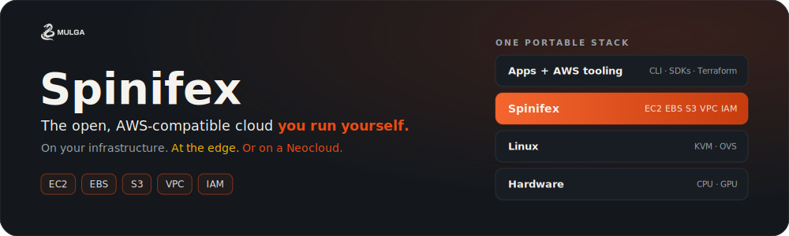
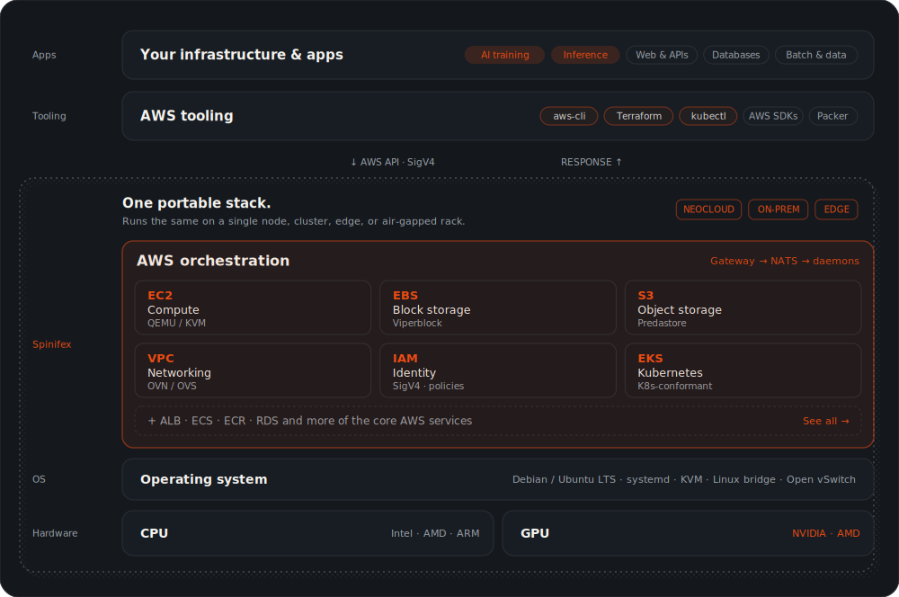
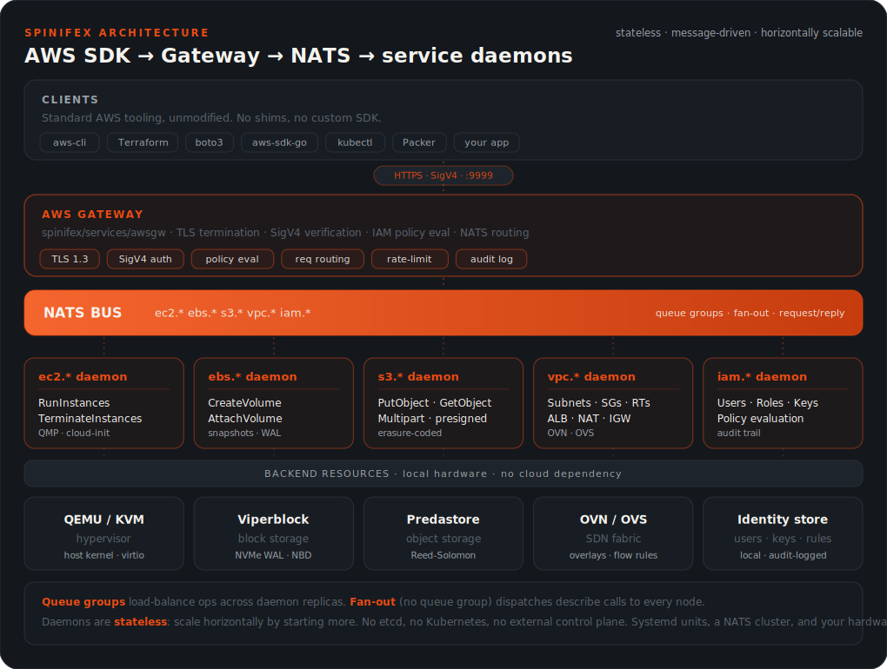

<p align="center">
  
</p>

<p align="center">
  <a href="https://go.dev"></a>
  <a href="LICENSE"></a>
  <a href="https://docs.mulgadc.com"></a>
</p>

<p align="center">
  <a href="#what-is-spinifex">What is Spinifex?</a> ·
  <a href="#the-platform">Platform</a> ·
  <a href="#three-ways-to-deploy">Deploy</a> ·
  <a href="#aws-compatibility">AWS services</a> ·
  <a href="#core-components">Components</a> ·
  <a href="#architecture-at-a-glance">Architecture</a> ·
  <a href="#installation">Installation</a> ·
  <a href="https://docs.mulgadc.com">Docs</a>
</p>

---

# Spinifex: the open, AWS-compatible cloud you run yourself

Spinifex, built by [Mulga](https://mulgadc.com), recreates the AWS services your
software already uses (EC2, EBS, S3, VPC, IAM) on infrastructure you control.
Move workloads off the hyperscalers, run AI at a fraction of the cost, or take
the cloud to the edge, without rewriting a line. The exact build you ship to AWS,
Spinifex serves on your own hardware: same APIs, same Terraform, same SDKs.

## What is Spinifex?

Spinifex is an open-source infrastructure platform that recreates the AWS service
surface (EC2, EBS, S3, VPC, IAM) on bare-metal, edge, and on-premises
environments. Run cloud-native software without a hyperscaler.

Most AWS alternatives wrap an API and call it a cloud. We rebuilt the engineering
underneath: distributed object storage with erasure coding, block storage built
to survive failure, and compute on bare metal. That depth is the reason your
software runs unchanged, instead of rewritten.

It's built for teams that need:

- The AWS tooling they already use (AWS CLI, SDKs, Terraform), with nothing to rewrite
- Full control of the stack: your hardware, your network, your data, your keys
- A cloud that keeps running offline, through disconnection, with no external control plane
- An open core (AGPL-3.0), auditable and yours to keep, with no lock-in

You change *where* your software runs, not *what* it is.

## The Platform

<p align="center">
  
</p>

From commodity hardware up to unmodified AWS tooling, every layer is replaceable and yours to own.

## Three ways to deploy

One AWS-compatible surface, three deployment shapes. Pick the one that matches
your reality; the platform on top is the same.

### Neocloud

Lift and shift onto a partner Neocloud. Move workloads off the hyperscalers and
onto our Neocloud partner ecosystem without rewriting them. GPU capacity
(H100 / H200 / B200), cheaper, available now. Change an endpoint, keep the
software.

### On-premise

Bring your own hardware and host Spinifex in your own data centre. A real
multi-node HA cluster integrated with your storage and networking, with full
control of stack, data, and jurisdiction. A predictable bill, no egress
surprises, an auditable open-source core.

### Edge

Cloud where the cloud can't reach. Air-gapped sites, vehicles, vessels,
factories, and clinics. Compute next to the data, running through disconnection,
on hardware you own. The same AWS APIs your software already uses.

## AWS compatibility

Speak the AWS API surface, natively. The AWS SDKs, AWS CLI, and Terraform:
everything you deploy on AWS deploys on Spinifex unchanged. At the edge,
on-premise, or on a partner Neocloud.

| Service | What it is | Status |
| --- | --- | --- |
| **EC2** | Compute | Available |
| **EBS** | Block storage | Available |
| **S3** | Object storage | Available |
| **VPC** | Networking | Available |
| **IAM** | Identity & auth | Available |
| **ALB / NLB** | Load balancers | Available |
| **EKS** | Kubernetes | Available |
| **ECR** | Container registry | Available |
| **ECS** | Container service | Available |
| **RDS** | Databases | Q3 2026 |

Roadmap items (Q3 2026) ship under the same AWS API surface. Code written for AWS
today keeps working the moment they land.
[Track what's shipped in the release notes](https://github.com/mulgadc/spinifex/releases).

## Core Components

### Spinifex (Compute Service – EC2 Alternative)

Spinifex is a minimal VM orchestration layer built on top of QEMU, exposing APIs similar to EC2. It manages lifecycle operations like start, stop, and terminate, using QEMU's QMP interface. Designed to be straightforward and scriptable, Spinifex lets you launch VMs using the AWS CLI, SDKs, or Terraform—without needing Kubernetes or heavyweight orchestrators. Keep in mind, you can also setup a Kubernetes environment using Spinifex with underlying instances.

- EC2-like VM management on bare metal
- Launches with cloud-init metadata support
- Works with standard AWS tooling

### Viperblock (Block Storage – EBS Alternative)

[Viperblock](https://github.com/mulgadc/viperblock) is a high-performance, WAL-backed block storage service that replicates volumes across multiple nodes. It's built for reliability and speed, with support for snapshots, recovery, and direct connection to QEMU instances using NBD or virtio-blk.

- Fast, durable virtual disks
- Replication for resilience
- Exposed over NBD or embedded in VMs
- Supports high performance WAL logs using local NVMe drives to reduce IO traffic to S3.
- In memory read/write block cache for blazing performance.

### Predastore (Object Storage – S3-Compatible)

[Predastore](https://github.com/mulgadc/predastore) is a fully S3-compatible object storage system. It supports the AWS S3 API, including Signature V4 authentication, multipart uploads, and Terraform provisioning. Data is chunked and distributed across nodes using Reed-Solomon erasure coding, making it fault-tolerant and ideal for large-scale or low-bandwidth scenarios.

- S3-compatible API and auth
- Multipart uploads, streaming reads/writes
- Data redundancy with Reed-Solomon encoding

## Architecture at a Glance

<p align="center">
  
</p>

Every AWS API call is authenticated at the gateway, published to a NATS subject,
and answered by whichever daemon claims it. Daemons are stateless: scale
horizontally by starting more. No etcd, no Kubernetes, no external control plane.
Just systemd units, a NATS cluster, and your hardware. Deep dive:
**[`docs/DESIGN.md`](docs/DESIGN.md)**.

## Key Features

- **AWS-compatible APIs.** Use the AWS CLI, SDKs, and Terraform you already know. Repoint your endpoint and ship; nothing to rewrite.
- **Zero cloud dependency.** Runs entirely on your hardware. No phone-home, no control plane, no external authority. Works fully offline.
- **Bare-metal compute.** QEMU-based with direct hardware access. No hypervisor tax, no abstraction overhead.
- **Built-in storage.** Block and object storage included: NVMe caching, Reed-Solomon erasure coding, and replication out of the box.
- **Edge-first architecture.** Designed for disconnected, contested, and resource-constrained environments from day one.
- **Open core, no lock-in.** AGPL-3.0 with a commercial option. Inspect it, modify it, deploy it. The platform is yours to keep.

## Installation

Installation requires an Ubuntu / Debian system. See the detailed documentation at [docs.mulgadc.com](https://docs.mulgadc.com) for maintaining and installing Spinifex.

### Bare Metal ISO

The recommended installation is a [bootable x86 installer](https://iso.mulgadc.com/spinifex.iso) for bare-metal hardware.

```bash
curl -fLO https://iso.mulgadc.com/spinifex.iso
```

Follow the [USB install guide](https://docs.mulgadc.com/docs/install-usb) to write the ISO to USB and install on your hardware. The install guide walks through the full process.


### Single Node Install

The installation is straightforward to set up and running on a single node for testing purposes. Debian 13 is currently supported, additional Linux distributions are on the immediate roadmap.

>*Prerequisite:* Linux bridge for networking.

Spinifex requires a Linux bridge configured on the host for VM networking. See the [single-node install guide](https://docs.mulgadc.com/docs/install#prerequisites) prerequisites for setup details.

```bash
curl -fsSL https://install.mulgadc.com | bash

sudo /usr/local/share/spinifex/setup-ovn.sh --management

sudo spx admin init --node node1 --nodes 1

sudo systemctl start spinifex.target

export AWS_PROFILE=spinifex

aws ec2 describe-instance-types
```

### Development Setup

For a complete development environment see the [Source Install](https://docs.mulgadc.com/docs/install-source) documentation

### Component Repositories

Spinifex coordinates these independent components:

- **[Predastore](https://github.com/mulgadc/predastore)** - S3-compatible object storage
- **[Viperblock](https://github.com/mulgadc/viperblock)** - EBS-compatible block storage

Each component can be developed independently. See component-specific documentation for focused development guides.

## Spinifex UI

Spinifex ships with a built-in web console — an optional alternative to the AWS CLI, SDKs, and Terraform. If you're familiar with the AWS Management Console, the Spinifex UI fills the same role: a browser-based view of your instances, volumes, buckets, VPCs, and IAM resources, without leaving your own network.

<p align="center">
  
</p>

The console is served by each node on port `3000` over TLS, and becomes available as soon as `spinifex.target` is up:

```bash
open https://YOUR_NODE_IP:3000
```

- **Same API, different surface.** Every action in the UI is the same AWS SigV4 call the CLI makes — so RBAC, audit trails, and IAM policies apply uniformly.
- **Single sign-on against your AWS credentials.** Log in with the access keys from `~/.aws/credentials` on the node where Spinifex is installed — no separate user database.
- **Self-hosted, works offline.** The UI is embedded in the Spinifex binary and served from the node itself. No external CDN, no analytics calls, no cloud dependency.

For the full walkthrough — first-time TLS certificate trust, login, and feature tour — see [**Launching the Web UI**](https://docs.mulgadc.com/docs/setting-up-your-cluster#7-launching-the-web-ui) in the cluster setup guide.

## Development Philosophy

### Built by Engineers, For Engineers

Spinifex is developed by experienced infrastructure engineers with deep AWS expertise, including former AWS team members who understand the intricacies of building production-grade cloud services. Our team brings decades of combined experience from AWS, enterprise infrastructure, and edge computing environments.

**Real-World Experience:**

- Production AWS service development and operations
- Large-scale infrastructure deployment and management
- Edge computing and resource-constrained environments
- Enterprise security and compliance requirements

### AI-Assisted Development

While Spinifex is architected and implemented by experienced engineers, we leverage **Claude Code** (Anthropic's AI coding assistant) to accelerate certain development tasks. This approach combines human expertise with AI efficiency:

**How We Use Claude Code:**

- **Code Generation**: Boilerplate AWS API structures and handlers
- **Documentation**: Comprehensive development guides and API documentation
- **Testing**: Test case generation and validation scenarios
- **Refactoring**: Large-scale code restructuring and optimization

**What Remains Human-Driven:**

- **Architecture Decisions**: Core system design and scalability choices
- **Security Implementation**: Authentication, encryption, and threat modeling
- **Performance Optimization**: Real-world performance tuning and benchmarking
- **Production Operations**: Deployment strategies and operational procedures

This hybrid approach ensures Spinifex benefits from both proven engineering expertise and modern development acceleration, while maintaining the quality and reliability standards required for production infrastructure.

## Trademarks

"AWS", "Amazon Web Services", and all related service names (EC2, EBS, S3, VPC, IAM, and others) are trademarks of Amazon.com, Inc. or its affiliates. Mulga Defense Corporation and Spinifex are independent and not affiliated with, endorsed by, or sponsored by Amazon.com, Inc. or Amazon Web Services, Inc. References to AWS services describe interoperability and compatibility only.

## License

Spinifex is open source under the [GNU Affero General Public License v3.0](LICENSE). You're free to use, modify, and deploy it anywhere you need reliable infrastructure without depending on centralized cloud platforms.
