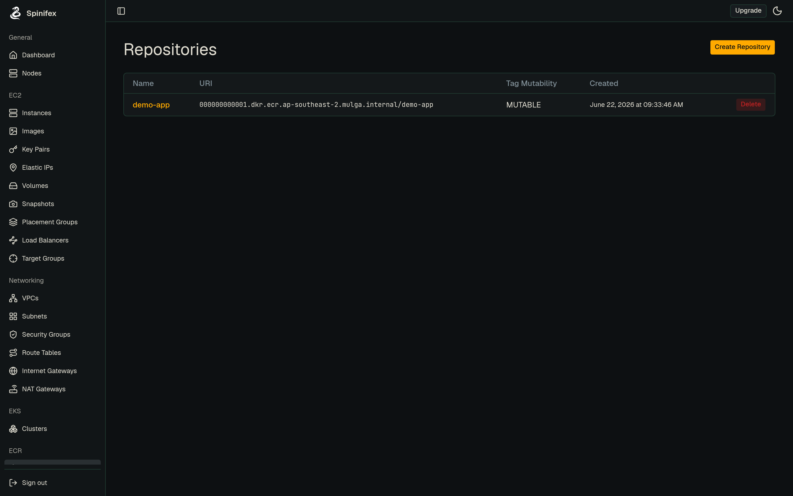
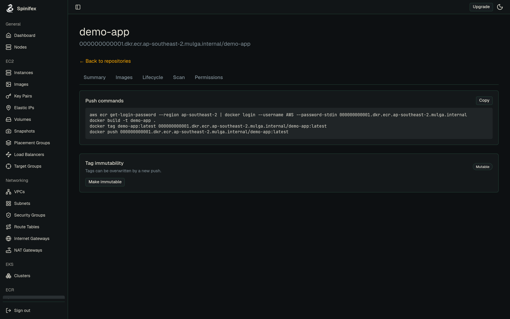

# ECR (Container Registry)

> Spinifex's ECR service is an AWS-compatible, OCI-compliant container registry. You create repositories with `aws ecr`, authenticate Docker with a registry token, and `docker push` / `docker pull` exactly as you would on AWS — and your EKS clusters can pull from it directly.

## Overview

ECR on Spinifex gives every account a private container registry reachable at a per-account endpoint, served on the Spinifex gateway port (`9999`):

```
<account-id>.dkr.ecr.<region>.<your-spinifex-domain>:9999
```

Each repository holds image manifests and their layers. Images are stored in object storage ([Predastore](https://github.com/mulgadc/predastore)) in a per-account bucket, with blobs content-addressed and de-duplicated across repositories. Authentication is token-based: `aws ecr get-login-password` mints a short-lived bearer token that `docker login` uses against the registry's `/v2/` endpoint.

**What works today**

- Repository lifecycle — `CreateRepository`, `DeleteRepository`, `DescribeRepositories`.
- OCI push and pull — blobs, manifests, and tags, including cross-repository blob mounts.
- Token auth — `GetAuthorizationToken` plus bearer/basic auth on `/v2/`.
- Repository policies — set, get, and delete a repository policy document.

**Current limitations**

- **Image scanning is not supported** — scan APIs return an explicit "operation not supported" error.
- **No automatic garbage collection yet** — deleting images does not yet reclaim underlying blobs.
- Lifecycle-policy enforcement and tag-immutability enforcement are not active.

## Prerequisites

- **Spinifex running**, with the AWS CLI configured for the `spinifex` profile (see [Installing Spinifex](/docs/install)).
- **Docker** installed locally to build, push, and pull images.
- **The registry endpoint** for your deployment — `<account-id>.dkr.ecr.<region>.<your-spinifex-domain>:9999`. `aws ecr get-login-password` and `aws ecr describe-repositories` return the exact `host:port` for your account.
- **For EKS pulls:** worker nodes need the `AmazonEC2ContainerRegistryReadOnly` policy on their node IAM role (the EKS prerequisites already include this) and network egress to the registry endpoint.

## Instructions

Create a repository and push an image using your preferred tool.

:::tabs
@tab AWS CLI

### 1. Create a repository

```bash
export AWS_PROFILE=spinifex

aws ecr create-repository --repository-name my-app
aws ecr describe-repositories --repository-names my-app \
  --query 'repositories[0].repositoryUri'
```

The `repositoryUri` is the value you tag and push to, port included:
`<account-id>.dkr.ecr.<region>.<your-spinifex-domain>:9999/my-app`.

### 2. Authenticate Docker

Take the registry host straight from the API so the `:9999` port is correct:

```bash
REGISTRY=$(aws ecr describe-repositories --repository-names my-app \
  --query 'repositories[0].repositoryUri' --output text | cut -d/ -f1)

aws ecr get-login-password --region <region> \
  | docker login --username AWS --password-stdin "$REGISTRY"
```

### 3. Build, tag, and push

```bash
docker build -t my-app:latest .
docker tag my-app:latest "$REGISTRY/my-app:latest"
docker push "$REGISTRY/my-app:latest"
```

### 4. Verify and pull

```bash
aws ecr describe-images --repository-name my-app
docker pull "$REGISTRY/my-app:latest"
```

@tab Spinifex UI

From the left navigation open **ECR → Repositories**.



### 1. Create a repository

1. Click **Create Repository**.
2. Enter the **repository name** and, optionally, set **tag mutability** (mutable or immutable).
3. Submit — the repository appears in the list with its full registry URI.

### 2. Copy the push commands

Open the repository to see its detail page. The **Push commands** panel lists the exact `aws ecr get-login-password | docker login`, `docker build`, `docker tag`, and `docker push` commands, pre-filled with your registry host and repository URI — use the **Copy** button and run them locally.



### 3. Manage the repository

- The **Permissions** tab edits the repository's access policy.
- The **Lifecycle** tab manages retention rules, and **Tag immutability** can be toggled from the detail page.
- The **Scan** tab reflects that image scanning is not supported on Spinifex.
- Delete a repository from the **Delete** action in the repositories list.

@tab Terraform

Repositories can be managed as code with the standard `aws_ecr_repository` resource, with the AWS provider pointed at Spinifex's `ecr` endpoint:

```hcl
provider "aws" {
  region                      = "ap-southeast-2"
  skip_credentials_validation = true
  skip_requesting_account_id  = true

  endpoints {
    ecr = "https://<your-spinifex-gateway>"
  }
}

resource "aws_ecr_repository" "my_app" {
  name = "my-app"
}

output "repository_url" {
  value = aws_ecr_repository.my_app.repository_url
}
```

```bash
export AWS_PROFILE=spinifex
tofu init
tofu apply
```

Then authenticate Docker and push using the `repository_url` output, following steps 2–4 in the AWS CLI tab.

:::

## Troubleshooting

**`docker login` fails with an authorization error.** The token is account-scoped and short-lived. Re-run `aws ecr get-login-password` to mint a fresh token, and confirm the registry host in `docker login` matches your account's endpoint (`aws ecr describe-repositories` returns it).

**`docker push` cannot reach the registry.** Confirm you are using the per-account endpoint with the `:9999` port — `<account-id>.dkr.ecr.<region>.<your-spinifex-domain>:9999`. Docker dials the host directly (no mirror), so without the port it tries `:443` and fails. The registry routes by Host header, so the hostname must also match your account and your deployment's domain.

**EKS workers cannot pull an image.** Confirm the node IAM role has `AmazonEC2ContainerRegistryReadOnly` and that the workers have egress to the registry endpoint (an Internet Gateway or NAT Gateway route). See the [EKS prerequisites](/docs/eks).

**Image-scanning commands return an error.** Image scanning is not supported on Spinifex; the scan APIs intentionally reject these calls. Remove scan-on-push configuration from your tooling.

**A pushed image still appears after deletion frees no space.** Garbage collection of unreferenced blobs is not yet automatic — deleting an image removes its manifest and tags but does not immediately reclaim the underlying layers.
