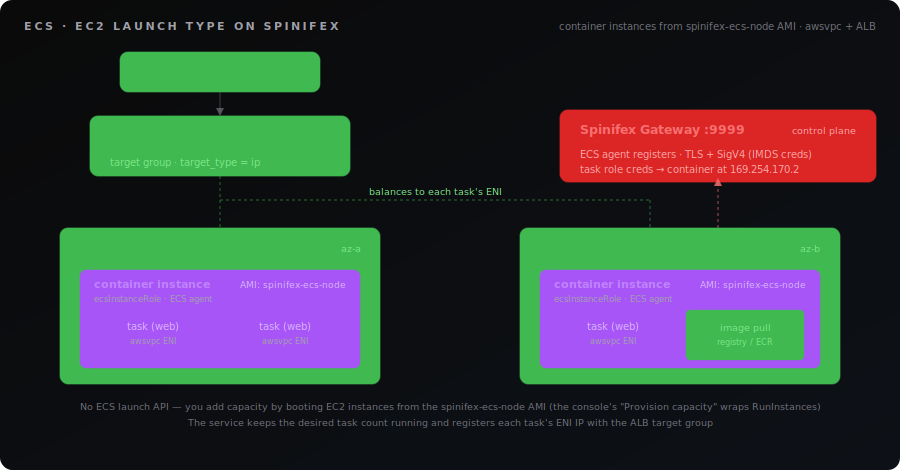

# ECS (Elastic Container Service)

> Spinifex's ECS service gives you an AWS-compatible container orchestrator: you register task definitions and run them — one-off as tasks, or kept-running as a service behind a load balancer — on container instances you launch from the Spinifex ECS node image. Standard tools — `aws ecs`, the Terraform AWS provider — work unchanged.

## Overview

ECS on Spinifex follows the AWS **EC2 launch type**: you supply the compute. A cluster is a logical grouping; the capacity behind it is **container instances** — ordinary EC2 instances booted from Spinifex's `spinifex-ecs-node` image, each running the Spinifex ECS agent. The agent registers the instance with the cluster, reports its CPU/memory, and runs the containers the scheduler places on it.

There is **no ECS-specific launch API** — this is AWS-faithful. You add capacity by launching EC2 instances from the ECS node image (with the `ecsInstanceRole` instance profile), exactly as on AWS. The Spinifex console wraps this in a one-click **Provision capacity** action, but underneath it is just `RunInstances`.

A **task definition** describes one or more containers (image, CPU/memory, ports, environment, and an optional task IAM role). A **task** is a running instantiation of a task definition; the scheduler bin-packs tasks onto instances with free capacity. A **service** keeps a desired number of tasks running, replaces failed ones, and — when configured — registers each task's IP with an Application Load Balancer target group.

<p align="center">
  
</p>

**What you'll create:**

| Resource | Purpose |
|---|---|
| VPC + subnets | The network the cluster and tasks run in |
| Internet Gateway | Egress so instances can pull container images |
| `ecsInstanceRole` | Instance profile letting the agent reach the control plane |
| ECS cluster | The logical grouping tasks and instances join |
| Task definition | The container spec (image, CPU/memory, ports, task role) |
| Container instance(s) | EC2 VMs from the ECS node image that run tasks |
| Service + ALB target group | Keeps N tasks running and load-balances them |

**Spinifex specifics**

- **EC2 launch type only.** There is no Fargate-equivalent serverless capacity; you run and pay for the container instances. `RequiresCompatibilities` of `FARGATE` is not honoured.
- **`awsvpc` network mode.** Each task gets its own ENI and private IP in your subnet. Target groups must use `target_type = "ip"`; the service's `network_configuration` selects the subnets and security groups.
- **The container-instance image is fixed.** Instances must boot Spinifex's `spinifex-ecs-node` image (resolve it by the `spinifex:managed-by=ecs` tag) and carry the `ecsInstanceRole` instance profile.
- **Task IAM roles via the credential endpoint.** A task with a `taskRoleArn` gets `AWS_CONTAINER_CREDENTIALS_RELATIVE_URI` injected; the agent serves short-lived credentials for that role at `169.254.170.2`, AWS-faithful — your container's SDK picks them up with no static keys.

### Limitations

ECS v1 is deliberately minimal. Keep these in mind:

- **No service discovery.** `serviceRegistries` / Cloud Map integration is not implemented — reach a service through its load balancer, not a DNS name.
- **Only the `json-file` log driver is collected.** Container stdout/stderr is captured host-side on the container instance (see [Logging](#logging)); it is not shipped to CloudWatch Logs. Any other driver (e.g. `awslogs`) is accepted for parity but its logs are discarded — `RegisterTaskDefinition` logs a warning naming the container so the drop is not silent.
- **No capacity providers or managed scaling.** Capacity is the static total of your registered instances; there is no scale-out/in or ASG binding — you manage the instance count.
- **`secrets[]` are rejected.** A task definition that declares container `secrets[]` fails `RegisterTaskDefinition` with `InvalidParameterException` rather than running without the secrets it expects. Tags set via `TagResource` are not persisted, and health-check settings beyond the target group default are not forwarded.

### Logging

Spinifex honours the host-side **`json-file`** log driver (the containerd default). A container's stdout/stderr is written on its container instance and retrievable there — no CloudWatch Logs path exists.

To read a task's logs, find the container instance running it (`aws ecs describe-tasks` → `containerInstanceArn` → the EC2 instance), then on that host inspect the containerd task output. Containers are named `{taskId}-{containerName}` and carry `mulga.ecs.*` labels:

```bash
# On the container instance:
ctr -n default containers ls                 # find {taskId}-{containerName}
ctr -n default tasks ls
journalctl -u containerd | grep <taskId>     # container stdout/stderr via the host journal
```

A task definition may still declare `awslogs` (or any other driver) for AWS compatibility — Spinifex accepts it, warns at registration that the driver is not implemented, and falls back to the host-side `json-file` behaviour.

### Deployments

An `UpdateService` to a new task-definition revision performs a **health-gated rolling update** honouring `deploymentConfiguration`: `minimumHealthyPercent` keeps that fraction of the desired count running while `maximumPercent` bounds how many extra tasks launch during the roll. Enabling the **deployment circuit breaker** fails a rollout whose tasks repeatedly fail to start, and — with `rollback` set — automatically reverts to the last-good task definition.

### Execution role

If a task definition sets `executionRoleArn`, the agent assumes that role to authorise ECR image pulls (instead of the container-instance role). When it is unset, pulls fall back to the instance role.

## Prerequisites

> [!IMPORTANT]
> **Prerequisite — `spinifex-ecs-node` image required.**
>
> Container instances **must** boot Spinifex's **`spinifex-ecs-node`** image — it carries the ECS agent. Import it before provisioning capacity (during `spx admin init` or via the image catalogue); the console's provision-capacity action and the Terraform workbook both resolve it by tag.
>
> **Verify before continuing:**
>
> ```bash
> aws ec2 describe-images \
>   --filters 'Name=tag:spinifex:managed-by,Values=ecs' \
>   --query 'Images[].[ImageId,Name]' --output text
> ```
>
> No rows means the image is not imported — register it before continuing.

The Terraform workbook builds all of this for you. For the CLI or console paths, have it in place first.

- **Spinifex running**, with the AWS CLI configured for the `spinifex` profile (see [Installing Spinifex](/docs/install)).
- **The `spinifex-ecs-node` image** imported. Confirm it resolves:

  ```bash
  aws ec2 describe-images \
    --filters 'Name=tag:spinifex:managed-by,Values=ecs' \
    --query 'Images[].[ImageId,Name]' --output text
  ```

- **A VPC with at least one subnet** and an **Internet Gateway** with a default route (`0.0.0.0/0 → IGW`), so instances can pull container images.
- **The `ecsInstanceRole` instance profile.** It is account-global: a role trusted by `ec2.amazonaws.com` with an `ecs:*` policy, exposed through an instance profile of the same name. The console's provision-capacity action creates it on first use; the Terraform workbook creates it unless you opt out.
- **An optional task IAM role** trusted by `ecs-tasks.amazonaws.com`, if your containers call AWS APIs.

## Instructions

The same workload can be created three ways. Pick your tool — each path reaches the same running service.

:::tabs
@tab AWS CLI

### 1. Create the cluster

```bash
export AWS_PROFILE=spinifex

aws ecs create-cluster --cluster-name demo
```

### 2. Register a task definition

`awsvpc` network mode, EC2 launch type, one nginx container on port 80:

```bash
aws ecs register-task-definition \
  --family web \
  --network-mode awsvpc \
  --requires-compatibilities EC2 \
  --cpu 256 --memory 512 \
  --container-definitions '[{
    "name":"web",
    "image":"docker.io/library/nginx:1.27-alpine",
    "portMappings":[{"containerPort":80,"protocol":"tcp"}],
    "essential":true
  }]'
```

### 3. Add capacity

Launch one or more EC2 instances from the ECS node image with the `ecsInstanceRole`
instance profile and a cloud-init that points the agent at the cluster. The
[ECS Quickstart workbook](https://github.com/mulgadc/spinifex/tree/main/docs/terraform-workbooks/ecs-quickstart)
produces this user-data for you; the console **Provision capacity** action is the
one-click equivalent. Once an instance boots and its agent registers, it appears here:

```bash
aws ecs list-container-instances --cluster demo
```

### 4. Run a task or create a service

Run a one-off task:

```bash
aws ecs run-task \
  --cluster demo --task-definition web --count 1 \
  --network-configuration 'awsvpcConfiguration={subnets=[subnet-aaaa]}'
```

Or keep it running behind an ALB target group (`target_type = ip`):

```bash
aws ecs create-service \
  --cluster demo --service-name web --task-definition web \
  --desired-count 2 \
  --network-configuration 'awsvpcConfiguration={subnets=[subnet-aaaa]}' \
  --load-balancers 'targetGroupArn=<tg-arn>,containerName=web,containerPort=80'

aws ecs describe-services --cluster demo --services web \
  --query 'services[0].[runningCount,desiredCount]'
```

@tab Spinifex UI

The Spinifex console drives the same workflow. From the left navigation open **ECS → Clusters**.

### 1. Create the cluster

Click **Create Cluster**, give it a name, and submit. It appears in the **Clusters** list.

### 2. Provision capacity

Open the cluster and use **Provision capacity** on the **Infrastructure** (container instances) tab. The console launches instances from the `spinifex-ecs-node` image, attaches the `ecsInstanceRole` instance profile (creating it if needed), and injects the gateway URL and CA into the instance's cloud-init — so the agent registers without any manual key handling. The instances appear under **Infrastructure** as they register.

### 3. Register a task definition and run it

- The **Task definitions** view lists families and revisions; register a new revision with the container image, CPU/memory, and ports.
- From a task definition, **Run task** for a one-off, or create a **Service** to keep a desired count running.
- A cluster's **Services** and **Tasks** tabs show what is running; open a task or service for its detail page (containers, networking, and public/private endpoints).

### 4. Attach a load balancer

When creating a service, select an ALB target group (`target_type = ip`) so each task's ENI is registered and traffic is balanced across tasks.

@tab Terraform

The [ECS Quickstart workbook](https://github.com/mulgadc/spinifex/tree/main/docs/terraform-workbooks/ecs-quickstart) builds the whole stack in one `apply`: VPC, IAM, cluster, task definition, container instances, and an ALB-fronted service. It is the Terraform-native equivalent of the console's provision-capacity action.

```bash
git clone --depth 1 --filter=blob:none --sparse https://github.com/mulgadc/spinifex.git spinifex-tf
cd spinifex-tf
git sparse-checkout set docs/terraform-workbooks
cd docs/terraform-workbooks/ecs-quickstart
```

The core resources point the AWS provider at Spinifex's `ecs`, `ec2`, `iam`, `sts`, and `elasticloadbalancingv2` endpoints, then create the cluster, an `awsvpc` task definition with a task role, and a service wired to a target group:

```hcl
resource "aws_ecs_cluster" "main" {
  name = "ecs-quickstart"
}

resource "aws_ecs_task_definition" "web" {
  family                   = "ecs-quickstart-web"
  network_mode             = "awsvpc"
  requires_compatibilities = ["EC2"]
  cpu                      = "256"
  memory                   = "512"
  task_role_arn            = aws_iam_role.task.arn

  container_definitions = jsonencode([{
    name         = "web"
    image        = "docker.io/library/nginx:1.27-alpine"
    essential    = true
    portMappings = [{ containerPort = 80, protocol = "tcp" }]
  }])
}

resource "aws_ecs_service" "web" {
  name            = "ecs-quickstart-web"
  cluster         = aws_ecs_cluster.main.id
  task_definition = aws_ecs_task_definition.web.arn
  desired_count   = 1

  network_configuration {
    subnets         = [aws_subnet.a.id, aws_subnet.b.id]
    security_groups = [aws_security_group.node.id]
  }

  load_balancer {
    target_group_arn = aws_lb_target_group.web.arn
    container_name   = "web"
    container_port   = 80
  }
}
```

Because a container instance reaches the control plane over the gateway (TLS + SigV4) rather than a managed AWS endpoint, the workbook makes the two things the console injects explicit: a **LAN-reachable** `gateway_url` (the host's bridge IP, not `127.0.0.1`) and the gateway CA, both baked into the instance's cloud-init. Apply it:

```bash
export AWS_PROFILE=spinifex
tofu init
tofu apply -var 'gateway_url=https://<host-lan-ip>:9999'
```

`ecsInstanceRole` is account-global — if it already exists (from the console), pass `-var 'create_instance_role=false'`. See the workbook README for the full variable list and teardown.

:::

## Troubleshooting

**No container instances appear after launching them.** The agent registers over the gateway, not a managed endpoint, so check its cloud-init injected a correct **LAN-reachable** gateway URL (not `127.0.0.1` — a guest VM cannot reach the host loopback) and the gateway CA. `cloud-init write_files` runs once per instance, so fixing the user-data needs an instance **replacement**, not an in-place modify. Confirm the instance carries the `ecsInstanceRole` instance profile.

**Tasks stay `PENDING`.** No instance has free capacity for the task's CPU/memory reservation. Add capacity, or lower the task definition's reservations. `aws ecs list-container-instances` should show at least one `ACTIVE` instance.

**Service `runningCount` below `desiredCount`.** Either there is not enough capacity (see above), or tasks are failing to start — check the task's containers can pull their image (instances need an egress route) and that the image reference is valid.

**Load balancer target unhealthy / app unreachable.** The target group must be `target_type = ip` (tasks register their ENI IP, not an instance ID). The ALB DNS name ends in `.elb.spinifex.local` and does not resolve from outside; fetch its public IP with `aws elbv2 describe-load-balancers` and curl that. Note health-check settings beyond the target group default are not forwarded.

**Container cannot assume its task role.** Confirm the task definition sets `taskRoleArn` and the role is trusted by `ecs-tasks.amazonaws.com`. The agent injects `AWS_CONTAINER_CREDENTIALS_RELATIVE_URI`; a container that overrides this variable, or an SDK too old to honour it, will not pick up the credentials.

**Expected a feature that is missing.** ECS v1 omits service discovery, CloudWatch Logs (`awslogs`) shipping, and capacity providers / managed scaling. See the Limitations in the Overview.
