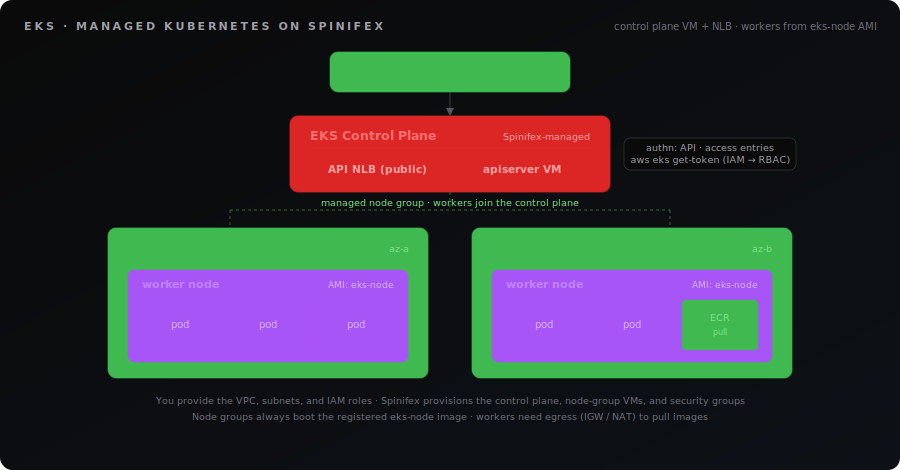
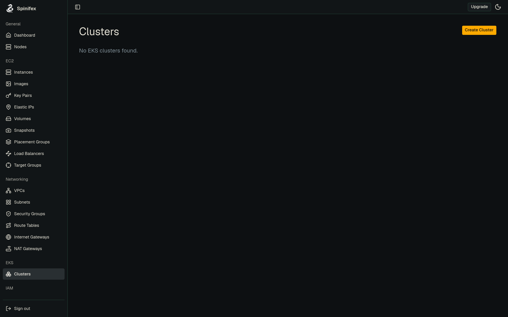
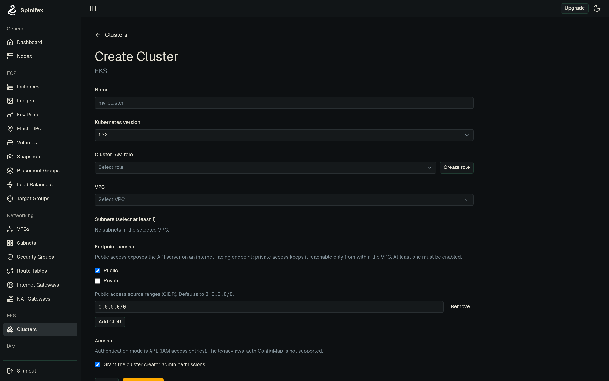

# EKS (Managed Kubernetes)

> Spinifex's EKS service gives you a managed, AWS-compatible Kubernetes API: you create a cluster and a node group, and Spinifex provisions and runs the control plane and workers for you. Standard tools — `aws eks`, `kubectl`, the Terraform AWS provider — work unchanged against your cluster.

## Overview

An EKS cluster on Spinifex has two parts: a **control plane** (the managed Kubernetes API server, provisioned on a Spinifex-managed VM and fronted by a network load balancer) and one or more **managed node groups** of worker VMs that run your pods. You provide the VPC, subnets, and IAM roles; Spinifex creates and reconciles the cluster, its load balancer, and its security groups.

Authentication uses **EKS access entries** (the API authentication mode) — IAM principals are mapped to Kubernetes RBAC groups, and `kubectl` authenticates with `aws eks get-token` exactly as it does on AWS.

<p align="center">
  
</p>

**What you'll create:**

| Resource | Purpose |
|---|---|
| VPC + subnets | The network the cluster and workers run in |
| Internet Gateway / NAT Gateway | Egress so workers can pull container images |
| Cluster IAM role | Lets the control plane manage cluster resources |
| Node IAM role | Lets workers join the cluster and pull images |
| EKS cluster | The managed Kubernetes API endpoint |
| Managed node group | The worker VMs that run your pods |
| Security-group rule | Opens your app's port to reach the workers |

**Spinifex specifics**

- **Auth mode is API-only.** `authentication_mode` must be `API`; the legacy `CONFIG_MAP` and `API_AND_CONFIG_MAP` modes are rejected. Grant access with access entries, not an `aws-auth` ConfigMap.
- **Security groups are auto-managed.** Spinifex creates the cluster and node-group security groups deterministically (e.g. `eks-cluster-<name>-nodegroup-sg`); `vpc_config.security_group_ids` is ignored. To expose a workload you add an ingress rule to the auto-managed node-group SG.
- **The worker image is fixed.** Node groups always boot Spinifex's `eks-node` image. `ami_type` is recorded but does not select the image, and the image must be registered on the cluster before you create a node group.
- **Default Kubernetes version is `1.32`.**

## Prerequisites

> [!IMPORTANT]
> **Prerequisite — `eks-node` image required.**
>
> Node groups always boot Spinifex's **`eks-node`** image, and it **must** be registered before you create a cluster — the console blocks cluster creation until it is present. Import it during `spx admin init` (or via the image catalogue) ahead of time.
>
> **Verify before continuing:**
>
> ```bash
> aws ec2 describe-images \
>   --filters 'Name=tag:spinifex:managed-by,Values=eks' \
>   --query 'Images[].[ImageId,Name]' --output text
> ```
>
> No rows means the image is not imported — register it before continuing.

Before creating a cluster you need the supporting infrastructure in place. The Terraform workbooks build all of this for you; if you are using the CLI or console, create it first.

- **Spinifex running**, with the AWS CLI configured for the `spinifex` profile (see [Installing Spinifex](/docs/install)) and `kubectl` installed.
- **The `eks-node` image** registered on the cluster. The console blocks cluster creation until it is present.
- **A VPC with at least one subnet.** The control plane launches in your first subnet; workers run in the subnets you pass to the node group.
- **Egress for the workers.** Workers must reach the internet to pull container images:
  - **Public workers** — an **Internet Gateway** with a default route (`0.0.0.0/0 → IGW`) and public IPs.
  - **Private workers** — a **NAT Gateway** in a public subnet with a default route (`0.0.0.0/0 → NAT`) from the private subnets.
- **Two IAM roles:**
  - A **cluster role** trusted by `eks.amazonaws.com` with `AmazonEKSClusterPolicy` attached.
  - A **node role** trusted by `ec2.amazonaws.com` with `AmazonEKSWorkerNodePolicy`, `AmazonEKS_CNI_Policy`, and `AmazonEC2ContainerRegistryReadOnly` attached (the last lets workers pull images from [ECR](/docs/ecr)).

## Instructions

The same cluster can be created three ways. Pick your tool — each path reaches the same working cluster.

:::tabs
@tab AWS CLI

### 1. Create the cluster

Point the cluster at your VPC subnets and the cluster role, with API authentication and a public endpoint:

```bash
export AWS_PROFILE=spinifex

aws eks create-cluster \
  --name demo \
  --role-arn arn:aws:iam::000000000000:role/eks-cluster-role \
  --resources-vpc-config subnetIds=subnet-aaaa,subnet-bbbb,endpointPublicAccess=true \
  --access-config authenticationMode=API \
  --kubernetes-version 1.32
```

Wait for it to become active:

```bash
aws eks wait cluster-active --name demo
aws eks describe-cluster --name demo --query 'cluster.status'
```

### 2. Add a node group

```bash
aws eks create-nodegroup \
  --cluster-name demo \
  --nodegroup-name default \
  --node-role-arn arn:aws:iam::000000000000:role/eks-node-role \
  --subnets subnet-aaaa subnet-bbbb \
  --scaling-config minSize=1,maxSize=2,desiredSize=1 \
  --instance-types t3.medium

aws eks wait nodegroup-active --cluster-name demo --nodegroup-name default
```

### 3. Connect kubectl

```bash
aws eks update-kubeconfig --name demo
kubectl get nodes
```

### 4. Expose a workload

Workers join an auto-managed security group that only allows intra-cluster traffic. To reach a NodePort service, add one ingress rule to that SG (look it up by its deterministic name):

```bash
SG=$(aws ec2 describe-security-groups \
  --filters Name=group-name,Values=eks-cluster-demo-nodegroup-sg \
  --query 'SecurityGroups[0].GroupId' --output text)

aws ec2 authorize-security-group-ingress \
  --group-id "$SG" --protocol tcp --port 30080 --cidr 0.0.0.0/0
```

Then deploy and publish your app:

```bash
kubectl create deployment hello --image=nginxdemos/hello --replicas=2
kubectl expose deployment hello --type=NodePort --port=80 \
  --overrides='{"spec":{"ports":[{"port":80,"nodePort":30080}]}}'
```

@tab Spinifex UI

The Spinifex console drives the same workflow through a guided form. From the left navigation open **EKS → Clusters**.



### 1. Create the cluster

1. Click **Create Cluster**.
2. Enter a **name** and choose the **Kubernetes version** (default `1.32`).
3. Choose the **cluster IAM role**, or create one inline from the dialog.
4. Select the **VPC and subnets** the cluster will run in.
5. Set **endpoint access** (public, private, or both) and submit.



The form notes that the authentication mode is API and that the legacy aws-auth ConfigMap is not supported. The cluster appears in the **Clusters** list as `CREATING` and flips to `ACTIVE` once the control plane is healthy.

### 2. Add a node group

1. Open the cluster and switch to the **Node groups** tab.
2. Click **Add node group**, choose the **node IAM role**, **subnets**, **instance type**, and **scaling** (desired / min / max).
3. Submit and wait for the node group to reach `ACTIVE`.

### 3. Manage access and addons

- The **Access** tab lists IAM principals and their cluster-access policies — add an access entry to let another user or role reach the cluster.
- The **Addons** tab installs and shows the health of managed addons.
- The **Networking** tab shows the cluster's VPC, subnets, endpoint access, and the auto-managed security groups.

To run `kubectl` against the cluster, follow the AWS CLI tab's `update-kubeconfig` step.

@tab Terraform

The Terraform workbooks are the fastest way to a working cluster — they build the VPC, IAM roles, cluster, node group, and a demo workload in one `apply`. Start with **eks-quickstart**:

```bash
git clone --depth 1 --filter=blob:none --sparse https://github.com/mulgadc/spinifex.git spinifex-tf
cd spinifex-tf
git sparse-checkout set docs/terraform-workbooks
cd docs/terraform-workbooks/eks-quickstart
```

The cluster config points the AWS provider at Spinifex's `eks`, `ec2`, `iam`, and `sts` endpoints, then creates the cluster and node group:

```hcl
resource "aws_eks_cluster" "this" {
  name     = "eks-quickstart"
  role_arn = aws_iam_role.cluster.arn
  version  = "1.32"

  access_config {
    authentication_mode = "API"
  }

  vpc_config {
    subnet_ids              = [aws_subnet.a.id, aws_subnet.b.id]
    endpoint_public_access  = true
  }
}

resource "aws_eks_node_group" "default" {
  cluster_name    = aws_eks_cluster.this.name
  node_group_name = "default"
  node_role_arn   = aws_iam_role.node.arn
  subnet_ids      = [aws_subnet.a.id, aws_subnet.b.id]

  scaling_config {
    desired_size = 1
    min_size     = 1
    max_size     = 2
  }

  instance_types = ["t3.medium"]
}
```

Apply it, then connect:

```bash
export AWS_PROFILE=spinifex
tofu init
tofu apply
aws eks update-kubeconfig --name eks-quickstart
kubectl get nodes
```

The workbooks form a ladder. **eks-quickstart** is a NodePort demo; **eks-https-ingress** adds private subnets, a NAT gateway, and HTTPS via the AWS Load Balancer Controller + ACM; **eks-gitops-argocd** delivers the app from a git repo with the Argo CD addon and persists state on an EBS-CSI (Viperblock-backed) volume. See the full templates linked in Resources.

:::

## Troubleshooting

**Cluster stuck in `CREATING`.** The control plane is still booting. Check `aws eks describe-cluster --name <name> --query 'cluster.health'` for reported issues. The control plane needs egress to bootstrap, so confirm its subnet has an Internet Gateway route.

**`kubectl` cannot connect.** Re-run `aws eks update-kubeconfig --name <name>` to refresh the endpoint and CA, and confirm the cluster is `ACTIVE`. `aws sts get-caller-identity` verifies your credentials reach the Spinifex endpoint.

**Workers stay `NotReady`.** Almost always an egress or IAM problem:
- Confirm the workers can pull images — a default route to an Internet Gateway (public) or NAT Gateway (private).
- Confirm the node role has `AmazonEKSWorkerNodePolicy`, `AmazonEKS_CNI_Policy`, and `AmazonEC2ContainerRegistryReadOnly`.

**Workload unreachable from outside the cluster.** The node-group security group only allows intra-cluster traffic by default. Add an ingress rule for your NodePort to `eks-cluster-<name>-nodegroup-sg`, as shown in the CLI tab.

**`create-cluster` rejected with an authentication-mode error.** `authentication_mode` must be `API`. Remove any `CONFIG_MAP` / `API_AND_CONFIG_MAP` setting and grant access with access entries instead.

**Addon install fails.** Only addons bundled into the registered `eks-node` image install successfully. If you pin an addon version in Terraform, leave `addon_version` unset so Spinifex selects the catalog default.
