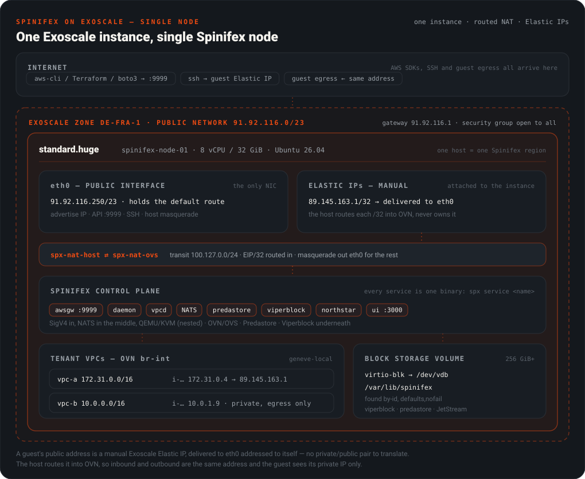
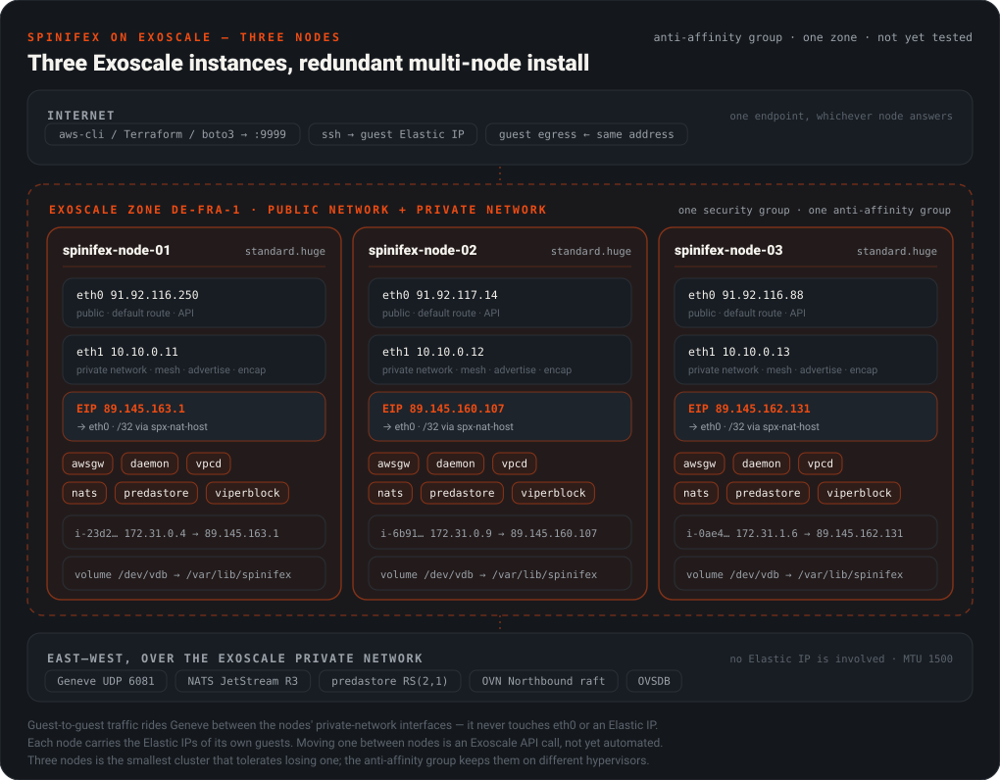

# Running Spinifex on Exoscale

> [!WARNING]
> **Work in progress.** This page is a draft template and is not published on docs.mulgadc.com. Do not add it to `scripts/docs-config.json` in `mulga-docs` until the [TODO](#todo) items are done.

> Run the AWS surface — EC2, EBS, S3, VPC — inside your own Exoscale organisation, with guests reachable on real Exoscale Elastic IPs.

## Table of Contents

- [Overview](#overview)
- [Support status](#support-status)
- [How it fits together](#how-it-fits-together)
- [What Exoscale changes](#what-exoscale-changes)
- [Deploying a single node](#deploying-a-single-node)
- [Verify end to end](#verify-end-to-end)
- [TODO](#todo)

---

## Overview

Spinifex brings core AWS services to bare-metal, edge and on-prem environments. A node runs QEMU/KVM for guests, OVN/Open vSwitch for VPC networking, [Predastore](https://github.com/mulgadc/predastore) for S3 and [Viperblock](https://github.com/mulgadc/viperblock) for EBS, all behind a SigV4 endpoint that the ordinary AWS SDKs and CLI talk to unmodified.

This guide runs that stack on [Exoscale](https://www.exoscale.com), a European cloud. It is the Exoscale counterpart of [Spinifex on Oracle Cloud](/docs/oci-integration), and it is shorter because Exoscale is simpler underneath: one network interface, and Elastic IPs that arrive addressed to themselves.

## Support status

**Proven on one single node, on 2026-09-28.** A `standard.huge` instance (8 vCPU / 32 GiB) in `de-fra-1`, Ubuntu 26.04, Spinifex `v1.20.0` from the release installer, routed NAT, one manual Elastic IP. An Ubuntu guest booted, was reachable over SSH on its Elastic IP from the internet, and its outbound traffic left from the same address.

Everything else is untested: multi-node, other zones, other instance types, GPU and bare metal. The three-node diagram below is the intended shape, not a proven one. See [TODO](#todo).

---

## How it fits together

### Single node — the whole AWS surface inside one Exoscale instance

One instance runs the control plane and every tenant guest. Customers reach the AWS APIs on the instance's own address, and their guests are reachable on Elastic IPs attached to the same instance.

<p align="center">
  
</p>

An Exoscale manual Elastic IP is delivered to `eth0` with the Elastic IP itself as the destination. There is no private half to translate, unlike OCI. Spinifex routes each `/32` from the host into OVN, so the guest keeps its private VPC address and `describe-instances` reports the Elastic IP as its public address.

All guest disks, S3 objects and JetStream state live under `/var/lib/spinifex`, which is an **Exoscale block storage volume**, not the root disk. Changing the instance type replaces the instance and its root disk, and the volume survives that.

### Three nodes — the same surface, distributed

> [!WARNING]
> **Not yet tested.** This is the intended topology.

Each node carries the Elastic IPs of its own guests on its own `eth0`. East–west traffic (Geneve, NATS, Predastore and the OVN raft) crosses an Exoscale **private network** on `eth1`, and an anti-affinity group keeps the three instances on different hypervisors.

<p align="center">
  
</p>

> [!NOTE]
> **The Spinifex region is your own naming.** `eu-central-1` in `spinifex.toml` beside `de-fra-1` at Exoscale is correct and expected.

---

## What Exoscale changes

| Property | What it means for Spinifex |
| --- | --- |
| **One NIC, one MAC.** An instance's public interface is not an Ethernet segment you can put other MACs on. | Use routed NAT (`--nat-uplink` / `--external-mode=nat`), which is what was proven. `pool` mode puts per-router MACs on the uplink and has not been tried. |
| **Manual Elastic IPs arrive addressed to themselves.** | The address pool is the list of Elastic IPs attached to the instance. The host never configures them on an interface. |
| **Elastic IPs are not contiguous.** | Today's static pool takes one `start-end` range, so a single node can hand out one Elastic IP. See [TODO](#todo). |
| **Elastic IPs are off-subnet.** | They sit outside the instance's `/23`, so the pool has no gateway of its own. Egress leaves through the host's default route. |
| **Security groups attach per instance.** | Open the group to everything. Guests are filtered by Spinifex VPC security groups in OVN, and the node by the Spinifex host firewall. |
| **The Ubuntu template has no host firewall.** | Arm the Spinifex host firewall **before** `spinifex.target` first starts. |
| **Nested virtualisation is not officially supported.** | It works on `standard.huge` (Intel, `kvm_intel nested=Y`). Check `/dev/kvm` before installing anything. |
| **Block storage is virtio-blk.** | The volume appears as `/dev/disk/by-id/virtio-<first 20 characters of the volume ID>`. |

### Sizing

| | Minimum | Recommended |
| --- | --- | --- |
| **Instance type** | `standard.huge` (8 vCPU / 32 GiB) | Larger `standard` or `memory` types. Bare metal is untested. |
| **Root disk** | 100 GiB | 100 GiB |
| **Data volume** | 256 GiB block storage volume | 1 TiB+ |
| **Elastic IPs** | 1 per guest that needs a public address | The organisation default quota is 5. Ask Exoscale for more. |

---

## Deploying a single node

### Step 1. Build the infrastructure

Create these in one zone. The walkthrough used `de-fra-1`.

| Resource | Detail |
| --- | --- |
| Compute instance | `standard.huge`, template `Linux Ubuntu 26.04 LTS 64-bit`, 100 GiB disk, your SSH key |
| Security group | Ingress open to all: TCP and UDP 1–65535, ICMP, ESP, AH, GRE and IPIP, from `0.0.0.0/0` |
| Block storage volume | 256 GiB or more, attached to the instance |
| Elastic IP | **Manual**, IPv4, attached to the instance |

Then confirm nested virtualisation before going further:

```bash
ls -l /dev/kvm && cat /sys/module/kvm_intel/parameters/nested   # must exist, and print Y
```

### Step 2. Mount the data volume at `/var/lib/spinifex`

```bash
VOL_ID=<volume UUID>
DEV=/dev/disk/by-id/virtio-${VOL_ID:0:20}

sudo blkid "$DEV" || sudo mkfs.ext4 -L spinifex-data "$DEV"   # format only if blank
sudo mkdir -p /var/lib/spinifex
echo "UUID=$(sudo blkid -o value -s UUID "$DEV") /var/lib/spinifex ext4 defaults,nofail,x-systemd.device-timeout=60s 0 2" \
  | sudo tee -a /etc/fstab
sudo mount /var/lib/spinifex && findmnt /var/lib/spinifex
```

Check with `findmnt`, not `ls`. A missing mount looks exactly like a working one until the root disk fills.

### Step 3. Install Spinifex and set up OVN

```bash
curl -sfL https://install.mulgadc.com | sudo bash
sudo /usr/local/share/spinifex/setup-ovn.sh --management --nat-uplink
```

### Step 4. Initialise

Replace `EIP` with your Elastic IP:

```bash
EIP=89.145.163.1
sudo spx admin init --node node1 --nodes 1 --region eu-central-1 --az eu-central-1a \
  --ipsec=false --external-mode=nat --external-source=static \
  --external-pool "$EIP-$EIP" --external-prefix-len 32
```

Then edit the public pool in `/etc/spinifex/spinifex.toml`, leaving the `nat-transit` pool alone. The pool must have **no** `gateway` line, and `gateway_ip` must be the instance's own address, so the Elastic IP is not reserved for the router:

```toml
[[network.external_pools]]
name        = "exo"
source      = "static"
range_start = "89.145.163.1"
range_end   = "89.145.163.1"
gateway_ip  = "91.92.116.250"   # the instance's eth0 address
prefix_len  = 32
```

> [!IMPORTANT]
> Both edits are needed on `v1.20.0`. With a `gateway`, every service refuses to start with `pool "wan" range [...] not inside <gateway>/32`. Without `gateway_ip`, the pool reserves its first address, and a one-address pool then fails every launch with `InsufficientAddressCapacity`. A pool is written to the cluster store the first time it is seen, so after a failed start rename it (`wan` → `exo`) rather than editing it in place.

### Step 5. Arm the firewall, then start

```bash
sudo env SETUP_STAGES=firewall /usr/local/share/spinifex/setup.sh --firewall on
sudo systemctl start spinifex.target
systemctl list-units 'spinifex-*' --no-pager
sudo nft list tables | grep spinifex_filter
```

Every `spinifex-*` service should be `active`.

---

## Verify end to end

On the node:

```bash
sudo spx admin images import --name ubuntu-26.04-x86_64 --config /etc/spinifex/spinifex.toml
export AWS_PROFILE=spinifex

aws ec2 import-key-pair --key-name demo --public-key-material fileb://~/.ssh/authorized_keys
SG=$(aws ec2 describe-security-groups --filters Name=group-name,Values=default \
  --query 'SecurityGroups[0].GroupId' --output text)
aws ec2 authorize-security-group-ingress --group-id "$SG" --protocol tcp --port 22 --cidr 0.0.0.0/0

AMI=$(aws ec2 describe-images --query 'Images[0].ImageId' --output text)
SUBNET=$(aws ec2 describe-subnets --query 'Subnets[0].SubnetId' --output text)
aws ec2 run-instances --image-id "$AMI" --instance-type t3.small --key-name demo \
  --subnet-id "$SUBNET" --query 'Instances[0].[InstanceId,PublicIpAddress]' --output text
```

From outside, with the matching private key:

```bash
ssh ubuntu@89.145.163.1 'curl -s ifconfig.me'   # prints 89.145.163.1
```

A login proves inbound delivery. The printed address proves the guest's egress leaves from its own Elastic IP.

---

## TODO

- **Elastic IPs.**
  - The static pool takes one contiguous range, but Elastic IPs are scattered, so today a node can hand out one. It needs either a static list of addresses or an Exoscale allocator (`source = "exoscale"`) that allocates, attaches and releases Elastic IPs through the Exoscale API, as the OCI integration does.
  - `spx admin init` should write a pool Exoscale can use, removing the manual edit in Step 4.
  - Moving an address with its guest between nodes needs the API allocator.
- **Block storage.**
  - Volumes back `/var/lib/spinifex` only. There is no native Exoscale block provider for EBS.
  - Guest disk performance on Exoscale volumes is not yet benchmarked.
  - The Terraform that builds the instance, volume, Elastic IPs and cloud-init mount is to be published under `scripts/terraform/`.
- **Multi-node.** Three nodes over an Exoscale private network, as in the diagram above, has not been tested. That includes the private network's 1500 MTU under Geneve.
- **Bare metal.** Test on Exoscale bare metal if it is available in a zone, which would remove the nested virtualisation dependency.
- **GPU.** Test Exoscale GPU instance types with GPU passthrough to guests.
