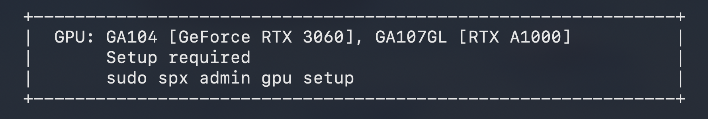
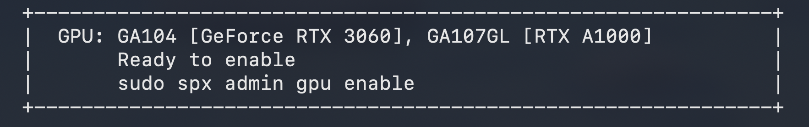
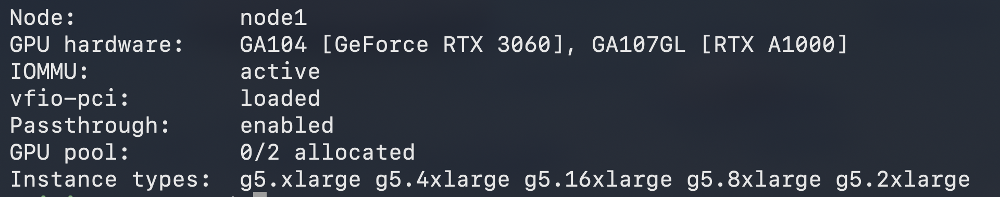

# Configuring GPU Passthrough for Spinifex Nodes


Spinifex is designed for bare-metal hardware, edge nodes and data-centre use. Follow this guide to configure your Spinifex node to enable GPU Passthrough to its VM instances if hardware is available.

>**Note:** this tutorial is for x86 architecture.


### Getting Started - GPU Setup
By default, Spinifex will probe for the presence of a GPU on its machine. After booting, the presence and availability of GPU hardware is printed in the info banner:


To enable GPU passthrough, you may first need to run:
```bash
sudo spx admin gpu setup
```
Note that this command will blacklist the GPU's drivers from the host machine such that they can be used by VM instances Therefore the GPU will **NOT** be available to the host machine until after the VM instance  It will also require rebooting the host machine before the changes take effect.

### Enable Passthrough
After reboot, the banner message should reflect that GPU passthrough is **ready** but not **enabled**.



This will require you to run:
```bash
sudo spx admin gpu enable
```
After running this command, you should see:



The host machine is now configured to provide GPU passthrough to EC2 instances on the host machine.

Lastly, import the Spinifex GPU enabled AMI: [link]

As a final check, spin up an EC2 instance, SSH into it, and check that the host machine's GPU is visible from the EC2 instance.

### Multiple GPUs
Spinifex is able to detect multiple GPUs. After running the setup commands, the total number of allocatable GPUs is printed.

### Mapping GPUs to EC2 instances
By defualt, any consumer grade GPUs are mapped to the g5 EC2 instance class, which is the most basic "Accelerated Computing" Ec2 instance provided by AWS. If using a consumer GPU, running:
```bash
aws ec2 describe-instance-types
```
will return the various sizes of g5 class. All other AWS "Accelerated Computing" EC2 instance classes map directly to their associated GPU, so the Spinifex host machine will need to have the specified GPU if a specific EC2 instance class is desired.
