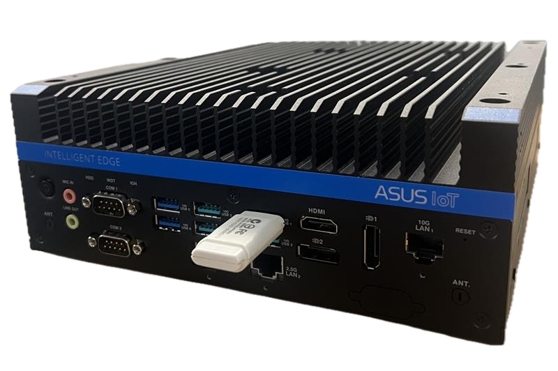
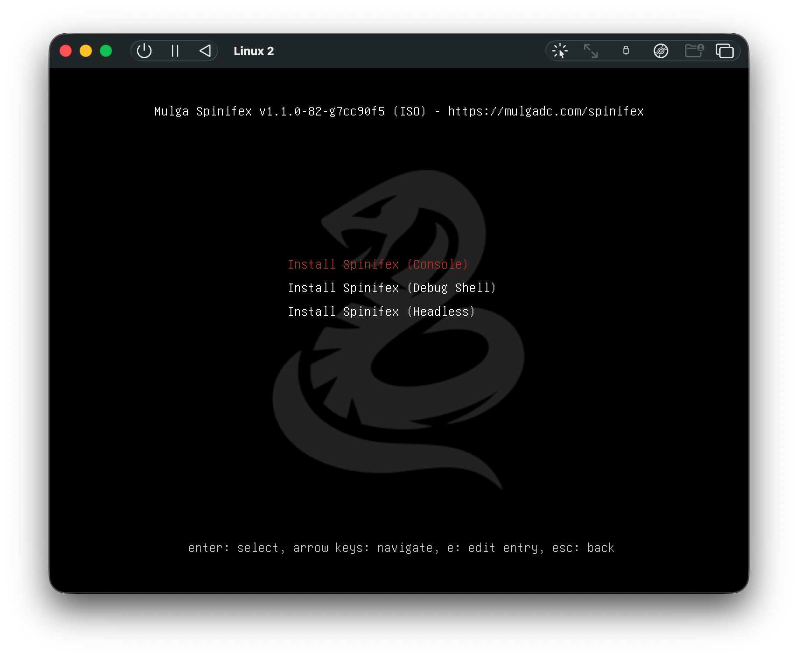
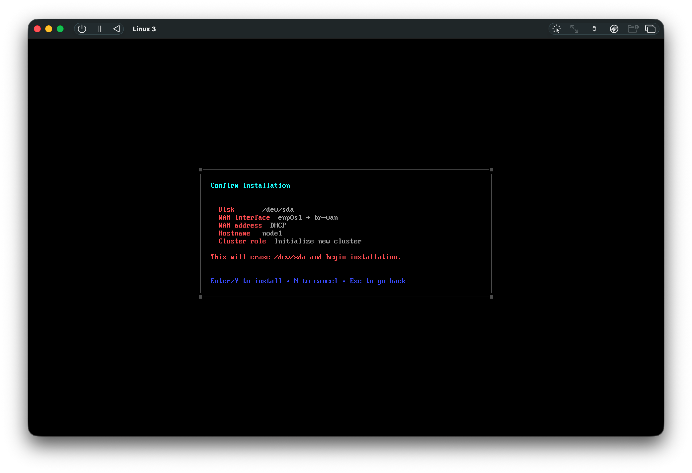

# Installing Spinifex from Bootable USB

Spinifex is designed for bare-metal hardware, edge nodes and data-centre use. Follow this guide to install Spinifex from a bootable USB using the Spinifex ISO.

>**Note:** this tutorial is for x86 architecture.

>**Also note:** This procedure COMPLETELY WIPES the target disk. For systems with multiple disks, ensure the correct one is targeted.

### Booting Media

For this tutorial, a USB drive with at least 8GB of memory is required.

>**Note:** Flashing the Spinifex ISO onto the USB completely wipes the USB, so ensure no important data is stored on the USB used.

### Balena Etcher installation

For this tutorial download Balena Etcher to simplify the ISO flash process.

* [Balena Etcher](https://etcher.balena.io)

## Download Spinifex ISO

Download the Spinifex ISO (x86)

* [Spinifex ISO](https://iso.mulgadc.com/spinifex.iso)

## Flash Media
Once installed, open Balena Etcher.
Select "Flash From Image," then select the downloaded spinifex.iso file.

Next, click "Select target" and choose the USB drive to be used as the boot media. Then click "Flash!"

Balena Etcher will now flash the USB drive with the spinifex.iso file. 

You can now safely eject the USB drive if it was not ejected automatically.

## Boot From USB drive
Insert your newly flashed USB drive into the target device and turn it on.

As it boots, quickly press the correct key for your device to bring up the BIOS/UEFI menu (commonly F2, F10, F12, ESC or DEL) (image) and change the boot order such that the flashed USB drive has first priority, then continue to boot.

If done succesfully, the Spinifex ISO GRUB menu will appear.

From this menu you can select which method of install is used (console recommended). Headless mode can be configured by mounting the USB on a host device after flashing and editing the grub.cfg file with the desired values.

## Setting up the Spinifex Node
In console mode, follow the installation prompts to set the required networking values for the Spinifex node.

The installer will default to the most sensible disk to install on depending on system configuration - ensure this default is correct before installation, as the process will wipe the disk.

For network configuration, it is recommended to use automatic IP (DHCP), but this can also be configured manually.

Network interfaces will be automatically detected. In the event that none are detected, the user can manually input the name of the network interface. In the event that multiple network interfaces are detected, the installer will prompt for WAN selection first, followed by LAN.

A hostname (eg node1) and admin password must be set, followed by the "cluster role" - whether the node is the first in a new cluster, or joining an already an existing one.

Once configuration is complete, a summary of the configuration will be shown.

The installer will then complete the installation of Spinifex onto the target device. Once complete, remove the USB drive from the device before automatic reboot.

Once the USB drive is removed, press enter or wait for the auto-reboot.

## Log In
The device will reboot and spend ~2-5 minutes configuring the Spinifex node. The user will then be prompted to log in. Use the following credentials for login:
* Login: spinifex
* Password: Set by user during installation

Both before and after login, a banner will be printed specifying important information, such as details for SSH into the node and accessing the web dashboard for further configuration of the node. 

## Setup Complete

**Congratulations! Spinifex is installed.**

Continue to [Setting Up Your Cluster](../getting-started/setting-up-your-cluster) to import an AMI, create a VPC, and launch your first instance.

## Troubleshooting

### Can't access BIOS/UEFI to change boot order
It can be difficult to get into the BIOS/UEFI - there is only a short window to press the correct key, and this key changes depending on the manufacturer. Search online for your device's BIOS/UEFI key, and press it rapidly as the device boots.

### GRUB Menu not appearing
Once in the BIOS/UEFI menu, ensure the correct boot order is set. First boot priority should be set to the USB drive flashed with the ISO - if the USB doesn't appear in the BIOS/UEFI menu, ensure it has been flashed with the ISO correctly. Take note of the name and storage capacity of the USB when flashing, as this should match what appears in the BIOS/UEFI.

### Networking Issues
* For a Spinifex node to be properly provisioned, the target device must have at least one NIC.

* Spinifex uses DHCP to assign instances within a node their public IP addresses, so

Instead of a static range, public IPs come from the upstream router's DHCP
server. When a VM launches, Spinifex requests a DHCP lease from the router
on behalf of the VM. When the VM terminates, the lease is released.

The VM itself never talks to the router's DHCP — it only sees its private
VPC IP (from OVN's internal DHCP). The host-side DHCP conversation is
invisible to the guest.

**Use when:** You don't control a static IP block but the router's DHCP
server has enough leases. Homelabs where you don't want to carve out a range.
Environments where IPs are managed centrally by the network team's DHCP

For further troubleshooting suggestions, refer to the [VPC networking](../compute/vpc-networking) guide.
