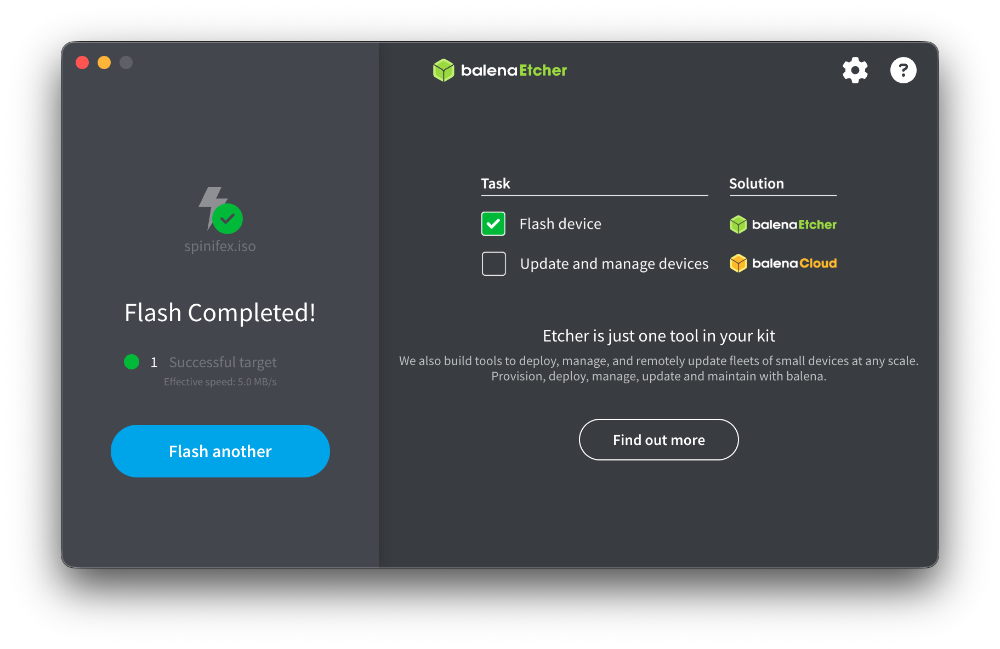
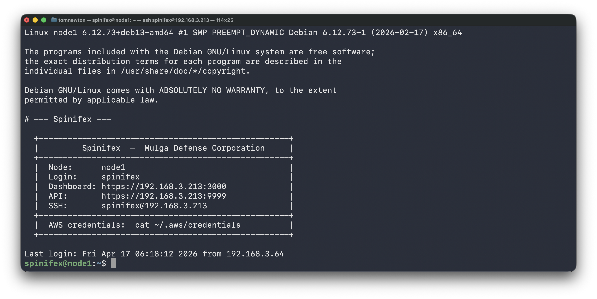

# Installing Spinifex from Bootable USB

Spinifex is designed for bare-metal hardware, edge nodes and data-centre use. Follow this guide to install Spinifex from a bootbale USB using the Spinifex ISO.

Note this tutorial is for x86 architecture.
Also note, this procedure COMPLETELY WIPES the target disk. For systems with multiple disks, ensure the correct one is targeted.

## Booting Media

For this tutorial, a USB drive with at least 8GB of memory is required. Note that burning the Spinifex ISO onto the USB completely wipes the USB, so ensure no important data is stored on the USB used.

## Balena Etcher installation

For this tutorial download Balena Etcher to simplify the ISO burning process.

* [Balena Etcher](https://etcher.balena.io)

## Download Spinifex ISO

Next, download the Spinifex ISO (x86)

* [Spinifex ISO](cloudflare link here)

## Flash Media
Once installed, open Balena Etcher.
(etcher image)
Select "Flash From Image," then select the downloaded spinifex.iso file (it should be in your Downloads folder).

Next, click "Select target" and choose the USB drive to be used as the boot media. Then click "Flash!"

Balena Etcher will now flash the USB drive with the spinifex.iso file. If completed successfully, it will look like this: 

You can now safely eject the USB drive if it was not ejected automatically.

## Boot From USB drive
Insert your newly flashed USB drive into the target device and turn it on. As it boots, quickly press the correct key for your device to bring up the BIOS/UEFI menu (commonly F2, F10, F12, ESC or DEL) (image) and change the boot order such that the flashed USB drive has first priority, then continue to boot.

If done succesfully, the Spinifex ISO GRUB menu will appear. From this menu you can select which method of install is used (console recommended). Headless mode can be configured by mounting the USB on a host device after flashing and editing the grub.cfg file with the desired values.

## Setting up the Spinifex Node
In console mode, follow the installation prompts to set the required networking values for the Spinifex node. We recommend using automatic IP (DHCP) but this can also be configured manually. Set a hostname (eg node1) and admin password.

The installer will then complete the installation of Spinifex onto the target device. Once complete, you will be prompted to remove the USB drive from the device before automatic reboot.

Once the USB drive is removed, press enter or wait for the auto-reboot.

## Log In
The device will reboot and spend ~2-5 minutes configuring the Spinifex node. The user will then be prompted to log in. Use the following credentials for login:
* Login: spinifex
* Password: Set by user during installation

Both before and after login, a banner will be printed specifying important info, such as details for SSHing into the node and accessing the web UI for further configuration of the node. 

## Setup Complete

Congratulations! You have now configured your device to operate as a Spinifex node!
