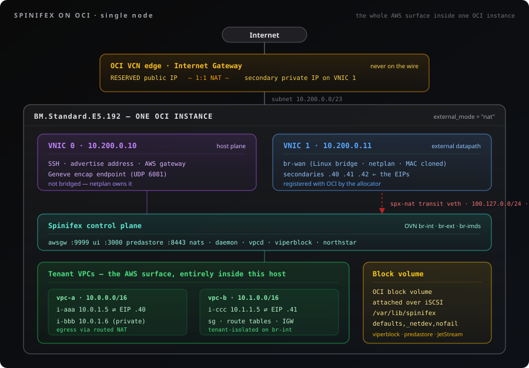
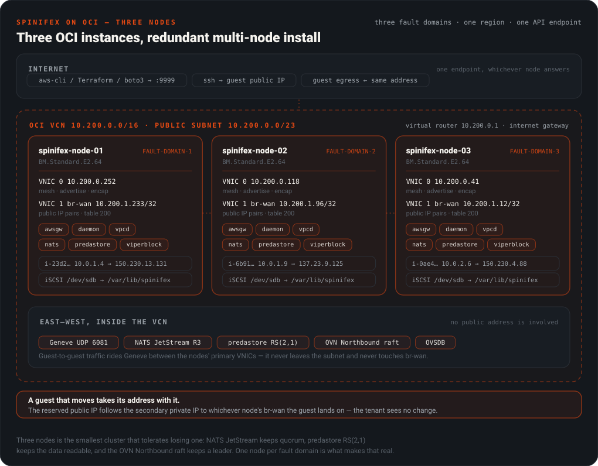

# Running Spinifex on Oracle Cloud Infrastructure

> Run the AWS surface — EC2, EBS, S3, VPC — inside your own OCI tenancy, with guests that get real, publicly reachable addresses through OCI's API.

## Table of Contents

- [Overview](#overview)
- [Why run Spinifex on OCI](#why-run-spinifex-on-oci)
- [What OCI changes](#what-oci-changes)
- [How it fits together](#how-it-fits-together)
- [Prerequisites](#prerequisites)
- [Deploying](#deploying)
  - [Step 1. Set your Terraform inputs](#step-1-set-your-terraform-inputs)
  - [Step 2. Build the infrastructure](#step-2-build-the-infrastructure)
  - [Step 3. Install Spinifex and set up OVN](#step-3-install-spinifex-and-set-up-ovn)
  - [Step 4. Form the cluster](#step-4-form-the-cluster)
  - [Step 5. Configure Spinifex for OCI, start and verify](#step-5-configure-spinifex-for-oci-start-and-verify)
  - [Step 6. Set up your cluster](#step-6-set-up-your-cluster)
  - [Step 7. Run your existing Terraform against the cluster](#step-7-run-your-existing-terraform-against-the-cluster)
  - [Step 8. Oracle Linux as a guest image](#step-8-oracle-linux-as-a-guest-image)
- [Verify end to end](#verify-end-to-end)
- [Troubleshooting](#troubleshooting)
- [Limits in this version](#limits-in-this-version)

---

## Overview

Spinifex is an open-source infrastructure platform that brings core AWS services to bare-metal, edge and on-prem environments. A node runs the Spinifex daemon and CLI, QEMU/KVM for guests, OVN/Open vSwitch for VPC networking, [Predastore](https://github.com/mulgadc/predastore) for S3-compatible object storage and [Viperblock](https://github.com/mulgadc/viperblock) for EBS-compatible block storage — and serves them all behind a SigV4 endpoint that the ordinary AWS SDKs and CLI talk to unmodified.

This guide runs that same stack on Oracle Cloud Infrastructure. Everything in [Single-Node Install](/docs/install) and [Multi-Node Install](/docs/install-multi-node) still applies: one node is a working install, three is the minimum for a cluster that can lose a node, and formation, storage and OVN behave exactly as they do on hardware you own. What changes is the layer underneath — an OCI VCN is not an Ethernet segment, so the external datapath is wired differently, and public addresses come from OCI's API rather than from a range you write in a config file.

**Read this guide end to end and you have a working cluster.** [Deploying](#deploying) is one sequence of seven steps, from an empty compartment to a node that can launch an instance with a publicly reachable address. It builds the infrastructure with Terraform, then installs and forms Spinifex the same way [Single-Node Install](/docs/install) and [Multi-Node Install](/docs/install-multi-node) do — those steps are inlined here, so you do not need to read three documents at once. The only choice to make is one node or three, and it is one line in Step 1.

Every command and every output below was run against a live OCI tenancy, on both paths.

## Why run Spinifex on OCI

**Lower cost for the same shape of workload.** OCI's compute and block storage are priced well below the large US clouds for equivalent OCPU and IOPS, and Spinifex turns one large instance into a whole EC2/EBS/S3 surface — so a tenant's twenty small instances are twenty QEMU guests on hardware you are billed for once, not twenty billable cloud instances.

**Egress stops being the line item that decides the architecture.** Oracle publishes a large monthly outbound-transfer allowance per tenancy and a per-GB rate beyond it that is roughly an order of magnitude below the majors — check the current pricing page rather than a number in a document, but the gap is the reason this integration exists. Traffic *between* guests never leaves the host or, on a cluster, never leaves the VCN: it is Geneve over the private plane, which is not billed as internet egress at all.

**Portability — the workload stops being AWS-shaped and starts being yours.** The API your tenants code against is Spinifex's, so the same Terraform, the same SDK calls and the same AMIs run on OCI today, on bare metal in your own rack tomorrow, and at an edge site after that. Moving off AWS becomes a deployment decision rather than a rewrite, and moving *again* costs nothing extra.

**You keep the parts of OCI that are worth keeping.** Bare-metal shapes, fault domains, block volumes with a chosen performance tier, and real public addresses out of OCI's own pool. Spinifex does not hide the cloud underneath it — it registers each guest's address with OCI so that guest is genuinely reachable on the internet, not behind a shared NAT.

## What OCI changes

> [!IMPORTANT]
> **Read this section before you provision anything.** OCI enforces addressing inside its virtual network in a way that makes one of Spinifex's three external modes unusable, and the choice is baked in at `spx admin init`. Getting it wrong produces a cluster that looks entirely healthy and drops every guest packet.

Three properties of an OCI virtual network shape everything below.

**OCI enforces the source IP per VNIC.** A packet leaving the instance with a source address that is not a registered private-IP object on that VNIC is dropped by the hypervisor. Measured, not inferred: from the same NIC with the same MAC, `ping -I <registered> 8.8.8.8` gets 0% loss and `ping -I <unregistered> 8.8.8.8` gets 100%. So an external address pool cannot be a range you write in a config file — **every address has to be registered with OCI before it works**, and registering it is exactly what this integration does.

> Pinging the VCN router (`10.200.0.1`) proves nothing. It answers from any source address at ~0.08 ms because the hypervisor replies locally. Always test egress past the subnet.

**A VNIC accepts one MAC; it does not learn MACs.** Every inbound frame arrives addressed to the VNIC's own MAC, whatever address the packet is for. Spinifex's default external datapath advertises each address by ARPing from a per-VPC router MAC onto a shared L2 segment, which needs a segment that learns MACs. OCI has none. Enforcement sits in the hypervisor on VM shapes and in the SmartNIC on bare metal, so there is no guest-side workaround.

**A public IP is a second object, and it never appears on the wire.** An OCI public address is a RESERVED public IP that OCI 1:1-NATs upstream onto a **secondary private IP** on the VNIC. The instance only ever sees the private half. Spinifex handles this internally — AWS-facing APIs report the public address, the datapath uses the private one — but it explains why `ip addr` on the host never shows a customer's public IP, and why that is correct rather than a fault.

### The consequence: routed mode is mandatory

| External mode | What goes on the uplink | On OCI |
| --- | --- | --- |
| `pool` (`UplinkModePhysical`, `UplinkModeVeth`) | Per-VPC gateway MAC plus a per-rule external MAC, ARPed onto the segment | **Does not work.** Egress is dropped (wrong source MAC); ingress never reaches OVN (the frame is addressed to the VNIC MAC, which no router port owns). |
| `nat` (`UplinkModeRouted`) | Nothing. The host forwards over an RFC 6598 transit veth and sets no external MAC | **Works.** One MAC identity, and registered source addresses. |

Spinifex **refuses** `source = "oci"` on a pool unless the node is in `nat` mode, and the refusal names this reason. See [VPC Networking → External modes](/docs/vpc-networking) for what each mode does off OCI.

### Sizing

**Bare metal is the recommendation.** `BM.Standard.E2.64` or similar gives you the hardware directly — no nested virtualisation, full NIC performance, and no hypervisor between your guests and the wire.

| | Minimum | Recommended |
| --- | --- | --- |
| **Shape** | `VM.Standard.E6.Flex` | Bare metal, e.g. `BM.Standard.E2.64` |
| **OCPU** | 8 (16 vCPU) | 32+ |
| **RAM** | 32 GB | 128 GB+ |
| **Data volume** | 256 GiB block volume | 1 TB+ NVMe-backed |
| **VNICs** | 2 | 2 |
| **Nodes** | 1 | 3 — see [Cluster sizing](/docs/install-multi-node#cluster-sizing) |

**Verify nested virtualisation before anything else on a VM shape.** Oracle's nested-KVM guidance names `VM.Standard3.Flex` (Intel) and `VM.Standard.E5.Flex` (AMD), and states Ampere shapes do not support it. `VM.Standard.E6.Flex` is **not** in that list but was measured working on 2026-09-24 (EPYC 9J45, `/dev/kvm` present, `svm` on all threads, `kvm_amd nested=1`). Treat an unlisted shape as unproven until you have checked:

```bash
# If /dev/kvm is absent, stop — change shape, do not continue.
ls -l /dev/kvm
grep -oE 'vmx|svm' /proc/cpuinfo | sort -u
cat /sys/module/kvm_amd/parameters/nested 2>/dev/null \
  || cat /sys/module/kvm_intel/parameters/nested
```

**OCI has no Debian image.** Ubuntu LTS is the tested path — Ubuntu 26.04 LTS on kernel `7.0.0-1009-oracle` is what this integration was built and proven against. Anything in the tooling that assumes Debian is a known gap, not a supported configuration.

---

## How it fits together

### Single node — the whole AWS surface inside one OCI instance

One bare-metal instance runs the control plane and every tenant guest. Customers reach the AWS APIs on the node's own address; their instances reach the internet through addresses registered on the node's second VNIC.

<p align="center">
  
</p>

Two things in that picture are the whole integration. The guest's private address (`10.0.1.4`) never leaves the host — OVN and the host route both hold it. The address OCI delivers to is a **secondary private IP registered on VNIC 1**, appearing on `br-wan`, and the customer's public address (`150.230.13.131`) is a reserved public IP that OCI 1:1-NATs onto it upstream. `describe-instances` reports the public one; every datapath object holds the private one, which is why the two never appear together on the host.

The third is storage. Every guest disk, every S3 object and the JetStream state all live under `/var/lib/spinifex`, which is an **OCI block volume attached over iSCSI**, not the boot disk. Size it for the guests you intend to run; a boot volume that quietly ends up carrying the stack is the most common way an install on OCI fails later rather than immediately.

### Three nodes — the same surface, distributed

Each node registers the addresses for **its own** guests on **its own** second VNIC, and the allocator runs per node, so nothing has to know another node's OCIDs. When a guest moves — a stop/start that lands elsewhere, or a host failure — the node it lands on claims the address's private half from the old VNIC through a single OCI call. The OCID and the public half are untouched, so the customer's address never changes.

<p align="center">
  
</p>

The overlay, the object shards and the OVN databases all cross **VNIC 0**, inside the VCN. Size that plane, not the external one: guest-to-guest traffic between nodes is Geneve over the VCN, and it is the link every distributed layer shares.

> [!NOTE]
> **The Spinifex region is your own naming and has nothing to do with the OCI region.** `ap-southeast-2` in `spinifex.toml` beside `ap-sydney-1` in OCI is correct and expected. Do not read one as evidence about the other.

---

## Prerequisites

Both paths need the same three things: an OCI compartment you can write to, an API key for Spinifex to allocate addresses with, and enough quota to hand out the addresses you plan to use.

### Credentials — v1 uses an operator-provisioned API key

**Instance principal is the better design and is not what v1 uses.** The instance certificate is served at `/opc/v2/identity/cert.pem` and the Go SDK can authenticate as the instance with no key material on disk — but it still needs a dynamic group and a policy authorising it, and on the reference tenancy it authenticated without being authorised for anything. **v1 requires an operator-provisioned API key**, deliberately, to keep the setup a single documented path.

```bash
# On your workstation, not the node.
openssl genrsa -out ~/.oci/oci_api_key.pem 2048
chmod 600 ~/.oci/oci_api_key.pem
openssl rsa -pubout -in ~/.oci/oci_api_key.pem -out ~/.oci/oci_api_key_public.pem
openssl rsa -pubout -outform DER -in ~/.oci/oci_api_key.pem \
  | openssl md5 -c        # this is the fingerprint
```

Upload the public key to the user under **Identity → Users → API Keys**, and record the user OCID, the fingerprint and the tenancy OCID.

### The IAM policy

Spinifex calls exactly nine operations. Grant no more than these:

| Operation | Why |
| --- | --- |
| `CreatePrivateIp` | Register the secondary private IP the datapath carries |
| `DeletePrivateIp` | Release it |
| `GetPrivateIp` | Poll for `AVAILABLE` after an asynchronous assign |
| `ListPrivateIps` | The startup reconcile, and the affinity pass that moves an address between nodes |
| `UpdatePrivateIp` | Reassign a private IP to this node's VNIC when a guest moves here |
| `CreatePublicIp` | Create the RESERVED public IP |
| `DeletePublicIp` | Release it |
| `GetPublicIp` / `GetPublicIpByPrivateIpId` | Poll lifecycle state, and reconcile a private IP back to its public half |
| `UpdatePublicIp` | Attach and detach the public IP from a private IP |

The matching policy, scoped to the one compartment Spinifex allocates in:

```text
Allow group SpinifexOperators to manage private-ips in compartment <compartment-name>
Allow group SpinifexOperators to manage public-ips  in compartment <compartment-name>
Allow group SpinifexOperators to read   vnics       in compartment <compartment-name>
Allow group SpinifexOperators to read   subnets     in compartment <compartment-name>
Allow group SpinifexOperators to read   vcns        in compartment <compartment-name>
```

**Scope it to a compartment, not the tenancy.** `manage public-ips` at tenancy level lets a compromised node consume the whole regional reserved-public-IP quota.

**Do not grant `manage instances` or `manage vnics`.** Spinifex never creates, attaches or deletes a VNIC — it only adds addresses to a VNIC that already exists. A grant that allows VNIC lifecycle is strictly more than the integration can use.

### Quotas to check before you size a deployment

Two limits bound how many public addresses a deployment can hand out, and they do not scale the same way:

| Quota | Default | Scope | Notes |
| --- | --- | --- | --- |
| **Reserved public IPs** | 50 | Per region, whole tenancy | Shared by every node, so it does **not** grow with node count. This is the wall you hit first. |
| **Secondary private IPs per VNIC** | 64 | Per VNIC, so per node | Not raisable. Three nodes gives you 192 — this is the limit that does scale. |

A raise on the first is a support request, not a setting: Console → Governance & Administration → Limits, Quotas and Usage → "Request a service limit increase". Cite the exact limit name from `oci limits definition list`, not a name from documentation.

```bash
oci limits definition list --service-name vcn --compartment-id <tenancy-ocid>
oci limits value list       --service-name vcn --compartment-id <tenancy-ocid>
oci limits resource-availability get --service-name vcn \
    --limit-name <name-from-above> --compartment-id <tenancy-ocid>
```

**These calls need a grant the node does not have, and must not be given.** Limits and usage are tenancy-level, which cannot be compartment-scoped the way the policy above insists the node's is. Create a **second, read-only principal** for an operator or a reporting job and keep it off every node:

```text
Allow group SpinifexReporting to read limits        in tenancy
Allow group SpinifexReporting to read usage-reports in tenancy
```

The second verb is what Cost Analysis and `oci usage-api usage-summary request-summarized-usages` read. Adding either to `SpinifexOperators` would hand every node tenancy-wide read, which is exactly what the node policy refuses.

### The `oci` CLI

**The `oci` CLI is not on the Ubuntu image**, and `apt` has no `python3-oci-cli` package. Install it into a virtualenv on your workstation, and on the node if you want to inspect allocations there:

```bash
sudo apt-get update && sudo apt-get install -y python3-venv
python3 -m venv ~/.oci-cli-venv
~/.oci-cli-venv/bin/pip install --upgrade pip oci-cli
sudo ln -sf ~/.oci-cli-venv/bin/oci /usr/local/bin/oci
oci --version
```

**What the CLI is and is not for.** Spinifex's daemon uses the OCI **Go SDK** for every allocation — the CLI is not on that path. You need it for bootstrap and for operational inspection. Do not build automation that shells out to it during an allocation; allocations run inside a request budget that a forked Python process will not respect.

---

## Deploying

**Terraform builds the infrastructure; the standard Spinifex installer builds the node.** That split is deliberate — formation on OCI is the same path prod and bare metal take, and diverging it for one cloud would mean two formation paths to keep correct.

There is one sequence of seven steps below, and the only thing that differs between a single node and a cluster is `node_count` in Step 1 and which variant of Steps 4 and 5 you follow. Decide now:

| | Single node | Three nodes |
| --- | --- | --- |
| **`node_count`** | `1` | `3` |
| **Survives losing a node** | No | Yes — NATS keeps quorum, predastore RS(2,1) keeps the data readable, the OVN raft keeps a leader |
| **Public addresses available** | 64 — the per-VNIC secondary private IP limit | 192, three VNICs' worth, still bounded by the regional reserved-public-IP quota |
| **Fault domains** | One | Three, one per node, chosen by Terraform |
| **Use it for** | Evaluation, a lab, an edge site with one box | Anything you would be unhappy to lose |

Two is not an option worth taking: it doubles the cost of a single node and gives you a cluster that cannot form a quorum. See [Cluster sizing](/docs/install-multi-node#cluster-sizing).

The configuration lives in [`scripts/terraform/oci-spx`](../../scripts/terraform/oci-spx/README.md), which has the resource-by-resource architecture.

### What Terraform builds, per node

| Resource | Detail |
| --- | --- |
| `oci_core_instance` | One per `node_count`, round-robined across **fault domains** so three nodes land on three sets of racks rather than wherever placement puts them |
| Primary VNIC | Public IP, `hostname_label`, the host plane — SSH, the advertise address, the Geneve endpoint |
| `oci_core_vnic_attachment` | A **second VNIC** in the same subnet. Every Spinifex external address becomes a secondary private IP here at runtime |
| `oci_core_volume` | A block volume per node, `data_volume_size_in_gbs` at `data_volume_vpus_per_gb` |
| `oci_core_volume_attachment` | **`attachment_type = "iscsi"`**, with the Oracle Cloud Agent's Block Volume Management plugin enabled so the node logs the iSCSI session in itself |
| cloud-init | Partitions, formats, mounts and `fstab`s the volume; builds `br-wan` over the second VNIC; opens the service ports |

**The data volume is iSCSI, and that is the detail that bites.** OCI presents the volume as an iSCSI target reachable at `169.254.2.2:3260` — attaching it in the API does not put a block device on the host. `is_agent_auto_iscsi_login_enabled` makes the Oracle Cloud Agent do the login, and because it does that *asynchronously*, the device is not there when cloud-init first runs. The mount script waits up to ten minutes for it, formats it **only if `blkid` reports no filesystem** (so a re-run cannot erase a populated volume), and writes an fstab entry by UUID:

```text
UUID=<uuid>  /var/lib/spinifex  ext4  defaults,_netdev,nofail  0 2
```

`_netdev` is what orders the mount after the network, and therefore after `iscsid` has a session. `nofail` is what keeps a missing volume from wedging the boot. Mounting `/var/lib/spinifex` *itself* rather than somewhere else and symlinking is deliberate: viperblock, predastore and JetStream all land on the volume with no configuration pointing anywhere unusual.

---

## Step 1. Set your Terraform inputs

Prerequisites: Terraform, Python 3, OCI credentials in `~/.oci/config`, and an SSH public key. The Python helper builds and uses the configuration's own `.venv`.

```bash
cd scripts/terraform/oci-spx
cat > terraform.auto.tfvars <<'EOF'
compartment_ocid            = "ocid1.compartment.oc1..aaaa..."
deployment_name             = "spinifex"

# Shape and size. Bare metal is preferred; a flex VM is what the quota allows.
compute_shape               = "VM.Standard.E6.Flex"
compute_ocpus               = 8          # OCI counts an OCPU as a full core
compute_memory_in_gbs       = 32

# 1 for a single node, 3 for a cluster. This is the only line that chooses.
node_count                  = 3

# The block volume behind /var/lib/spinifex, attached over iSCSI.
data_volume_size_in_gbs     = 256
data_volume_vpus_per_gb     = 120        # 120 = Ultra High Performance

node_client_cidr_allow_list = ["203.0.113.10/32"]
EOF
```

The variables worth knowing, all of which have defaults that build a working single node:

| Variable | Default | What it decides |
| --- | --- | --- |
| `compartment_ocid` | — | **Required.** An OCID, not a name: this deploys into a compartment that already exists, because creating one needs tenancy-root rights the API user must not have |
| `deployment_name` | `spinifex` | Prefixes every resource and becomes the VCN `dns_label`, so 1–15 lowercase alphanumerics starting with a letter |
| `node_count` | `1` | Nodes, 1–25. `1` for a single node, `3` for a cluster. Each gets its own volume, its own second VNIC and its own fault domain |
| `compute_shape` | `VM.Standard.E6.Flex` | **`BM.*` for bare metal, `VM.*.Flex` for a VM.** A fixed bare-metal shape carries its own size, so `shape_config` is emitted only when the name contains `Flex` — set a BM shape and the two sizing variables below are ignored rather than rejected |
| `compute_ocpus` | `8` | OCPUs on a flex shape. Validated at ≥ 8 (16 vCPU), the minimum recommended for a node |
| `compute_memory_in_gbs` | `32` | GiB on a flex shape. Validated at ≥ 32 |
| `data_volume_size_in_gbs` | `256` | Size of each node's data volume. This is where guest disks, S3 objects and JetStream live — size it for the guests, not for the control plane |
| `data_volume_vpus_per_gb` | `120` | Performance tier, 0–120 VPUs/GB. 120 is Ultra High Performance; 10 is Balanced. Higher is more IOPS and more cost |
| `data_mountpoint` | `/var/lib/spinifex` | Where cloud-init mounts it. Change only if you know why |
| `vcn_cidr` | `10.200.0.0/22` | VCN address space. A `/22` leaves room for the secondary private IPs Spinifex registers per node |
| `public_subnet_cidr` | `10.200.0.0/23` | The subnet every node sits in, **on both VNICs**. Nodes serve the UI, the S3 gate and the AWS gateway directly, so they cannot live in a private subnet |
| `node_client_cidr_allow_list` | `["0.0.0.0/0"]` | Who may reach SSH and the service ports from the internet. **Change this** |
| `node_service_ports` | `[3000, 8443, 9999]` | Console, predastore gate, AWS gateway. SSH is opened separately |
| `ubuntu_version` | `26.04` | Canonical platform image version. The newest image for the shape and region is resolved at plan time rather than pinned to a regional OCID |
| `wan_bridge_name` | `br-wan` | The Linux bridge built over the second VNIC |
| `wan_bridge_mtu` | `9000` | The OCI VCN carries 9000 |

> [!WARNING]
> **`node_client_cidr_allow_list` defaults to `0.0.0.0/0`.** Nodes sit in a public subnet with public addresses because they serve the UI, the S3 gate and the AWS gateway directly — there is no bastion. Restrict this before any real use.

> [!NOTE]
> **Bare metal changes nothing else in this document.** Set `compute_shape = "BM.Standard.E2.64"` and the same config builds it: the two flex sizing variables stop applying, the shape's own CPU and memory take over, and every other step — the volume, the second VNIC, `br-wan`, the install — is identical. Nested virtualisation stops being a question, because there is no nesting.

## Step 2. Build the infrastructure

```bash
KEY=~/.ssh/oci-spx.pub
python3 scripts/oci_env.py --ssh-public-key-path "$KEY" -- terraform init
python3 scripts/oci_env.py --ssh-public-key-path "$KEY" -- terraform plan -out=oci-spx.tfplan
```

Read the saved plan, then apply **that exact plan** rather than re-planning:

```bash
python3 scripts/oci_env.py --ssh-public-key-path "$KEY" -- terraform apply oci-spx.tfplan
```

**The apply ends with the addresses you need for every remaining step.** With `node_count = 3` it prints twenty-two resources and this:

```text
Apply complete! Resources: 22 added, 0 changed, 0 destroyed.

Outputs:

compartment_name = "mulgadc"
compartment_ocid = "ocid1.compartment.oc1..aaaaaaaa6nkk...ztta"
hosts_file = <<EOT
192.9.186.97
137.23.20.12
192.9.162.14
EOT
nodes = [
  {
    "fault_domain" = "FAULT-DOMAIN-1"
    "name" = "spinifex-node-01"
    "private_ip" = "10.200.1.249"
    "public_ip" = "192.9.186.97"
  },
  {
    "fault_domain" = "FAULT-DOMAIN-2"
    "name" = "spinifex-node-02"
    "private_ip" = "10.200.0.201"
    "public_ip" = "137.23.20.12"
  },
  {
    "fault_domain" = "FAULT-DOMAIN-3"
    "name" = "spinifex-node-03"
    "private_ip" = "10.200.1.79"
    "public_ip" = "192.9.162.14"
  },
]
subnet_ocids = {
  "private" = "ocid1.subnet.oc1.ap-sydney-1.aaaaaaaayqu4...ssgq"
  "public"  = "ocid1.subnet.oc1.ap-sydney-1.aaaaaaaagptz...tefq"
}
vcn_ocid = "ocid1.vcn.oc1.ap-sydney-1.amaaaaaa6eq5...4mcq"
```

With `node_count = 1` it is fourteen resources and one entry:

```text
Apply complete! Resources: 14 added, 0 changed, 0 destroyed.

nodes = [
  {
    "fault_domain" = "FAULT-DOMAIN-1"
    "name" = "spinifex-node-01"
    "private_ip" = "10.200.0.252"
    "public_ip" = "161.33.226.245"
  },
]
hosts_file = "161.33.226.245"
```

Read `nodes` twice, because the two addresses in each entry are used for different things and confusing them wastes an afternoon:

- **`public_ip`** is how *you* reach the node — SSH, the console on `:3000`, the AWS gateway on `:9999`. It is on the primary VNIC and Terraform assigned it.
- **`private_ip`** is what goes in `--bind`, `--cluster-bind`, `--encap-ip` and `--db-cluster-*-addr` in Steps 4 and 5. **Every cluster flag takes the private address**, because the mesh runs inside the VCN and never over the public one.
- **`fault_domain`** is not cosmetic. Three nodes in three fault domains is what makes a three-node cluster survive a rack, and it is chosen here, not later.

`terraform output` reprints all of this at any time, and `terraform output -json nodes` is the machine-readable form.

> [!WARNING]
> Never commit the state file, a plan file, or key material. `.gitignore` covers `terraform.tfstate*`, `*.tfplan`, `*.auto.tfvars`, `terraform.tfvars` and `*.pem`.

## Step 3. Install Spinifex and set up OVN

Spinifex installs the same way here as anywhere else. Run this **on every node**:

```bash
curl -fsSL https://install.mulgadc.com | bash
```

That puts the binary, the systemd units and the helper scripts in place and starts nothing. Then wire OVN, which is where the single-node and multi-node paths differ.

Two flags are the same on every node and on both paths, and both are decisions you cannot change afterwards without re-doing this step:

- **`--management` is load bearing.** Omitting it takes the compute-node branch, which stops *and disables* `ovn-central` — silently, leaving a node with no record of what it was meant to be.
- **`--nat-uplink`, not `--wan-bridge=br-wan`.** The two are mutually exclusive, and only `--nat-uplink` creates the `spx-nat` transit veth that routed mode runs on. `--wan-bridge` takes the veth-to-`br-ext` branch and deletes `spx-nat` on the way, after which `host.Routed.EnsureUplinkPort` refuses with *"not on OVS — run setup-ovn.sh --nat-uplink"*.

**That does not make `br-wan` redundant.** It is still doing two jobs, neither of which involves OVS:

1. It **names the VNIC** for the OCI allocator. `oci_vnic_iface = "br-wan"` in Step 6's pool config is resolved to a VNIC OCID **by MAC**, on the node it runs on — which is what lets one identical config file be correct on all three nodes.
2. It **holds the addresses.** Every external address Spinifex registers becomes a secondary private IP on that VNIC, appears on `br-wan`, and gets its own source-routing rule into table 200. The guests' own traffic reaches it through `spx-nat` and the host's `spinifex-nat-egress` masquerade.

So a correct OCI node has `br-wan` as a **Linux** bridge with no OVS port at all, and `br-ext` as an OVS bridge whose ports are `spx-nat-ovs` and the patch to `br-int`. That asymmetry is the design, not a half-finished install.

> If you suspect an OVS problem on this host, read `ovs-vsctl --columns=name,error list Interface` and the vswitchd log. **Never trust `ovs-vsctl`'s exit status** — it exits 0 even when the datapath rejected the device.

### Single node

```bash
sudo /usr/local/share/spinifex/setup-ovn.sh --management --nat-uplink
```

### Three nodes

Servers 1 to 3 run a clustered **OVN database**, so VPC networking survives losing any one of them. **Node 1 creates the cluster and must finish first**; nodes 2 and 3 then join it. `--recreate-db` appears in all three because `ovn-central` starts a standalone database when the package installs, and a clustered one can only be created from scratch.

Every address below is a **private** IP from the Terraform `nodes` output.

```bash
# Run on every node, with the values from your own apply.
export SPINIFEX_NODE1=10.200.1.249
export SPINIFEX_NODE2=10.200.0.201
export SPINIFEX_NODE3=10.200.1.79
export SPINIFEX_OVN_REMOTE=tcp:$SPINIFEX_NODE1:6642,tcp:$SPINIFEX_NODE2:6642,tcp:$SPINIFEX_NODE3:6642
```

`--ovn-remote` is the whole member list, and **it is the same on all three nodes** — do not trim it to the peers. It is what `ovn-northd` dials, and an OVSDB RAFT follower does not forward writes: it answers *not cluster leader, trying another server*. A northd pointed at one member therefore works only while it happens to share a node with the database leader, and stops translating Northbound intent into Southbound flows the moment leadership moves. Nothing about that is visible from `systemctl` — every service stays `active` — and the symptom appears much later as a `terraform apply` hung on `aws_internet_gateway.igw: Still creating...` forever.

**Node 1 — create the cluster:**

```bash
sudo /usr/local/share/spinifex/setup-ovn.sh \
  --management --nat-uplink \
  --db-cluster-local-addr=$SPINIFEX_NODE1 \
  --ovn-remote=$SPINIFEX_OVN_REMOTE \
  --recreate-db \
  --encap-ip=$SPINIFEX_NODE1
```

**Nodes 2 and 3 — join it,** after node 1 reports `=== OVN compute node setup complete ===`:

```bash
# on node 2
sudo /usr/local/share/spinifex/setup-ovn.sh \
  --management --nat-uplink \
  --db-cluster-local-addr=$SPINIFEX_NODE2 \
  --db-cluster-remote-addr=$SPINIFEX_NODE1 \
  --ovn-remote=$SPINIFEX_OVN_REMOTE \
  --recreate-db \
  --encap-ip=$SPINIFEX_NODE2

# on node 3
sudo /usr/local/share/spinifex/setup-ovn.sh \
  --management --nat-uplink \
  --db-cluster-local-addr=$SPINIFEX_NODE3 \
  --db-cluster-remote-addr=$SPINIFEX_NODE1 \
  --ovn-remote=$SPINIFEX_OVN_REMOTE \
  --recreate-db \
  --encap-ip=$SPINIFEX_NODE3
```

Each run ends with its own verification block. Node 1 reports `chassis count: 1`; nodes 2 and 3 report `0`, because a chassis is registered by `ovn-controller` a moment later and the script checks immediately. That is not a failure — confirm the real answer from node 1 once all three are done:

```bash
sudo ovn-appctl -t /var/run/ovn/ovnnb_db.ctl cluster/status OVN_Northbound
sudo ovn-sbctl show
```

```text
Name: OVN_Northbound
Cluster ID: 7c7d (7c7d6d29-8243-4f82-8b4e-2848dbd5942e)
Server ID: 5d95 (5d952726-6ab5-4188-8eb9-b70acf37c374)
Address: tcp:10.200.1.249:6643
Status: cluster member
Role: leader
Term: 1
```

`Status: cluster member` with one leader, and a `Chassis` entry in `ovn-sbctl show` for each of the three. If `cluster/status` says the database is standalone, `--db-cluster-local-addr` did not reach it — re-run that node.

Then confirm northd is actually translating, which `cluster/status` cannot tell you. Run this on any node:

```bash
echo "NB $(sudo ovn-nbctl --no-leader-only get NB_Global . nb_cfg) / SB $(sudo ovn-sbctl --no-leader-only get SB_Global . nb_cfg)"
```

The two numbers must be equal, or within one of each other on a busy cluster. A gap that does not close within a few seconds means the active `ovn-northd` cannot write to the Northbound leader, and `/var/log/ovn/ovn-northd.log` will be looping on `clustered database server is not cluster leader; trying another server`. The fix is the `--ovn-remote` list above.

## Step 4. Form the cluster

Everything here is Spinifex's own formation, unchanged from bare metal except for two flags that OCI requires:

- **`--external-mode=nat` is mandatory.** See [the consequence](#the-consequence-routed-mode-is-mandatory). `pool` mode produces a cluster that passes every health check and drops every guest packet.
- **`--ipsec=false`:** `openvswitch-ipsec` is masked on the OCI Ubuntu image while `spx admin init` defaults the flag to true. A cluster formed with it on will not bring its overlay up.

Both are read from node 1 only. Joining nodes inherit the external mode, the transit pool and the IPsec posture, so they are chosen once.

### Single node

```bash
sudo spx admin init --node node1 --nodes 1 \
  --region ap-southeast-2 --az ap-southeast-2a \
  --external-mode=nat --ipsec=false
```

It finishes in a few seconds:

```text
📡 External networking: nat (routed; no public pool configured yet)
  Transit:       100.127.0.0/24 via spx-nat-host (host masquerades out any uplink)
✅ Created: spinifex.toml
🔧 Configuring AWS credentials... Profile: spinifex
✅ Host DNS: spx3.net + compute.internal -> 10.200.0.252:53 (northstar)
🎉 Spinifex initialization complete!
   Advertise IP: 10.200.0.252
```

"no public pool configured yet" is expected — the OCI pool is Step 6.

### Three nodes

Init and join run **concurrently**: init blocks until every node has joined. Start node 1, take the token from its output, then run both joins while it is still waiting.

`--force` is in every command so the sequence is identical whichever way you installed. On a node Terraform just built there is nothing to lose either way; on a node that has been in service, joining discards its master key and orphans every volume sealed under it, and `--force` is the confirmation for that.

**Node 1 — initialize:**

```bash
sudo spx admin init --force \
  --node node1 --nodes 3 \
  --bind $SPINIFEX_NODE1 --cluster-bind $SPINIFEX_NODE1 \
  --port 4432 --region ap-southeast-2 --az ap-southeast-2a \
  --external-mode=nat --ipsec=false
```

It generates the keys and the CA, then stops and waits, printing the token:

```text
📡 Formation server started on 10.200.1.249:4432
   Waiting for 2 more node(s) to join...
   Token expires in 30m0s

   Other nodes should run:
   sudo spx admin join --host 10.200.1.249:4432 --token spx_join_YHRL6y_yVP0E8Tc1 --node <name> --bind <ip>
```

Take the **token** from that output, but run the commands below rather than the line it prints — they add `--force` and `--cluster-bind`.

**Nodes 2 and 3 — join,** while init is still waiting:

```bash
# on node 2
sudo spx admin join --force \
  --node node2 --bind $SPINIFEX_NODE2 --cluster-bind $SPINIFEX_NODE2 \
  --host $SPINIFEX_NODE1:4432 --token <token-from-init> \
  --region ap-southeast-2 --az ap-southeast-2a

# on node 3
sudo spx admin join --force \
  --node node3 --bind $SPINIFEX_NODE3 --cluster-bind $SPINIFEX_NODE3 \
  --host $SPINIFEX_NODE1:4432 --token <token-from-init> \
  --region ap-southeast-2 --az ap-southeast-2a
```

Each join answers with the membership it now sees:

```text
🎉 Node successfully joined cluster!
   Cluster: spinifex (3 nodes)
   Bind: 10.200.0.201  Advertise: 10.200.0.201  Loopback: 127.0.0.1
   Nodes:
     - node2 (bind=10.200.0.201 advertise=10.200.0.201)
     - node3 (bind=10.200.1.79 advertise=10.200.1.79)
     - node1 (bind=10.200.1.249 advertise=10.200.1.249)
```

and node 1 unblocks:

```text
🎉 Cluster formation complete!
   Cluster: spinifex (3 nodes)
   Region: ap-southeast-2
```

Confirm the joiners inherited the OCI-critical settings before going on — this is cheap and catches a node that formed against the wrong leader:

```bash
sudo grep -E 'external_mode|ipsec_enabled' /etc/spinifex/spinifex.toml
```

```text
ipsec_enabled = false
external_mode = "nat"
```

The join token expires 30 minutes after init; `--token-ttl 2h` if provisioning is slower than that.

## Step 5. Configure Spinifex for OCI, start and verify

**This is the step that is genuinely OCI-specific**, and it is identical on one node or three. Do all of it on **every** node before starting anything.

### Discover the OCIDs

```bash
# Instance, compartment and both VNICs, straight from the instance metadata.
curl -sH 'Authorization: Bearer Oracle' http://169.254.169.254/opc/v2/instance/ \
  | python3 -c 'import json,sys; d=json.load(sys.stdin); print("compartment:", d["compartmentId"]); print("instance:", d["id"])'

curl -sH 'Authorization: Bearer Oracle' http://169.254.169.254/opc/v2/vnics/ \
  | python3 -c 'import json,sys
for v in json.load(sys.stdin):
    print(v["macAddr"], v["vnicId"], v["subnetCidrBlock"], v.get("privateIp"))'
```

```text
compartment: ocid1.compartment.oc1..aaaaaaaa6nkk...ztta
instance: ocid1.instance.oc1.ap-sydney-1.anzxsljr6eq5...tkxdq

02:00:17:01:9C:22 ocid1.vnic.oc1.ap-sydney-1.abzxsljrnat7...y6vw5q 10.200.0.0/23 10.200.0.252
02:00:17:04:1A:57 ocid1.vnic.oc1.ap-sydney-1.abzxsljrjd7z...czgvua 10.200.0.0/23 10.200.1.233
```

**You only need the compartment OCID for the config below** — the VNIC is resolved at runtime. Match a VNIC by MAC against `ip -br link show br-wan` if you want to confirm which is which; Oracle's VNIC ordering is not a documented contract, so "the second one" is not a selector.

### Install the credentials on the node

**The daemon cannot read `~/.oci/`.** Its systemd unit sets `ProtectHome=yes`, so a config under any home directory is invisible to it however the permissions read. Credentials go under `/etc/spinifex/`, on every node:

```bash
sudo install -d -o root -g spinifex -m 0750 /etc/spinifex/oci
sudo install -o root -g spinifex -m 0640 ~/.oci/oci_api_key.pem /etc/spinifex/oci/oci_api_key.pem
sudo tee /etc/spinifex/oci/config >/dev/null <<'EOF'
[spinifex]
user=ocid1.user.oc1..aaaa...
fingerprint=aa:bb:cc:...
key_file=/etc/spinifex/oci/oci_api_key.pem
tenancy=ocid1.tenancy.oc1..aaaa...
region=ap-sydney-1
EOF
sudo chown root:spinifex /etc/spinifex/oci/config
sudo chmod 0640 /etc/spinifex/oci/config
```

```text
drwxr-x--- 2 root spinifex 4096 Sep 26 03:48 .
-rw-r----- 1 root spinifex  303 Sep 26 03:48 config
-rw-r----- 1 root spinifex 1715 Sep 26 03:48 oci_api_key.pem
```

The profile name — `spinifex` here — is what `oci_config_profile` names below. Keep a copy at `~/.oci/config` too if you want the `oci` CLI on the node; that is a different consumer and it is not on any Spinifex code path.

### Configure the OCI pool and the IMDS remap

Both go in `/etc/spinifex/spinifex.toml`, on every node, with the **same text on each** — nothing here is per-node:

```toml
[network]
external_mode     = "nat"
imds_host_meta_ip = "169.254.42.254"
imds_host_dns_ip  = "169.254.42.253"

# Leave the nat-transit pool init wrote exactly as it is, and add this one.
[[network.external_pools]]
name               = "oci-public"
source             = "oci"
oci_compartment_id = "ocid1.compartment.oc1..aaaa..."
oci_vnic_iface     = "br-wan"
oci_config_file    = "/etc/spinifex/oci/config"
oci_config_profile = "spinifex"
dns_servers        = ["169.254.169.253"]
```

Notes on the keys:

- **Exactly one of `oci_vnic_id` and `oci_vnic_iface`**, never both — the config is rejected if you set both or neither. Two that disagreed would send allocations to a VNIC the datapath is not on, and OCI would drop the traffic without a word.
- **`oci_vnic_iface` is the right choice on a cluster**, because it resolves through instance metadata **by MAC** on the node it runs on. Naming either `br-wan` or the physical interface resolves to the same VNIC. Use `oci_vnic_id` only when you want to pin a specific VNIC on a single node.
- `oci_compartment_id` is the only other required key. `oci_subnet_id` is optional and defaults to the VNIC's own subnet; set it only when you want private IPs from a different subnet. `oci_config_file` defaults to `~/.oci/config` and `oci_config_profile` to `DEFAULT` — **on a node both need setting**, because the daemon cannot read a home directory.
- `oci_public_ip_pool` takes a BYOIP pool OCID. Accepted today so BYOIP is a config change later rather than a code change; see [Limits](#limits-in-this-version).
- `range_start`, `range_end`, `gw_lrp_range_*`, `bind_bridge` and `dhcp_mac` are **rejected** on an OCI pool. OCI owns the addresses; a range you wrote would be fiction.
- Leave the `nat-transit` pool alone. In routed mode the per-VPC gateway router addresses come from the RFC 6598 transit range, not from OCI — **only public addresses handed to guests consume an OCI address.** Fifty VPCs and three Elastic IPs cost three reserved public IPs, not fifty-three.
- **The IMDS pair is required on OCI**, and it is set both keys or neither — a half-configured pair is ignored and the node behaves as if the remap were off. [The next section](#the-169254169254-collision) is why it exists; `169.254.42.254` / `169.254.42.253` is the tested choice.

### Start and verify

On **every** node:

```bash
sudo systemctl start spinifex.target
```

Then, from any one of them:

```bash
sudo spx get nodes
```

```text
NAME  | STATUS | ROLES         | IP           | REGION         | AZ              | UPTIME | VMs | SERVICES
node1 | Ready  | nats:follower | 10.200.1.249 | ap-southeast-2 | ap-southeast-2a | 0m     | 0   | nats,predastore,viperblock,daemon,awsgw,vpcd,ui
node2 | Ready  | nats:follower | 10.200.0.201 | ap-southeast-2 | ap-southeast-2a | 0m     | 0   | nats,predastore,viperblock,daemon,awsgw,vpcd,ui
node3 | Ready  | nats:leader   | 10.200.1.79  | ap-southeast-2 | ap-southeast-2a | 0m     | 0   | nats,predastore,viperblock,daemon,awsgw,vpcd,ui
```

Every node listed, all `Ready`, exactly one `nats:leader`, and the same `SERVICES` on each. `spx top nodes` shows pooled capacity and what the cluster can launch right now; if it looks like one server rather than three, the others never joined.

**Confirm the OCI allocator came up**, which `spx get nodes` cannot tell you:

```bash
sudo journalctl -u spinifex-vpcd --since -5m | grep -i ocinet
```

```text
"msg":"ocinet resolved the external VNIC from its interface","pool":"oci-public","iface":"br-wan",
  "vnic_id":"ocid1.vnic.oc1.ap-sydney-1.abzxsljrjwlf...kimuq","private_ip":"10.200.1.31","subnet":"10.200.0.0/23"
"msg":"OCI allocator ready","pool":"oci-public","collected":0,"stale_bindings":0,"skipped":1
```

**`resolved the external VNIC` is the line that matters** — it proves the credentials work, the compartment is right, and `br-wan`'s MAC matched a real VNIC. A node missing it will accept `allocate-address` and fail it.

> [!NOTE]
> On a cold cluster start you may instead see `OCI allocator reconcile failed … nats: no responders available for request` on some nodes. That is vpcd racing JetStream's KV at boot; the startup reconcile is skipped and not retried. It is harmless on a new cluster where nothing has been allocated, and it is tracked — restart `spinifex-vpcd` on that node to run it. The `resolved the external VNIC` line above is still the one that decides whether allocation works.

## Step 6. Set up your cluster

The cluster is running, but it holds nothing yet — no machine images, no networks, no instances.

Continue to [Setting Up Your Cluster](/docs/setting-up-your-cluster) to import an AMI, create an SSH key pair, create a VPC with a public subnet, and launch your first instance. It ends by arming the [host firewall](/docs/host-firewall), which is also where you re-arm it if you turned it off to form the cluster.

---

## Step 7. Run your existing Terraform against the cluster

This is the part worth pausing on. Everything above builds infrastructure **on** OCI using the OCI provider. Everything from here uses the **AWS** provider — unmodified, from the OpenTofu or Terraform registry — pointed at your own cluster. The same `aws_vpc`, `aws_instance`, `aws_db_instance`, `aws_ecs_service` and `aws_eks_cluster` resources a team already has in git apply against Spinifex on an OCI tenancy, with no rewriting and no OCI-specific module.

That is the claim, so it is measured rather than asserted. What follows is a run of the workbooks we ship against a three-node Spinifex cluster on OCI VMs.

### Pointing the provider at your cluster

Three things differ from a provider block aimed at AWS, and only three:

```hcl
provider "aws" {
  region     = "ap-southeast-2"
  access_key = var.access_key
  secret_key = var.secret_key

  endpoints {
    ec2 = var.spinifex_endpoint      # https://<node private IP>:9999
    s3  = var.predastore_endpoint    # https://<node private IP>:8443
    iam = var.spinifex_endpoint
    sts = var.spinifex_endpoint
  }

  s3_use_path_style       = true
  skip_metadata_api_check = true
  skip_region_validation  = true
}
```

Credentials come from the `[spinifex]` profile that `spx admin init` writes into `~/.aws/credentials` on node 1.

> **Use the node's private address, not its OCI reserved public IP.** The node certificate carries no SAN for the public address, because that address is never on the wire — OCI NATs it to a private one. An `aws` or `terraform` call to `https://<public IP>:9999` fails TLS verification with *hostname doesn't match*. Until that is fixed, run Terraform from a node, or from anything else inside the VCN.

### What we tested, and what happened

Measured on 2026-09-26 against a three-node cluster of `VM.Standard.E6.Flex` instances in `ap-sydney-1`, running `spinifex v1.20.0-107`. Each workbook is a full `apply`, a functional assertion against the thing it built, and a `destroy`.

| Workbook | What it exercises | Result |
| --- | --- | --- |
| `nginx-webserver` | VPC, subnet, IGW, security group, key pair, EC2 instance, public IP; HTTP 200 from the internet | **Passed** (86s) |
| `bastion-private-subnet` | Public and private subnets, NAT egress, a bastion, SSH hop to a private host | **Passed** (117s) |
| `rds-quickstart` | DB subnet group, parameter group, `aws_db_instance` (PostgreSQL), client instance, connection | **Passed** (296s) |
| `ecs-quickstart` | ECS cluster, task definition, service, container instances, ALB with a healthy target | **Passed** (166s) |
| `eks-quickstart` | EKS control plane, managed node group, `kubectl` against the cluster, nodes `Ready` | **Passed** (259s) |
| `nginx-alb` | Application Load Balancer across two subnets, two backends, health checks | **Passed** (123s) |
| `s3-webapp` | S3 bucket, IAM role and instance profile, IMDS-fetched credentials, upload from the guest | **Failed** — see below |
| `demo-app` | Container image for the EKS workbooks, pushed to ECR | Not yet tested on OCI |
| `eks-https-ingress` | AWS Load Balancer Controller addon, ACM certificate, HTTPS Ingress | Not yet tested on OCI |
| `eks-gitops-argocd` | Argo CD addon, EBS-CSI PersistentVolume, GitOps sync | Not yet tested on OCI |

Six of the seven pass. RDS, ECS and EKS are the answer to the question this section exists to ask: an EKS control plane and a managed node group come up, `kubectl get nodes` reports them `Ready`, a PostgreSQL instance accepts connections, and an ECS service runs behind a load balancer with a healthy target. None of it knows it is running on someone else's cloud.

`s3-webapp` fails on the read-back rather than the create: the AWS provider issues an **S3 Control** `ListTagsForResource` for the bucket, an endpoint nothing serves, and the SDK builds its hostname by prefixing the account ID onto the host — which cannot resolve against an IP. The bucket, the IAM role and the instance are all created correctly first. This is not OCI-specific — it fails the same way on bare metal — and it is a known defect we are fixing. Until then, either pin the AWS provider to 5.x or set `skip_requesting_account_id = true` in the provider block, and buckets apply cleanly.

Two things bit during the run that are worth knowing before you hit them, neither of which is a reason the workbooks do not work:

- A `spinifex-daemon` restart while a node group is creating is terminal for that node group — `NodeCreationFailure: create interrupted by daemon restart`, with no retry.
- A `terraform destroy` immediately followed by a `terraform apply` of the same EKS cluster name can fail with `ResourceInUseException` while `DescribeCluster` and `ListClusters` both report the cluster gone, so there is nothing to wait on. Leave a minute between the two.

---

## Step 8. Oracle Linux as a guest image

Spinifex ships four Oracle Linux entries in its image catalog, so a customer on OCI can run the same distro their Oracle support contract covers. They import exactly like any other AMI — nothing about them is OCI-specific, and they run equally well on bare metal:

| Catalog name | Release | Arch | Kernel |
| --- | --- | --- | --- |
| `oracle-10.1-x86_64` | Oracle Linux 10.1 | x86_64 | UEK 8 |
| `oracle-10.1-arm64` | Oracle Linux 10.1 | arm64 | UEK 8 |
| `oracle-9.8-x86_64` | Oracle Linux 9.8 | x86_64 | UEK 7 |
| `oracle-9.8-arm64` | Oracle Linux 9.8 | arm64 | UEK 7 |

```bash
sudo spx admin images import --name oracle-10.1-x86_64 --config /etc/spinifex/spinifex.toml
aws ec2 describe-images --query 'Images[].[Name,State,BootMode]' --output text
```

All four boot **UEFI**, so launch them into a shape that boots UEFI — a BIOS-only instance type will not come up, and the failure looks like a hung boot rather than a rejected image.

### The login user is `cloud-user`, not `opc`

```bash
ssh -i path/to/key.pem cloud-user@<public-ip>
```

**This is the one that catches people.** `opc` is the default user on the images Oracle publishes *into OCI itself*; these are the generic **KVM cloud images** from `yum.oracle.com`, whose cloud-init `default_user` is `cloud-user`. Verified on both releases: `opc`, `oracle` and `ec2-user` are all refused. The Spinifex UI's instance detail page shows the right user per AMI, so read it there rather than guessing from the distro.

### Why these four pin a checksum digest inline

Every other catalog entry verifies against the publisher's sums file. Oracle ships none — the digests are published as HTML on `yum.oracle.com/oracle-linux-templates.html` — so these four carry `ChecksumDigest` in `spinifex/utils/images.go` instead. That is safe **only** because each URL names an immutable build (`b291`, `b293`, `b178`, `b182`) and Oracle never moves one. A new point release is a new URL and a new digest, never an edit to an existing entry.

On arm64 Oracle publishes a `-kvm-cloud-` build alongside a plain `-kvm-` one. The catalog takes `-kvm-cloud-`: it is the one with cloud-init, and so the one that matches x86_64's `-kvm-`. The plain arm64 build imports fine and then has no datasource, which surfaces as an instance with no key and no metadata rather than as an import error.

### SELinux is enforcing

Both releases ship `SELinux: enforcing`, unlike the Debian and Ubuntu images. That is the upstream default and Spinifex does not change it. It does not affect networking, IMDS or cloud-init — all verified working — but a workload that has only ever run on Debian may meet it for the first time here.

---

---

## Verify end to end

```bash
export AWS_PROFILE=<your-profile>

aws ec2 allocate-address
aws ec2 run-instances --image-id <ami> --instance-type t3.micro --key-name <key> \
    --subnet-id <subnet> --associate-public-ip-address
aws ec2 describe-instances --query \
    'Reservations[].Instances[].[InstanceId,PrivateIpAddress,PublicIpAddress,State.Name]' \
    --output text
```

Then, from the host:

```bash
ping -c 3 <public-ip>
ssh -i <key> ubuntu@<public-ip> hostname
```

And from inside the guest — note that IMDS is **IMDSv2, so it needs a token**; an untokened request correctly returns 401:

```bash
TOK=$(curl -s -X PUT http://169.254.169.254/latest/api/token \
      -H 'X-aws-ec2-metadata-token-ttl-seconds: 120')
curl -s -H "X-aws-ec2-metadata-token: $TOK" \
     http://169.254.169.254/latest/meta-data/instance-id
traceroute -n 8.8.8.8
```

A healthy topology is three hops before OCI's network: the OVN router port, the transit gateway, then upstream.

On a cluster, prove an address survives a move. `scripts/terraform/oci-spx/eip-move-test.sh` does the whole sequence — it asserts that an auto-assigned address is returned to OCI on stop and a different one comes back, then associates an Elastic IP, forces the guest to start on another node, and checks OCI's own record of which VNIC carries the private half:

```bash
INSTANCE=i-... ./scripts/terraform/oci-spx/eip-move-test.sh
```

### What a correct node looks like

Worth knowing so the asymmetry does not read as a fault:

```bash
sudo ovn-nbctl lr-nat-list <logical-router>    # dnat_and_snat holds the PRIVATE address
aws ec2 describe-instances ...                 # reports the PUBLIC address
ip route show | grep spx-nat-host              # route to the PRIVATE address
```

**These disagreeing is the design.** The public address is 1:1-NATed by OCI upstream and never touches the wire, so every datapath object holds the private half while every AWS-facing record holds the public half. If OVN showed the public address, the rule would be matching something that never arrives.

---

## Troubleshooting

### Addresses and quotas

**Spinifex enforces no limit of its own.** It attempts the allocation and reports what OCI says, so the ceiling you hit is always your tenancy's, never a number baked into the software. A quota is raised with Oracle, not reconfigured here, and there is nothing to restart afterwards.

**`InsufficientAddressCapacity` on `allocate-address` is what exhaustion looks like.** It is the AWS error code for "out of addresses" and Spinifex returns it for either quota, mapped from OCI's own refusal. On a cluster the regional one is the likelier of the two.

**A detached reserved public IP still bills.** `disassociate-address` returns the address to `AVAILABLE` without deleting it, exactly as an unassociated AWS Elastic IP behaves, and it keeps consuming your regional quota as well as your bill. `release-address` is what frees both.

**A stopped instance costs nothing for its auto-assigned address.** Stopping an instance returns its auto-assigned address to the pool and deletes the reserved public IP object behind it, as AWS does; the start that follows creates a new one. An **Elastic IP** is yours and survives the stop untouched — that is the whole distinction between the two, and on OCI it is also the difference between a stopped fleet that bills for addresses and one that does not.

### Datapath

**Instance launches but the public address is unreachable.** In order:

1. `sudo ovn-nbctl lr-nat-list <router>` — is there a `dnat_and_snat` row, and does it hold the *private* address?
2. `ip route get <private-addr>` — does it route via the transit veth?
3. `sudo iptables -S FORWARD | grep spinifex-eip-ingress` — both directions present?
4. `oci network private-ip list --vnic-id <vnic>` — is the private address actually registered with OCI, **and on this node's VNIC**? If not, nothing else matters.

**Egress works from one address and not another on the same NIC.** That is [source-IP enforcement](#what-oci-changes), and it means the address is not a registered private-IP object on the VNIC. It is never a routing problem on the host.

**An address went dark after a guest moved node.** The affinity pass should have claimed it within 15 seconds. Check the new node's daemon journal for `ocinet affinity`, then confirm with step 4 above which VNIC OCI thinks holds the private half.

### A node that was fine and then was not

Terraform's cloud-init does the host jobs on each node — the iSCSI volume, `br-wan` and its source routing, the firewall. When one of them did not take, the symptom arrives much later and rarely looks like a networking or storage problem. This one command answers all of it:

```bash
ssh -i ~/.ssh/oci-spx ubuntu@<node-public-ip> '
  cloud-init status                  # done
  sudo iscsiadm -m session           # a session to 169.254.2.2:3260
  findmnt /var/lib/spinifex          # mounted by UUID, with _netdev
  ip -br addr show br-wan            # UP, second VNIC address as a /32
  ip -br addr show enp1s0            # the bridge MEMBER holds NO address
  ip route show default              # still on the PRIMARY interface
  ls -l /dev/kvm                     # present
'
```

Three answers are worth knowing in advance, because each looks wrong and is not:

- **`br-wan` holds a `/32` and the default route is on the other interface.** That is how two VNICs share one subnet without the second stealing the first one's traffic, and it is what satisfies OCI's per-VNIC source check. `br-wan`'s address appears in `ip rule` instead of in the default route.
- **`br-wan`'s address is not one you chose.** It is the second VNIC's own private IP, assigned by OCI, and not predictable before the apply.
- **`enp1s0` carrying an address is the one real fault here.** The kernel derives an on-link route from it that beats the primary VNIC's, so every packet to another node leaves the wrong VNIC and OCI drops it. The node still forms a cluster and still reports `Ready` — formation uses outbound connections — and it surfaces later as `predastore … the stripe is short one holder` on the first AMI import. `sudo /usr/local/sbin/spinifex-setup-wan-bridge` repairs it in place.

### Host

**`RunInstances` returns `ServerInternal`.** Check the daemon journal for the real error — `journalctl -u spinifex-daemon --since -10m`. An OCI allocation failure surfaces this way.

**The stack ends up on the boot disk and the node fills.** The data volume was mounted without `_netdev` and lost the race with `iscsid`. `findmnt /var/lib/spinifex` is the check; `ls` cannot tell the difference.

### Guests cannot reach instance metadata

**Guests boot but cloud-init hangs on metadata**, or the host stops answering its own. OCI uses `169.254.169.254` for its instance metadata, and so does every AWS-compatible guest — the host and the guests want the same address.

Spinifex resolves this by moving the *host* side of the per-guest metadata link to a different link-local pair, so guests keep asking `169.254.169.254` exactly as they do on AWS. [Step 5](#step-5-configure-spinifex-for-oci-start-and-verify) sets `imds_host_meta_ip` and `imds_host_dns_ip` for you. **Set both or neither** — a half-configured pair is ignored and the node behaves as if the remap were off, which is what this symptom looks like.

Check it after your first guest launches:

```bash
ip route get 169.254.169.254                 # your real NIC, not lo
curl -sH 'Authorization: Bearer Oracle' -o /dev/null -w '%{http_code}\n' \
     http://169.254.169.254/opc/v2/instance/ # 200
ip -br addr show | grep ime-                 # holds 169.254.42.x, not .169.x
```

`ip route get 169.254.169.254` returning `dev lo` is the signature of a missing remap. The same signature can appear after a guest terminates, from a leftover `ime-` endpoint still holding the address; with the remap configured it is harmless, and removing the stale OVS port clears it.

---

## Limits in this version

- **Operator-provisioned API key**, not instance principal. The key is on each node's disk and its rotation is your responsibility.
- **One VNIC per pool.** A pool cannot grow past the per-VNIC secondary private IP limit of 64. Three nodes give you three pools' worth; a single node is capped at 64 addresses.
- **IPv4 only.** IPv6 on OCI is materially simpler — no pools, prefixes assign directly to VCNs — but is not implemented.
- **No BYOIP.** The integration accepts a public IP pool OCID in config so BYOIP becomes a config change rather than a code change, but the RIR validation and Oracle's own validation window both precede any use of it.
- **OCI Block Volumes are not an EBS provider.** They back `/var/lib/spinifex` and therefore viperblock, which captures most of the performance benefit, but there is no native OCI block provider.
- **Terraform builds infrastructure, not Spinifex.** Formation is still the standard install path, by design: it is the same path prod and bare metal take, and diverging it for one cloud would mean two formation paths to keep correct.

### What is no longer a limit

Recorded because earlier versions of this guide said otherwise:

- **Multi-node works.** The `--nodes=1` cap on routed mode is gone, three-node formation and guest-to-guest traffic are proven on OCI, and the routed-NAT datapath is guarded nightly on three nodes.
- **Public addresses are not pinned to one node.** Each node allocates on its own VNIC, and an affinity pass reassigns an address's private half to whichever node the guest is on — one OCI call, keeping the OCID, so the customer's public address never changes. No node needs another node's VNIC OCID, and `oci_vnic_iface` is correct on every node.
- **Addresses are released when an instance stops.** An auto-assigned address goes back to the pool on stop and the reserved public IP object is deleted, so a stopped fleet stops costing you addresses.
