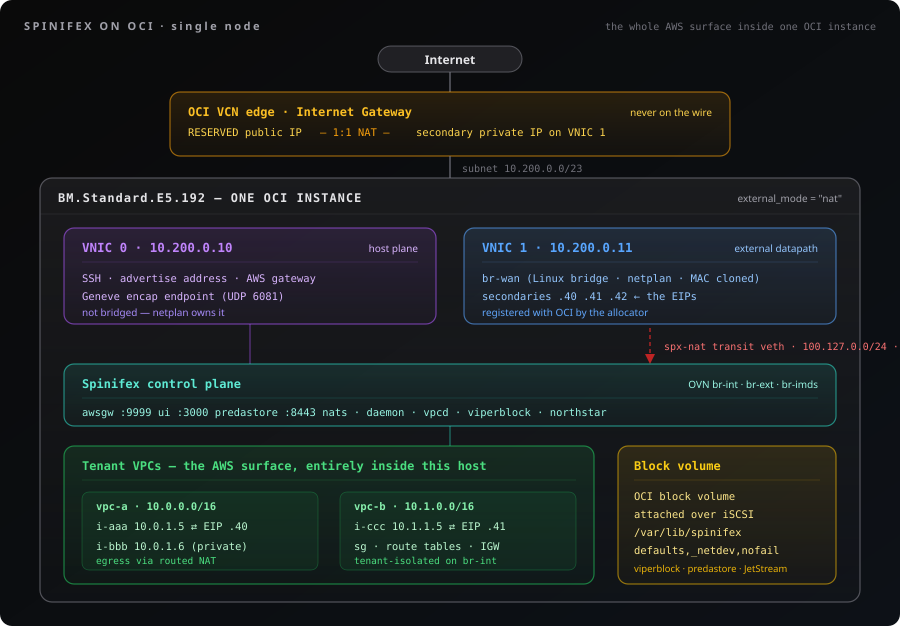
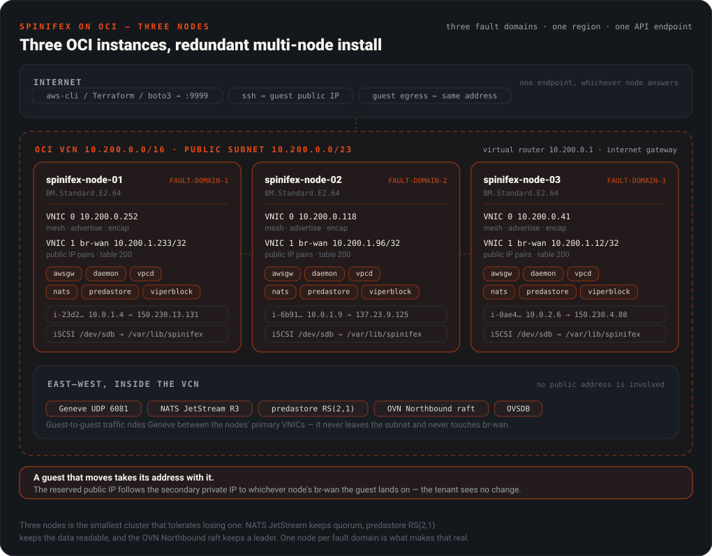

# Spinifex on OCI — Architecture and Operations

> The reference half of the OCI integration. [Spinifex on Oracle Cloud](/docs/oci-integration) is the step-by-step deployment; everything here is what sits underneath it, plus the troubleshooting.

## Table of Contents

- [Why run Spinifex on OCI](#why-run-spinifex-on-oci)
- [Sizing](#sizing)
- [How it fits together](#how-it-fits-together)
- [Credentials: an API key, or an instance principal](#credentials-an-api-key-or-an-instance-principal)
- [The IAM policy](#the-iam-policy)
- [Quotas](#quotas)
- [Firewalls, in all three layers](#firewalls-in-all-three-layers)
- [What Terraform builds, per node](#what-terraform-builds-per-node)
- [Every Terraform variable](#every-terraform-variable)
- [The `oci` CLI](#the-oci-cli)
- [Deploying without Terraform](#deploying-without-terraform)
- [Troubleshooting](#troubleshooting)

---

## Overview

## Why run Spinifex on OCI

**Lower cost for the same shape of workload.** OCI's compute and block storage are priced well below the large US clouds for equivalent OCPU and IOPS, and Spinifex turns one large instance into a whole EC2/EBS/S3 surface — so a tenant's twenty small instances are twenty QEMU guests on hardware you are billed for once, not twenty billable cloud instances.

**Egress stops being the line item that decides the architecture.** Oracle publishes a large monthly outbound-transfer allowance per tenancy and a per-GB rate beyond it that is roughly an order of magnitude below the majors — check the current pricing page rather than a number in a document, but the gap is the reason this integration exists. Traffic _between_ guests never leaves the host or, on a cluster, never leaves the VCN: it is Geneve over the private plane, which is not billed as internet egress at all.

**Portability — the workload stops being AWS-shaped and starts being yours.** The API your tenants code against is Spinifex's, so the same Terraform, the same SDK calls and the same AMIs run on OCI today, on bare metal in your own rack tomorrow, and at an edge site after that. Moving off AWS becomes a deployment decision rather than a rewrite, and moving _again_ costs nothing extra.

**You keep the parts of OCI that are worth keeping.** Bare-metal shapes, fault domains, block volumes with a chosen performance tier, and real public addresses out of OCI's own pool. Spinifex does not hide the cloud underneath it — it registers each guest's address with OCI so that guest is genuinely reachable on the internet, not behind a shared NAT.

## Sizing

**Bare metal is the recommendation.** `BM.Standard.E2.64` or similar gives you the hardware directly — no nested virtualisation, full NIC performance, and no hypervisor between your guests and the wire. If bare metal is out of scope, a single `VM.Standard.E6.Flex` is the recommendation for testing and development, or three of them for production.

|                 | Minimum               | Recommended                                                       |
| --------------- | --------------------- | ----------------------------------------------------------------- |
| **Shape**       | `VM.Standard.E6.Flex` | Bare metal, e.g. `BM.Standard.E2.64`                              |
| **OCPU**        | 8 (16 vCPU)           | 32+                                                               |
| **RAM**         | 32 GB                 | 128 GB+                                                           |
| **Data volume** | 256 GiB block volume  | 1 TB+ NVMe-backed                                                 |
| **VNICs**       | 2                     | 2                                                                 |
| **Nodes**       | 1                     | 3 — see [Cluster sizing](/docs/install-multi-node#cluster-sizing) |

## How it fits together

Everything in [Single-Node Install](/docs/install) and [Multi-Node Install](/docs/install-multi-node) still applies: formation, storage and OVN behave exactly as they do on hardware you own. What changes is the layer underneath — an OCI VCN is not an Ethernet segment, so the external datapath is wired differently, and public addresses come from OCI's API rather than from a range you write in a config file.

### Single node — the whole AWS surface inside one OCI instance

One instance runs the control plane and every tenant guest. Customers reach the AWS APIs on the node's own address; their instances reach the internet through addresses registered on the node's second VNIC.

<p align="center">
  
</p>

Two things in that picture are the whole integration. The guest's private address (`10.0.1.4`) never leaves the host — OVN and the host route both hold it. The address OCI delivers to is a **secondary private IP registered on VNIC 1**, appearing on `br-wan`, and the customer's public address (`150.230.13.131`) is a reserved public IP that OCI 1:1-NATs onto it upstream. `describe-instances` reports the public one; every datapath object holds the private one, which is why the two never appear together on the host.

The third is storage. Every guest disk, every S3 object and the JetStream state all live under `/var/lib/spinifex`, which is an **OCI block volume attached over iSCSI**, not the boot disk. Size it for the guests you intend to run; a boot volume that quietly ends up carrying the stack is the most common way an install on OCI fails later rather than immediately.

### Three nodes — the same surface, distributed

Each node registers the addresses for **its own** guests on **its own** second VNIC, and the allocator runs per node, so nothing has to know another node's OCIDs. When a guest moves — a stop/start that lands elsewhere, or a host failure — the node it lands on claims the address's private half from the old VNIC through a single OCI call. The OCID and the public half are untouched, so the customer's address never changes.

<p align="center">
  
</p>

The overlay, the object shards and the OVN databases all cross **VNIC 0**, inside the VCN. Size that plane, not the external one: guest-to-guest traffic between nodes is Geneve over the VCN, and it is the link every distributed layer shares.

> [!NOTE]
> **The Spinifex region is your own naming and has nothing to do with the OCI region.** `ap-southeast-2` in `spinifex.toml` beside `ap-sydney-1` in OCI is correct and expected. Do not read one as evidence about the other.

## Credentials: an API key, or an instance principal

The allocator needs OCI credentials at runtime. **A node with none forms, passes every health check, and then refuses every launch that wants a public address** with `InsufficientAddressCapacity`, naming no cause outside its own journal.

### An API key — the documented path

It needs nothing from a tenancy admin, which also makes it the only option when the compartment belongs to someone else's tenancy. The cost is key material on disk, with a rotation obligation, on every node:

```bash
# On your workstation, not the node.
openssl genrsa -out ~/.oci/oci_api_key.pem 2048
chmod 600 ~/.oci/oci_api_key.pem
openssl rsa -pubout -in ~/.oci/oci_api_key.pem -out ~/.oci/oci_api_key_public.pem
openssl rsa -pubout -outform DER -in ~/.oci/oci_api_key.pem \
  | openssl md5 -c        # this is the fingerprint
```

Upload the public key to the user under **Identity → Users → API Keys**, and record the user OCID, the fingerprint and the tenancy OCID.

Each node then needs **two** files, and a node with only the first is the silent failure above — it forms, looks healthy, and cannot allocate:

| Path                                | Mode                 | Contents                                                                 |
| ----------------------------------- | -------------------- | ------------------------------------------------------------------------ |
| `/etc/spinifex/oci/oci_api_key.pem` | `0640 root:spinifex` | The private key                                                          |
| `/etc/spinifex/oci/config`          | `0640 root:spinifex` | An ordinary OCI SDK config, profile `[spinifex]`, naming the key by path |

Nothing creates the second one for you, and its profile name must be `spinifex` to match `oci_config_profile` in the pool:

```ini
[spinifex]
user=ocid1.user.oc1..aaaa...
fingerprint=12:34:56:78:90:ab:cd:ef:12:34:56:78:90:ab:cd:ef
tenancy=ocid1.tenancy.oc1..aaaa...
region=ap-sydney-1
key_file=/etc/spinifex/oci/oci_api_key.pem
```

**Put that in a credential hook and the deploy installs it on every node.** The hook is an executable of yours, run as `hook <ssh-key> <host>...` after formation and before the pool is configured, which is the only window where a node has `/etc/spinifex` but has not started the allocator. It is yours rather than ours deliberately: a credential belongs to whoever owns it, and one rendered into user-data or Terraform state is readable from instance metadata for the life of the instance — on a host that runs other people's guests.

### An instance principal: no key material, but it needs a tenancy admin

The instance certificate is served at `/opc/v2/identity/cert.pem` and the Go SDK authenticates as the instance with no key on disk. It must also be _authorised_, by a dynamic group and a policy, and **both are tenancy-root resources** — `oci_identity_dynamic_group` is created with `compartment_id` set to the tenancy OCID. A compartment-scoped user cannot create them, and the attempt fails with `404-NotAuthorizedOrNotFound` on `CreateDynamicGroup`, which reads like a misconfiguration and is not one.

```bash
cd scripts/terraform/oci-spx
./setup-identity.sh --dry-run     # always first
./setup-identity.sh               # needs a tenancy-admin OCI profile
```

Then set `instance_principal = "adopt"` in your tfvars and pass `--instance-principal` to the deploy instead of `--credential-hook`. The dynamic group matches on `instance.compartment.id`, so it covers every node you ever build in that compartment and nothing needs updating when nodes are replaced.

**This path is not yet proved end to end.** Every validated run so far used an API key, because the reference tenancy is an allocated child compartment with no tenancy-root rights. On a tenancy where you are admin it should be the better choice; treat the first run as the test.

## The IAM policy

Spinifex calls exactly ten operations, all of them in `spinifex/cloud/oci/client.go`. Grant no more than these:

| Operation                                  | Why                                                                              |
| ------------------------------------------ | -------------------------------------------------------------------------------- |
| `CreatePrivateIp`                          | Register the secondary private IP the datapath carries                           |
| `DeletePrivateIp`                          | Release it                                                                       |
| `GetPrivateIp`                             | Poll for `AVAILABLE` after an asynchronous assign                                |
| `ListPrivateIps`                           | The startup reconcile, and the affinity pass that moves an address between nodes |
| `UpdatePrivateIp`                          | Reassign a private IP to this node's VNIC when a guest moves here                |
| `CreatePublicIp`                           | Create the RESERVED public IP                                                    |
| `DeletePublicIp`                           | Release it                                                                       |
| `GetPublicIp` / `GetPublicIpByPrivateIpId` | Poll lifecycle state, and reconcile a private IP back to its public half         |
| `UpdatePublicIp`                           | Attach and detach the public IP from a private IP                                |

The matching policy, scoped to the one compartment Spinifex allocates in:

```text
Allow group SpinifexOperators to use    vnics       in compartment <compartment-name>
Allow group SpinifexOperators to manage private-ips in compartment <compartment-name>
Allow group SpinifexOperators to manage public-ips  in compartment <compartment-name>
```

These are the same three statements `instance-principal.tf` grants the dynamic group, which is the only version of this policy that has been exercised. Keep them identical: the two credential paths differ in who is authorised, never in what.

> [!IMPORTANT]
> **`use vnics` is required, and `read vnics` is not enough.** Registering a secondary private IP is an operation *on a VNIC*, so OCI checks `VNIC_ASSIGN` as well as `PRIVATE_IP_CREATE`, and `VNIC_ASSIGN` lives in the `use` verb. With only `read`, the node forms and looks healthy and every allocation fails `NotAuthorizedOrNotFound` — which reads as a wrong compartment OCID rather than a missing verb.

**Scope it to a compartment, not the tenancy.** `manage public-ips` at tenancy level lets a compromised node consume the whole regional reserved-public-IP quota.

**Do not grant `manage vnics` or `manage instances`.** Spinifex never creates, attaches or deletes a VNIC, and never touches an instance — it only adds addresses to a VNIC that already exists. `use` permits that; `manage` permits VNIC lifecycle, which is strictly more than the integration can use.

## Quotas

Two limits bound how many public addresses a deployment can hand out, and they do not scale the same way:

| Quota                              | Default | Scope                     | Notes                                                                                          |
| ---------------------------------- | ------- | ------------------------- | ---------------------------------------------------------------------------------------------- |
| **Reserved public IPs**            | 50      | Per region, whole tenancy | Shared by every node, so it does **not** grow with node count. This is the wall you hit first. |
| **Secondary private IPs per VNIC** | 64      | Per VNIC, so per node     | Not raisable. Three nodes gives you 192 — this is the limit that does scale.                   |

**On a new tenancy, check the compute limits too.** A fresh account commonly carries a service limit of zero for bare-metal shapes and a low one for flex VMs, so `BM.Standard.E2.64` may be unavailable until you request it. That refusal arrives at apply time, not at plan time.

A raise is a support request, not a setting: Console → Governance & Administration → Limits, Quotas and Usage → "Request a service limit increase". Cite the exact limit name from `oci limits definition list`, not a name from documentation.

```bash
oci limits definition list --service-name vcn --compartment-id <tenancy-ocid>
oci limits value list       --service-name vcn --compartment-id <tenancy-ocid>
oci limits resource-availability get --service-name vcn \
    --limit-name <name-from-above> --compartment-id <tenancy-ocid>
```

**These calls need a grant the node does not have, and must not be given.** Limits and usage are tenancy-level, which cannot be compartment-scoped the way the policy above insists the node's is. Create a **second, read-only principal** for an operator or a reporting job and keep it off every node:

```text
Allow group SpinifexReporting to read limits        in tenancy
Allow group SpinifexReporting to read usage-reports in tenancy
```

The second verb is what Cost Analysis and `oci usage-api usage-summary request-summarized-usages` read. Adding either to `SpinifexOperators` would hand every node tenancy-wide read, which is exactly what the node policy refuses.

## Firewalls, in all three layers

Three independent things filter traffic to an OCI deployment, and they are easy to mistake for one. Nearly every "my port is closed" report on OCI is the wrong layer being adjusted.

| Layer | What it guards | Who configures it |
| --- | --- | --- |
| **OCI security list** | The whole public subnet, including the addresses guests are reached on | `node_client_cidr_allow_list` |
| **The host firewall** | The node's own listeners — console, S3 gate, AWS gateway, SSH, the cluster plane | `node_service_ports`, then the Spinifex nft policy |
| **OVN security groups** | Each guest, per AWS security-group rules | Your tenants, through the EC2 API |

### The OCI security list is deliberately open, and should stay that way

```hcl
# network.tf, security_list.public
ingress_security_rules { protocol = "all", source = var.vcn_cidr }      # intra-VCN
dynamic "ingress_security_rules" { ... source = each allow-list CIDR }  # protocol = "all"
```

A guest's public address is a **secondary private IP on VNIC 1, in the public subnet**, so inbound traffic to a guest crosses this security list. Narrowing `node_client_cidr_allow_list` to your own office `/32` therefore cuts internet ingress to **every guest**, not just to the node — a tenant who opens 443 on their own security group finds it does nothing, with no error anywhere naming the cause.

That is also why the rule is `protocol = "all"` rather than the three service ports: enumerating ports here would mean a Terraform change for every customer port.

**So leave it at `0.0.0.0/0` for any deployment that serves guests**, and do the restricting in the host firewall, which is the layer that can tell the node's own listeners apart from a guest's. Narrow the allow list only for a private lab with no public guest services.

The separate intra-VCN rule exists so that narrowing the allow list can never cut Geneve, OVN, NATS or predastore between nodes.

### The host firewall is what you harden

Terraform's cloud-init runs `open-service-ports.sh`, which opens all protocols from the peer CIDR plus `node_service_ports` (`3000 8443 9999`) to any source, in the Ubuntu image's **iptables**. SSH is already open to the world from the image's own INPUT rule, and nothing in that script narrows it.

The Spinifex nft policy is installed but **not armed** on this path, because the installer arms it only when asked. Arming it is what gives you the proper policy — public plane, peer-scoped cluster plane, and an SSH scope you own:

```bash
# On each node. Arms the policy the ISO installer arms by default.
sudo env SETUP_STAGES=firewall /usr/local/share/spinifex/setup.sh --firewall on
```

Then narrow SSH in the one file `setup.sh` creates and never overwrites:

```bash
# /etc/spinifex/firewall/custom.nft — yours, left unchanged by upgrades.
define trusted_ssh_peers = { 203.0.113.10/32 }
```

```bash
sudo nft -c -f /etc/spinifex/firewall/spinifex.nft    # check before applying
sudo /usr/local/lib/spinifex/spinifex-firewall-apply
```

What the armed policy allows, and why each port is where it is, is in [Host Firewall](/docs/host-firewall) — including [Narrowing SSH access](/docs/host-firewall#narrowing-ssh-access) and the rule that **forming or expanding a cluster starts by turning the policy off**, because nodes mid-formation are not yet each other's peers.

Two OCI-specific notes on top of that guide:

- **Northstar's DNS on 53 is in the armed policy's public plane, but `node_service_ports` does not include it.** Until the nft policy is armed, a node serving a public zone does not answer on 53 from the internet.
- **Never flush iptables on an OCI node.** The image's `InstanceServices` chain in OUTPUT is what permits iSCSI to `169.254.2.0/24:3260` and the metadata service; clearing it takes the data volume and IMDS with it.

## What Terraform builds, per node

| Resource                     | Detail                                                                                                                                             |
| ---------------------------- | -------------------------------------------------------------------------------------------------------------------------------------------------- |
| `oci_core_instance`          | One per `node_count`, round-robined across **fault domains** so three nodes land on three sets of racks rather than wherever placement puts them   |
| Primary VNIC                 | Public IP, `hostname_label`, the host plane — SSH, the advertise address, the Geneve endpoint                                                      |
| `oci_core_vnic_attachment`   | A **second VNIC** in the same subnet. Every Spinifex external address becomes a secondary private IP here at runtime                               |
| `oci_core_volume`            | A block volume per node, `data_volume_size_in_gbs` at `data_volume_vpus_per_gb`                                                                    |
| `oci_core_volume_attachment` | **`attachment_type = "iscsi"`**, with the Oracle Cloud Agent's Block Volume Management plugin enabled so the node logs the iSCSI session in itself |
| cloud-init                   | Partitions, formats, mounts and `fstab`s the volume; builds `br-wan` over the second VNIC; opens the service ports                                 |

The resource-by-resource architecture is in [`scripts/terraform/oci-spx`](https://github.com/mulgadc/spinifex/tree/dev/scripts/terraform/oci-spx).

**The data volume is iSCSI, and that is the detail that bites.** OCI presents the volume as an iSCSI target reachable at `169.254.2.2:3260` — attaching it in the API does not put a block device on the host. `is_agent_auto_iscsi_login_enabled` makes the Oracle Cloud Agent do the login, and because it does that _asynchronously_, the device is not there when cloud-init first runs. The mount script waits up to ten minutes for it, formats it **only if `blkid` reports no filesystem** (so a re-run cannot erase a populated volume), and writes an fstab entry by UUID:

```text
UUID=<uuid>  /var/lib/spinifex  ext4  defaults,_netdev,nofail  0 2
```

`_netdev` is what orders the mount after the network, and therefore after `iscsid` has a session. `nofail` is what keeps a missing volume from wedging the boot. Mounting `/var/lib/spinifex` _itself_ rather than somewhere else and symlinking is deliberate: viperblock, predastore and JetStream all land on the volume with no configuration pointing anywhere unusual.

## Every Terraform variable

All of these have defaults that build a working single node, except the first:

| Variable                      | Default               | What it decides                                                                                                                                                                                                                                      |
| ----------------------------- | --------------------- | ---------------------------------------------------------------------------------------------------------------------------------------------------------------------------------------------------------------------------------------------------- |
| `compartment_ocid`            | —                     | **Required.** An OCID, not a name: this deploys into a compartment that already exists, because creating one needs tenancy-root rights the API user must not have                                                                                    |
| `deployment_name`             | `spinifex`            | Prefixes every resource and becomes the VCN `dns_label`, so 1–15 lowercase alphanumerics starting with a letter                                                                                                                                      |
| `node_count`                  | `1`                   | Nodes, 1–25. `1` for a single node, `3` for a cluster. Each gets its own volume, its own second VNIC and its own fault domain                                                                                                                        |
| `compute_shape`               | `VM.Standard.E6.Flex` | **`BM.*` for bare metal, `VM.*.Flex` for a VM.** A fixed bare-metal shape carries its own size, so `shape_config` is emitted only when the name contains `Flex` — set a BM shape and the two sizing variables below are ignored rather than rejected |
| `compute_ocpus`               | `8`                   | OCPUs on a flex shape. Validated at ≥ 8 (16 vCPU), the minimum recommended for a node                                                                                                                                                                |
| `compute_memory_in_gbs`       | `32`                  | GiB on a flex shape. Validated at ≥ 32                                                                                                                                                                                                               |
| `data_volume_size_in_gbs`     | `256`                 | Size of each node's data volume. This is where guest disks, S3 objects and JetStream live — size it for the guests, not for the control plane                                                                                                        |
| `data_volume_vpus_per_gb`     | `120`                 | Performance tier, 0–120 VPUs/GB. 120 is Ultra High Performance; 10 is Balanced. Higher is more IOPS and more cost                                                                                                                                    |
| `data_mountpoint`             | `/var/lib/spinifex`   | Where cloud-init mounts it. Change only if you know why                                                                                                                                                                                              |
| `vcn_cidr`                    | `10.200.0.0/22`       | VCN address space. A `/22` leaves room for the secondary private IPs Spinifex registers per node                                                                                                                                                     |
| `public_subnet_cidr`          | `10.200.0.0/23`       | The subnet every node sits in, **on both VNICs**. Nodes serve the UI, the S3 gate and the AWS gateway directly, so they cannot live in a private subnet                                                                                              |
| `node_client_cidr_allow_list` | `["0.0.0.0/0"]`       | OCI security-list ingress, **all protocols**, for the whole public subnet. Guest public addresses cross it too — see [Firewalls](#firewalls-in-all-three-layers) before narrowing it                                                                 |
| `node_service_ports`          | `[3000, 8443, 9999]`  | Console, predastore gate, AWS gateway, opened in the host's iptables by cloud-init. SSH comes from the image's own rule                                                                                                                              |
| `instance_principal`          | unset                 | `"adopt"` to authenticate the allocator as the instance rather than with a key file. Needs the tenancy dynamic group and policy to exist                                                                                                            |
| `ubuntu_version`              | `26.04`               | Canonical platform image version. The newest image for the shape and region is resolved at plan time rather than pinned to a regional OCID                                                                                                           |
| `wan_bridge_name`             | `br-wan`              | The Linux bridge built over the second VNIC                                                                                                                                                                                                          |
| `wan_bridge_mtu`              | `9000`                | The OCI VCN carries 9000                                                                                                                                                                                                                             |

**Six more exist and are not yours to set**: `tenancy_ocid`, `user_ocid`, `fingerprint`, `private_key`, `private_key_path` and `region`. `scripts/oci_env.py` fills them as `TF_VAR_*` from the profile in `~/.oci/config` on every `terraform` call the driver makes, so **the region you deploy into is the profile's region** and the credential never reaches a `.tfvars` file. Setting them by hand works and is how a run with no config file at all would have to work, but then two sources disagree about which tenancy this is.

The profile is resolved as `--oci-profile`, then `$OCI_CLI_PROFILE`, then the reference tenancy, then `DEFAULT`. A name passed explicitly and absent from the config is an error that lists the profiles present; only an unasked-for name falls through. CI takes a different route entirely — `OCI_TENANCY_OCID`, `OCI_USER_OCID`, `OCI_FINGERPRINT`, `OCI_PRIVATE_KEY` and `OCI_REGION` in the environment, so a runner writes no key to disk — and a partial set there is an error rather than a fallback, because half a credential means a secret failed to reach the job.

## The `oci` CLI

**The `oci` CLI is not on the Ubuntu image**, and `apt` has no `python3-oci-cli` package. Nothing in the deployment needs it; install it when you want to inspect allocations by hand:

```bash
sudo apt-get update && sudo apt-get install -y python3-venv
python3 -m venv ~/.oci-cli-venv
~/.oci-cli-venv/bin/pip install --upgrade pip oci-cli
sudo ln -sf ~/.oci-cli-venv/bin/oci /usr/local/bin/oci
oci --version
```

**What the CLI is and is not for.** Spinifex's daemon uses the OCI **Go SDK** for every allocation — the CLI is not on that path. You need it for bootstrap and for operational inspection. Do not build automation that shells out to it during an allocation; allocations run inside a request budget that a forked Python process will not respect.

---

## Deploying without Terraform

**Terraform automates every step of a normal install, and that is the point of it.** The `oci-spx` configuration builds the VCN, the subnets, the gateways, the block volumes and both VNICs per node, then renders the cloud-init that installs Spinifex and sets up OVN — so the sequence below happens without anyone typing it, in the same order every time, on one node or three.

If you need to install by hand — an existing OCI tenancy you cannot run Terraform against, an unsupported shape, or a stage you are debugging — the install itself is not OCI-specific. Follow the standard guides:

- [Installing Spinifex](../../install/install/README.md) for a single node.
- [Multi-Node Installation](../../install/install-multi-node/README.md) for a cluster, which covers `spx admin init` on the leader and `spx admin join` on the rest.

Four things about OCI are not in those guides, and each has its own section above:

- **The external pool** is `source = "oci"`, which needs the API key or instance principal from [Credentials](#credentials-an-api-key-or-an-instance-principal) and the [IAM policy](#the-iam-policy). Without it a node forms, passes every health check, and then refuses every launch that wants a public address.
- **`br-wan` stays a Linux bridge** owned by netplan, linked to OVS `br-ext` by a veth pair. Pass `setup-ovn.sh --wan-bridge=br-wan` and it detects this itself; the NIC never becomes an OVS port, so the VNIC keeps its MAC identity. See [How it fits together](#how-it-fits-together).
- **The block volume must be mounted with `_netdev`**, because it arrives over iSCSI and the mount is otherwise attempted before a session exists.
- **IMDS needs the 169.254 remap** described under [Guests cannot reach instance metadata](#guests-cannot-reach-instance-metadata), since the guest's metadata address collides with OCI's own.

---

## Troubleshooting

### If a deploy stage fails

The driver stops at the first failure, names the log, and leaves the rest alone. Logs are all under `.validate-<topology>/`:

| Stage                                           | Log                                      |
| ----------------------------------------------- | ---------------------------------------- |
| Building the infrastructure                     | `apply.log`                              |
| Installing Spinifex                             | `install-<host>.log`                     |
| Forming the cluster                             | `form.log`                               |
| Installing the credential, configuring the pool | `credential-hook.log`, `pool-<host>.log` |
| Verifying public addressing                     | `allocator-<host>.log`                   |
| The Terraform workbooks                         | `workbooks.log`, `workbooks.tsv`         |

The allocator log is the one worth knowing about, because public addressing is the part with the most moving pieces. If the allocator never comes up, the driver captures the daemon journal, the pool as configured, the bridge and OCI MAC addresses, and whether each credential file exists and is readable — never the credentials themselves — before anything is torn down.

Add `--keep-on-fail` to leave a failed deployment running so you can log in and look. **It keeps billing** until you run `--destroy-only`.

### Addresses and quotas

**Spinifex enforces no limit of its own.** It attempts the allocation and reports what OCI says, so the ceiling you hit is always your tenancy's, never a number baked into the software. A quota is raised with Oracle, not reconfigured here, and there is nothing to restart afterwards.

**`InsufficientAddressCapacity` on `allocate-address` is what exhaustion looks like.** It is the AWS error code for "out of addresses" and Spinifex returns it for either quota, mapped from OCI's own refusal. On a cluster the regional one is the likelier of the two.

**A detached reserved public IP still bills.** `disassociate-address` returns the address to `AVAILABLE` without deleting it, exactly as an unassociated AWS Elastic IP behaves, and it keeps consuming your regional quota as well as your bill. `release-address` is what frees both.

**A stopped instance costs nothing for its auto-assigned address.** Stopping an instance returns its auto-assigned address to the pool and deletes the reserved public IP object behind it, as AWS does; the start that follows creates a new one. An **Elastic IP** is yours and survives the stop untouched — that is the whole distinction between the two, and on OCI it is also the difference between a stopped fleet that bills for addresses and one that does not.

### A guest's public address is unreachable

**Check where you are probing from first.** A node is a bad vantage point for a public address, and two independent things make it so: the security list may not admit the node's own public address as a source, and a VCN may or may not reflect its public addresses back into itself. Either way a healthy cluster fails the probe. Test from outside the VCN, which is where a customer is.

Then, in order:

1. `sudo ovn-nbctl lr-nat-list <router>` — is there a `dnat_and_snat` row, and does it hold the _private_ address?
2. `ip route get <private-addr>` — does it route via the transit veth?
3. `sudo iptables -S FORWARD | grep spinifex-eip-ingress` — both directions present?
4. `oci network private-ip list --vnic-id <vnic>` — is the private address actually registered with OCI, **and on this node's VNIC**? If not, nothing else matters.

**Egress works from one address and not another on the same NIC.** OCI enforces the source address per VNIC, so this means the address is not a registered private-IP object on it. It is never a routing problem on the host.

**An address went dark after a guest moved node.** The affinity pass should have claimed it within 15 seconds. Check the new node's daemon journal for `ocinet affinity`, then confirm with step 4 above which VNIC OCI thinks holds the private half.

### A node that was fine and then was not

Terraform's cloud-init does the host jobs on each node — the iSCSI volume, `br-wan` and its source routing, the firewall. When one of them did not take, the symptom arrives much later and rarely looks like a networking or storage problem. This one command answers all of it:

```bash
ssh -i ~/.ssh/oci-spx ubuntu@<node-public-ip> '
  cloud-init status                  # done
  sudo iscsiadm -m session           # a session to 169.254.2.2:3260
  findmnt /var/lib/spinifex          # mounted by UUID, with _netdev
  ip -br addr show br-wan            # UP, second VNIC address as a /32
  ip -br addr show enp1s0            # the bridge MEMBER holds NO address
  ip route show default              # still on the PRIMARY interface
  ls -l /dev/kvm                     # present
'
```

Three answers are worth knowing in advance, because each looks wrong and is not:

- **`br-wan` holds a `/32` and the default route is on the other interface.** That is how two VNICs share one subnet without the second stealing the first one's traffic, and it is what satisfies OCI's per-VNIC source check. `br-wan`'s address appears in `ip rule` instead of in the default route.
- **`br-wan`'s address is not one you chose.** It is the second VNIC's own private IP, assigned by OCI, and not predictable before the apply.
- **`enp1s0` carrying an address is the one real fault here.** The kernel derives an on-link route from it that beats the primary VNIC's, so every packet to another node leaves the wrong VNIC and OCI drops it. The node still forms a cluster and still reports `Ready` — formation uses outbound connections — and it surfaces later as `predastore … the stripe is short one holder` on the first AMI import. `sudo /usr/local/sbin/spinifex-setup-wan-bridge` repairs it in place.

### The allocator

**Confirm it came up**, which `spx get nodes` cannot tell you:

```bash
sudo journalctl -u spinifex-vpcd --since -5m | grep -i ocinet
```

```text
"msg":"ocinet resolved the external VNIC from its interface","pool":"oci-public","iface":"br-wan",
  "vnic_id":"ocid1.vnic.oc1.ap-sydney-1.abzxsljrjwlf...kimuq","private_ip":"10.200.1.31","subnet":"10.200.0.0/23"
"msg":"OCI allocator ready","pool":"oci-public","collected":0,"stale_bindings":0,"skipped":1
```

**`resolved the external VNIC` is the line that matters** — it proves the credentials work, the compartment is right, and `br-wan`'s MAC matched a real VNIC. A node missing it will accept `allocate-address` and fail it.

On a cold cluster start you may instead see `OCI allocator reconcile failed … nats: no responders available for request` on some nodes. That is vpcd racing JetStream's KV at boot; the startup reconcile is skipped and not retried. It is harmless on a new cluster where nothing has been allocated, and it is tracked — restart `spinifex-vpcd` on that node to run it.

### Host

**`RunInstances` returns `ServerInternal`.** Check the daemon journal for the real error — `journalctl -u spinifex-daemon --since -10m`. An OCI allocation failure surfaces this way.

**The stack ends up on the boot disk and the node fills.** The data volume was mounted without `_netdev` and lost the race with `iscsid`. `findmnt /var/lib/spinifex` is the check; `ls` cannot tell the difference.

### Guests cannot reach instance metadata

**Guests boot but cloud-init hangs on metadata**, or the host stops answering its own. OCI uses `169.254.169.254` for its instance metadata, and so does every AWS-compatible guest — the host and the guests want the same address.

Spinifex resolves this by moving the _host_ side of the per-guest metadata link to a different link-local pair, so guests keep asking `169.254.169.254` exactly as they do on AWS. The deploy sets `imds_host_meta_ip` and `imds_host_dns_ip` for you. **Set both or neither** — a half-configured pair is ignored and the node behaves as if the remap were off, which is what this symptom looks like.

Check it after your first guest launches:

```bash
ip route get 169.254.169.254                 # your real NIC, not lo
curl -sH 'Authorization: Bearer Oracle' -o /dev/null -w '%{http_code}\n' \
     http://169.254.169.254/opc/v2/instance/ # 200
ip -br addr show | grep ime-                 # holds 169.254.42.x, not .169.x
```

`ip route get 169.254.169.254` returning `dev lo` is the signature of a missing remap. The same signature can appear after a guest terminates, from a leftover `ime-` endpoint still holding the address; with the remap configured it is harmless, and removing the stale OVS port clears it.

### An OVS problem, when `ovs-vsctl` says nothing is wrong

`ovs-vsctl` exits 0 even when a bridge could not be instantiated. Read the error column and the log, never the exit status:

```bash
sudo ovs-vsctl --columns=name,error list Interface
sudo journalctl -u ovs-vswitchd --since -10m
```
