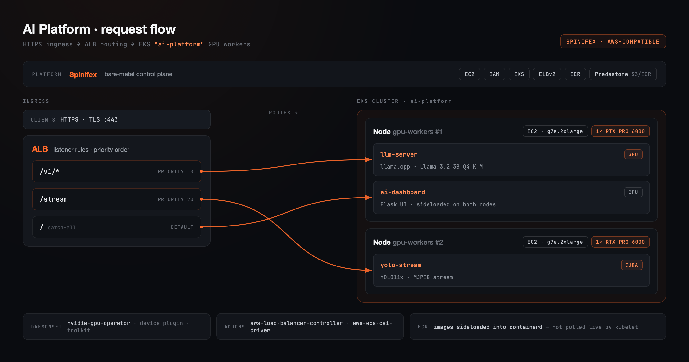
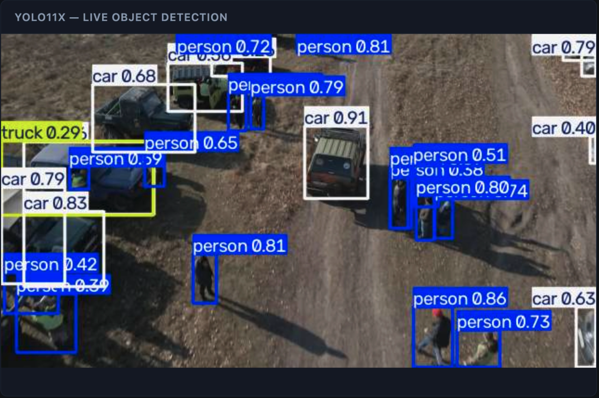
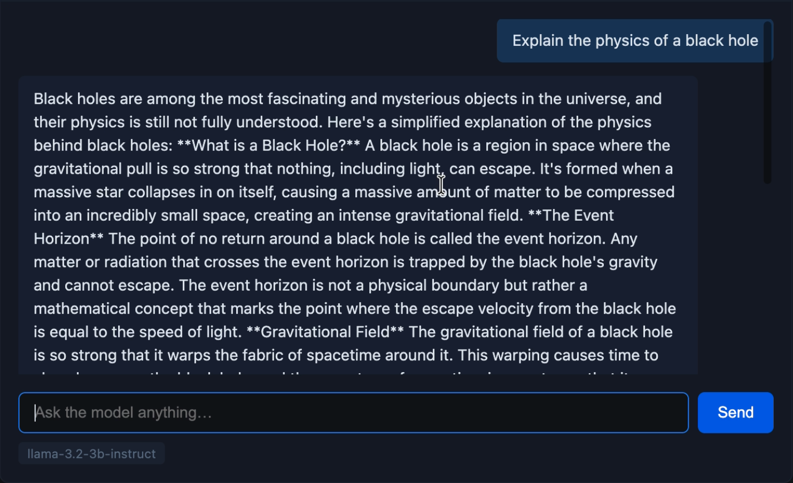

## Overview

Spinifex is an open-source infrastructure platform that brings core AWS services such as EC2, S3, EBS and EKS, to bare-metal, edge, and on-prem deployments. It exposes a fully AWS-compatible API, so any tooling that works against AWS — the `aws` CLI, OpenTofu, `kubectl` — works against a Spinifex node unchanged, with a single profile swap.

This guide walks through the use of Spinifex to deploy a self-contained AI inference platform on Supermicro's bare metal X14 platform using only standard AWS tooling. We use Terraform to create resources (wrapped in simple `make` commands) in the exact same way you would create AWS resources.


Specifically, we create an EKS cluster with two worker nodes, each consisting of a g7e.2xlarge EC2 instance with an attached GPU via VFIO passthrough, an ALB to route traffic to each node, ECR for storing and managing our workload images, and all of the associated security and certificate management requirements (IAM, ACM) you would expect from real AWS.

### Platform

| Component | Specification |
|---|---|
| **Chassis** | Supermicro X14 2U CloudDC with Intel Xeon 6730P |
| **GPUs** | 2× NVIDIA RTX Pro 6000 Blackwell Server Edition (96 GiB GDDR7 each, 192 GiB total) |
| **Storage** | 4× NVMe SSD: 2× 1.5 TB, 2× 880 GB — one 1.5 TB drive carries the OS; the remaining three back Predastore |
| **Spinifex instance family** | `g7e` — one RTX Pro 6000 per instance via VFIO PCIe passthrough |
| **Kubernetes** | k3s, managed via Spinifex EKS API |
| **API endpoint** | `https://<host>:9999` (AWS-compatible) |

### Workloads
Three workloads run in the `inference` namespace of an EKS cluster backed by two GPU worker nodes:

| Pod | Role | GPU | Model | Image source |
|---|---|---|---|---|
| `llm-server` | OpenAI-compatible chat API (llama.cpp) | 1× RTX Pro 6000 | Llama 3.2 3B Instruct Q4_K_M GGUF | ECR `llm-server:latest` |
| `yolo-stream` | MJPEG object-detection stream (CUDA) | 1× RTX Pro 6000 | YOLO11x | ECR `yolo-stream:latest` |
| `ai-dashboard` | Web UI: chat + live detection feed | CPU only | — | ECR `ai-dashboard:latest` |

Both GPU workloads bake their model weights into the Docker image at build time — `llm-server`'s GGUF weights (~2 GiB) and `yolo-stream`'s YOLO11x checkpoint (~109 MB) are present in the image when it starts.

`yolo-stream` renders a 1280×720 sample video through YOLO11x once on startup (~25 s), caches the annotated frames in memory, then serves `/stream` from that cache — smooth MJPEG playback decoupled from per-frame inference cost after the initial warm-up.

The two GPU nodes are split one-per-workload. With one RTX Pro 6000 per node and both pods requesting `nvidia.com/gpu: "1"`, the scheduler cannot fit both on the same node, so the split happens naturally without explicit affinity rules.


## Architecture

<p align="center"></p>

### AWS services exercised

| Service | Role |
|---|---|
| **IAM** | Cluster role, node role (with ECR, LBC, EBS-CSI permissions inline), viewer access entry |
| **ECR** | Private registry for all three images; source of truth for builds, though nodes receive images via sideload rather than live OCI pull for this demo |
| **EC2** | 2× GPU microVM (`g7e.2xlarge`), one RTX Pro 6000 each via VFIO PCIe passthrough |
| **EKS** | Cluster, GPU nodegroup (`desired_size = 2`), LBC and EBS-CSI managed addons, access entries |
| **ELBv2** | ALB provisioned by the LBC addon; single shared IngressGroup across all three services |
| **ACM** | Self-signed cert (`ai-platform.spinifex.local`) imported and attached to the ALB HTTPS listener |
| **EBS (Viperblock)** | 200 GB root volume per GPU worker node, provisioned by the nodegroup (`disk_size = 200`)|

All permissions for the LBC and EBS-CSI addons are attached directly to the node role. Both addons support IRSA, but fall back to the node's instance profile when no `service_account_role_arn` is supplied — sufficient for a single-cluster deployment.

## Prerequisites

### On the Spinifex host

**1. Configure host-local VPC networking**

Spinifex uses bridged networking via OVN. The X14 exposes a single public IP on one physical NIC — before installing Spinifex, ensure `br-wan` exists with the physical NIC enslaved to it, and attach a host-local address range for EC2 instance communication:

```yaml
# /etc/netplan/…
bridges:
  br-wan:
    addresses:
      - 192.168.10.1/24             # VM pool gateway — host-local
      - <existing-wan-ip>/<prefix>  # existing WAN IP — unchanged
    routes:
      - to: default
        via: <upstream-gateway>
```

Apply with `sudo netplan apply`. For outbound connectivity from instances through the host's WAN interface:

```bash
sysctl -w net.ipv4.ip_forward=1
iptables -t nat -A POSTROUTING -s 192.168.10.0/24 -o br-wan -j MASQUERADE
```

The full process is described in the [VPC Networking](/docs/vpc-networking#host-local-subnet-no-upstream-router) guide.

**2. Install Spinifex**

Follow the [Single Node Install](/docs/install) guide. This installs Spinifex and starts all services, however `spinifex.toml` needs to be edited to wire up the bridge created in the previous step, as described in the following section.

**3. Configure spinifex.toml and restart services**

Edit `/etc/spinifex/spinifex.toml` to point the external pool at the bridge address range created in step 1:

```toml
[network]
external_mode = "pool"

[[network.external_pools]]
name        = "wan"
source      = "static"
range_start = "192.168.10.2"
range_end   = "192.168.10.100"
gateway     = "192.168.10.1"
prefix_len  = 24
dns_servers = ["8.8.8.8"]
```

Then restart all services:

```bash
sudo systemctl restart spinifex.target
sudo systemctl status spinifex.target
```

**4. Bind the GPUs to VFIO**

```bash
sudo spx admin gpu setup
# Reboot, then:
sudo spx admin gpu enable
```

Confirm both GPUs are bound:

```bash
lspci -d 10de: -nn
# Expect: NVIDIA Corporation Device [10de:2bb5] appearing twice
```

**5. Attach Predastore storage**

The X14 has four NVMe drives: two 1.5 TB SSDs (one carries the OS) and two ~880 GB SSDs. Predastore is distributed across the three non-OS drives — one storage node per physical drive, with Reed–Solomon redundancy so a single drive failure is recoverable.

Confirm drive assignments with `lsblk` before proceeding, as device names vary between systems.

```bash
lsblk   # identify the OS drive and the three data drives

# Stop services so Predastore isn't writing while we relocate its data directories
sudo systemctl stop spinifex.target

# --- Repeat the block below for each data drive (node-1/nvme-1, node-2/nvme-2, node-3/nvme-3) ---

# Drive 1: non-OS 1.5 TB (e.g. /dev/nvme1n1)
sudo mkdir -p /mnt/nvme-1
sudo mount /dev/nvme1n1 /mnt/nvme-1
sudo mkdir -p /mnt/nvme-1/nodes /mnt/nvme-1/db

sudo mv /var/lib/spinifex/predastore/distributed/nodes/node-1 /mnt/nvme-1/nodes/node-1
sudo mv /var/lib/spinifex/predastore/distributed/db/node-1    /mnt/nvme-1/db/node-1

sudo ln -s /mnt/nvme-1/nodes/node-1 /var/lib/spinifex/predastore/distributed/nodes/node-1
sudo ln -s /mnt/nvme-1/db/node-1    /var/lib/spinifex/predastore/distributed/db/node-1

echo "/dev/nvme1n1  /mnt/nvme-1  auto  defaults  0  2" | sudo tee -a /etc/fstab

# Drive 2: first ~880 GB drive (e.g. /dev/nvme2n1)
sudo mkdir -p /mnt/nvme-2
sudo mount /dev/nvme2n1 /mnt/nvme-2
sudo mkdir -p /mnt/nvme-2/nodes /mnt/nvme-2/db

sudo mv /var/lib/spinifex/predastore/distributed/nodes/node-2 /mnt/nvme-2/nodes/node-2
sudo mv /var/lib/spinifex/predastore/distributed/db/node-2    /mnt/nvme-2/db/node-2

sudo ln -s /mnt/nvme-2/nodes/node-2 /var/lib/spinifex/predastore/distributed/nodes/node-2
sudo ln -s /mnt/nvme-2/db/node-2    /var/lib/spinifex/predastore/distributed/db/node-2

echo "/dev/nvme2n1  /mnt/nvme-2  auto  defaults  0  2" | sudo tee -a /etc/fstab

# Drive 3: second ~880 GB drive (e.g. /dev/nvme3n1)
sudo mkdir -p /mnt/nvme-3
sudo mount /dev/nvme3n1 /mnt/nvme-3
sudo mkdir -p /mnt/nvme-3/nodes /mnt/nvme-3/db

sudo mv /var/lib/spinifex/predastore/distributed/nodes/node-3 /mnt/nvme-3/nodes/node-3
sudo mv /var/lib/spinifex/predastore/distributed/db/node-3    /mnt/nvme-3/db/node-3

sudo ln -s /mnt/nvme-3/nodes/node-3 /var/lib/spinifex/predastore/distributed/nodes/node-3
sudo ln -s /mnt/nvme-3/db/node-3    /var/lib/spinifex/predastore/distributed/db/node-3

echo "/dev/nvme3n1  /mnt/nvme-3  auto  defaults  0  2" | sudo tee -a /etc/fstab

# --- End of per-drive block ---

sudo systemctl start spinifex.target
```

Verify the nodes are healthy before proceeding:

```bash
export AWS_PROFILE=spinifex
aws s3 ls
# Should return without error (empty bucket list is fine)
```

**6. Verify the GPU instance type**

```bash
sudo spx admin gpu status
```

This will print confirmation that GPU passthrough has been configured correctly along with the available GPU instance types. The RTX Pro 6000 Blackwell Server Edition (PCI device `10de:2bb5`) maps to the `g7e` family. The workbook defaults to `g7e.2xlarge` (one GPU per node); override with `GPU_TYPE=g7e.4xlarge` (or the size your host reports) if needed. Do not use `g7e.12xlarge` — that is the 2× GPU size.

### Local tooling

- [OpenTofu](https://opentofu.org/) >= 1.6
- [kubectl](https://kubernetes.io/docs/tasks/tools/)
- [Docker](https://docs.docker.com/get-docker/)


### Clone the workbook

```bash
git clone https://github.com/mulgadc/eks-ai-platform
cd eks-ai-platform
```

## Instructions

### 1. Import the EKS GPU node AMI

GPU worker nodes require the `ecr-credential-provider` binary so kubelet can call `GetAuthorizationToken` against ECR. This binary is included in the dedicated EKS GPU node AMI in the Spinifex image catalogue. List available images and import it:

```bash
spx admin images list
# Look for the EKS GPU node image

spx admin images import --name spinifex-eks-node-gpu
```

Confirm the AMI is registered:

```bash
aws ec2 describe-images --query 'Images[*].[Name,ImageId]' --output table
```

### 2. Provision the cluster

```bash
make infra ENDPOINT=https://<host>:9999
```

This provisions the VPC (`10.33.0.0/16`, two public and two private subnets with a NAT gateway), IAM roles, ECR repositories, EKS cluster, GPU nodegroup (2× `g7e.2xlarge`, 200 GB disk each), LBC and EBS-CSI managed addons, a self-signed ACM certificate, and the NodePort security group rules the ALB needs to reach the worker nodes.

Update your kubeconfig once the cluster reports `ACTIVE`:

```bash
$(tofu -chdir=workbook output -raw update_kubeconfig)
kubectl get nodes
# Expect: 2 Ready nodes in the gpu-workers nodegroup
```

The Makefile wraps `tofu -chdir=workbook apply -var spinifex_endpoint=... -var gpu_instance_type=...` — running Tofu directly is equivalent and lets you pass any additional variables. The workbook provisions `aws_vpc`, `aws_subnet` (two public, two private), `aws_eks_cluster`, `aws_eks_node_group` (two `g7e.2xlarge` nodes, each with a 200 GB Viperblock root volume via `disk_size = 200`), `aws_eks_addon` for LBC and EBS-CSI, three `aws_ecr_repository` resources, three IAM roles, and a self-signed `aws_acm_certificate` — all via Spinifex's AWS-compatible endpoint at `:9999`.

### 3. Build and push container images

```bash
make images
```

This authenticates to ECR, then builds and pushes all three images:

- **`llm-server`** — based on `ghcr.io/ggml-org/llama.cpp:server-cuda`; downloads Llama 3.2 3B Instruct Q4_K_M GGUF (~2 GiB) from Hugging Face at build time and bakes it into the image. Exposes an OpenAI-compatible `/v1/chat/completions` API.
- **`yolo-stream`** — based on `pytorch/pytorch:2.7.1-cuda12.8-cudnn9-runtime`; installs Ultralytics and downloads YOLO11x weights at build time. PyTorch 2.7.1+cu128 is required: the RTX Pro 6000 Blackwell is compute capability sm_120, and earlier PyTorch releases ship no sm_120 kernels.
- **`ai-dashboard`** — lightweight Flask proxy (`FROM python:3.11-slim`) that aggregates the LLM API and YOLO stream into a single page.

The ECR registry URI always includes `:9999` — for example, `<account>.dkr.ecr.ap-southeast-2.<suffix>:9999`. Use the `ecr_registry` Tofu output directly in `docker login` and image references; do not construct the hostname manually.

Image URIs come from `tofu -chdir=workbook output -raw ecr_registry`. ECR authentication uses the same API as AWS: `aws ecr get-login-password` calls `GetAuthorizationToken` against the Spinifex ECR endpoint and returns a short-lived JWT that Docker accepts as a registry password. The `make images` target is equivalent to running those `docker build` and `docker push` commands directly against `$REGISTRY` from that Tofu output.

### 4. Sideload images onto GPU worker nodes

```bash
make sideload
```

ECR is the source of truth for all three images — authentication, push, and registry management all work identically to AWS. In a standard EKS deployment, nodes would pull images directly from ECR at scheduling time. In this demo, live pulls of these image sizes (~2 GiB for `llm-server`, ~4.5 GiB for `yolo-stream`) through the Spinifex ECR gateway proved unreliable — large transfers stalled or failed mid-stream, a combination of network conditions on this single-host setup and a rough edge in early Spinifex ECR support. This step works around that by staging the images directly into each node's containerd store before the pods are scheduled.

It exports each image from the local Docker daemon, serves the tarballs over HTTP from the Spinifex host, and imports them directly into each worker node's containerd store via short-lived privileged pods. All three Deployments use `imagePullPolicy: IfNotPresent` and depend on the images already being present in containerd.

The script also labels the two GPU nodes deterministically (`workload=llm-server` / `workload=yolo-stream`, sorted by node name), and the Deployments use matching `nodeSelector` values so each pod lands on the node that already has its image. `ai-dashboard` has no GPU requirement and is imported on both nodes since it can schedule onto either.

Expect several minutes for `yolo-stream`'s image (CUDA + PyTorch + YOLO11x weights, ~4.5 GiB).

This step has no Tofu equivalent — it operates directly on the running cluster via `kubectl`. The ECR registry URI is read from the Tofu state; node labelling uses `kubectl label` and image import uses short-lived privileged pods that run `ctr images import` into each node's containerd store.

### 5. Deploy workloads

```bash
make workloads ENDPOINT=https://<host>:9999
```

This deploys the NVIDIA GPU Operator via Helm, then all three application Deployments, ClusterIP and NodePort services, and the shared ALB Ingresses.

The GPU Operator requires two adjustments for k3s:

- `driver.enabled=false` — the NVIDIA driver is pre-built into the GPU AMI at image creation time; the Operator installs only the toolkit and device plugin.
- `CONTAINERD_SOCKET=/run/k3s/containerd/containerd.sock` — k3s bundles its own containerd at a different socket and config path than the standalone containerd default. Without this override the toolkit DaemonSet crash-loops with `no such file or directory`.

Watch the GPU Operator complete, then the inference pods come up:

```bash
kubectl -n gpu-operator get pods -w
kubectl -n inference get pods -w
```

Confirm each GPU node reports `nvidia.com/gpu: 1` in allocatables:

```bash
$(tofu -chdir=workbook output -raw gpu_verify_hint)
```

All three routes share a single ALB via `alb.ingress.kubernetes.io/group.name`. Explicit `group.order` values (`/v1` = 10, `/stream` = 20, `/` = 100) ensure the dashboard's catch-all path evaluates last — without them, the LBC sorts Ingress resources alphabetically, which places the catch-all first and swallows the other routes.

Retrieve the ALB IP (the DNS name `*.elb.spinifex.local` is a label, not a resolvable entry):

```bash
$(tofu -chdir=workbook output -raw alb_ip_hint)
ALB_IP=<output>
```

Validate the LLM endpoint:

```bash
curl -sk https://$ALB_IP/v1/chat/completions \
  -H "Content-Type: application/json" \
  -d '{"model":"llama-3.2-3b-instruct","messages":[{"role":"user","content":"What is Spinifex?"}]}' \
  | python3 -m json.tool
```

Open `https://$ALB_IP/` to reach the dashboard. If accessing from a remote machine:

```bash
ssh -L 8443:$ALB_IP:443 <spinifex-host>
# Open https://ai-platform.spinifex.local:8443/
# Add 127.0.0.1 ai-platform.spinifex.local to /etc/hosts if the browser requires hostname match
```

The workloads module reads cluster coordinates, ECR image URIs, NodePort values, and the ACM cert ARN from the parent module's Tofu state, then creates the NVIDIA GPU Operator `helm_release`, three `kubernetes_deployment_v1` resources, six `kubernetes_service_v1` resources (ClusterIP + NodePort per workload), and three `kubernetes_ingress_v1` resources — all through the Terraform Kubernetes and Helm providers, which authenticate to the cluster via `aws eks get-token`.

### Dashboard

After the successful completion of the `make workloads` step, the dashboard should be available and displaying the outputs of the two worker nodes; YOLO computer vision in the left pane, and a LLM chat in the right pane, as shown in the images below.

<p align="center"></p>

<p align="center"></p>


### 6. Teardown

```bash
make destroy ENDPOINT=https://<host>:9999
```

Workloads are destroyed before infra. Both GPU worker instances terminate, immediately returning their RTX Pro 6000s to the Spinifex pool.

The Makefile runs the two-module destroy sequence — `tofu -chdir=workbook/workloads destroy` first, then `tofu -chdir=workbook destroy` — because the parent module's security group rules are referenced by the ALB created in the workloads layer. Running Tofu directly in that order is equivalent.

## Troubleshooting

### `llm-server` or `yolo-stream` pod stuck in `Pending`

The GPU Operator DaemonSet must complete before `nvidia.com/gpu` appears in node allocatables:

```bash
kubectl -n gpu-operator get daemonset -w
kubectl get node -o custom-columns=NAME:.metadata.name,GPU:.status.allocatable.'nvidia\.com/gpu'
```

If a pod shows `Insufficient nvidia.com/gpu` on a node that looks healthy, the `workload=` labels from `make sideload` may be stale — for example, after a nodegroup recreation that assigned new node names. Re-run `make sideload` to relabel the nodes and re-import the images.

### GPU worker instances fail to launch (`bind ... to vfio-pci: invalid argument`)

On hosts where the GPU's IOMMU group contains an upstream PCIe root-port bridge (no ACS isolation), Spinifex attempts to bind the bridge to `vfio-pci`. Bridges are non-endpoint devices that `vfio-pci` refuses to bind, causing the instance to crash immediately after launch:

```
GPU claim failed... bind IOMMU group member 0000:14:02.0: bind 0000:14:02.0 to vfio-pci: invalid argument
```

Check IOMMU group membership with `lspci -nnk` and `/sys/kernel/iommu_groups/*/devices/`. This is fixed in Spinifex by excluding bridge-class PCI devices from the bind lifecycle — ensure your Spinifex build includes that fix. If the failed bind left a bridge without a driver, restore it:

```bash
echo | sudo tee /sys/bus/pci/devices/<bridge-addr>/driver_override
echo <bridge-addr> | sudo tee /sys/bus/pci/drivers/pcieport/bind
```

If the nodegroup got wedged in `CREATING` after hitting this, delete it and let Terraform recreate it:

```bash
aws eks delete-nodegroup --cluster-name ai-platform --nodegroup-name gpu-workers
```

### Nodegroup stuck `CREATING` with healthy nodes, Tofu times out

`tofu apply` hangs for 20 minutes and fails with `workers did not become Ready: timed out`, even though `kubectl get nodes` shows both workers `Ready`. The cause is a missing `eks.amazonaws.com/nodegroup` label on the node — without it, the control plane never tallies the nodegroup as satisfied. Confirm with:

```bash
kubectl get node <worker> -o jsonpath='{.metadata.labels}'
```

This is fixed upstream in Spinifex. If stuck, delete both the nodegroup and cluster and let Terraform recreate them cleanly:

```bash
aws eks delete-nodegroup --cluster-name ai-platform --nodegroup-name gpu-workers
aws eks delete-cluster --name ai-platform
```

### ALB returns 502 immediately after rollout

Both `llm-server` and `yolo-stream` require a few seconds after container start before their readiness probes pass — CUDA and GPU Operator initialisation contribute to the delay. The ALB marks targets unhealthy during this window. Watch the pods become ready:

```bash
kubectl -n inference get pods -w
kubectl -n inference logs -f deploy/llm-server
```

## Conclusion

This guide demonstrates how Spinifex turns a single bare-metal chassis into a production-shaped AI serving platform managed entirely with standard AWS tooling. IAM roles, ECR repositories, an EKS cluster, GPU worker nodes, addons, and an ALB are all provisioned with the same Terraform resources and AWS CLI commands that work on real AWS — with a single `AWS_PROFILE` swap.

The RTX Pro 6000 Blackwell Server Edition's 96 GiB GDDR7 fits substantial GPU workloads in a single PCIe slot, and Spinifex's `g7e` instance family exposes each GPU as a standard EC2 instance. Teams already operating AWS infrastructure can point their existing tooling at a Spinifex node and retain the full EKS workflow — from `aws ecr get-login-password` to `kubectl get ingress` — on hardware they own. ECR acts as the canonical registry throughout: image build, push, and authentication are identical to AWS, with direct kubelet pulls being the intended path as Spinifex's ECR gateway matures.
