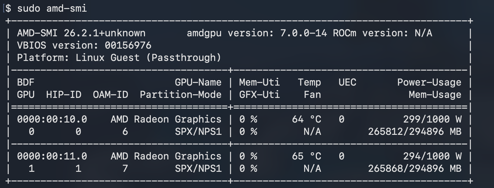
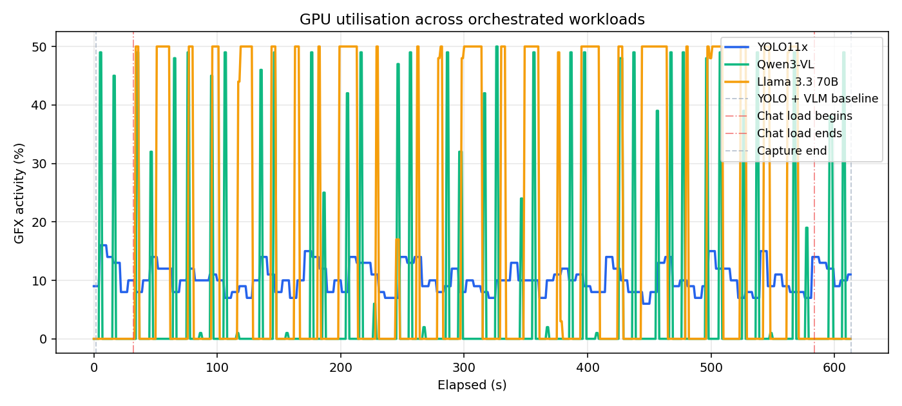
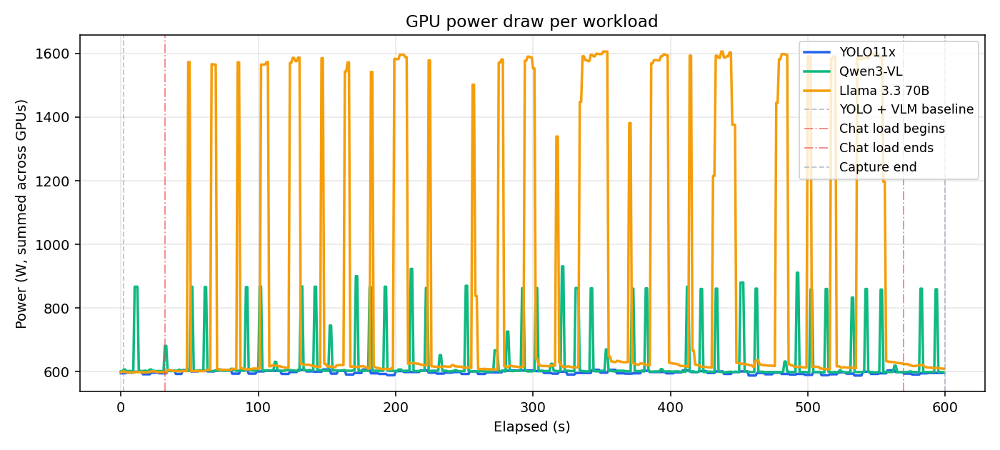
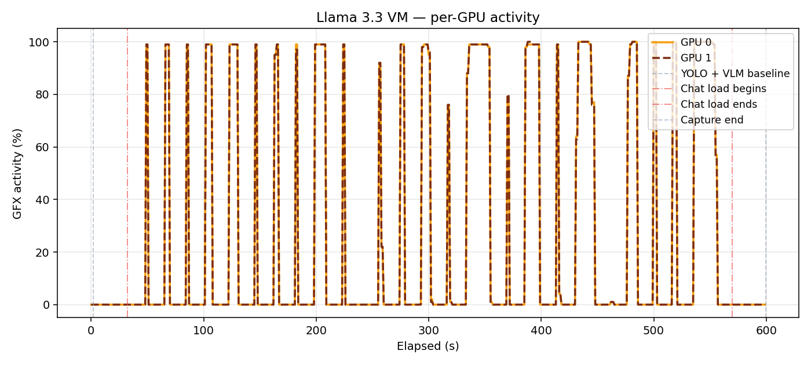
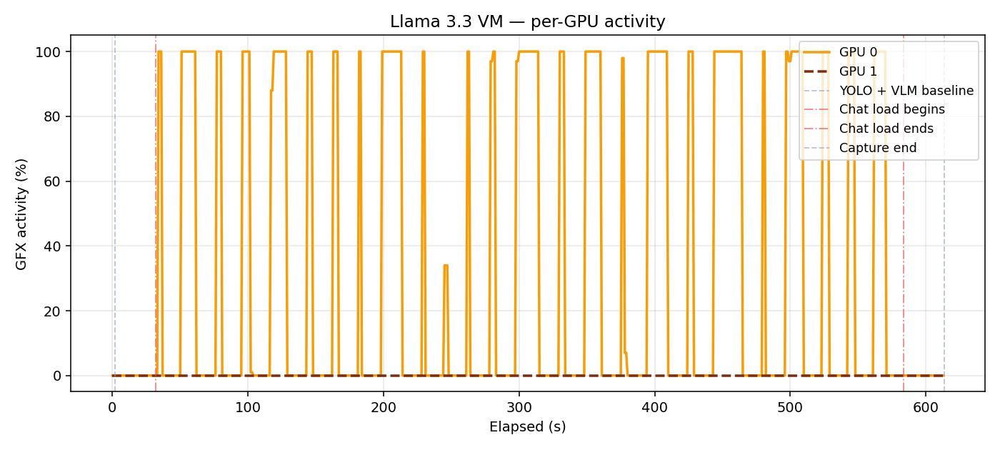
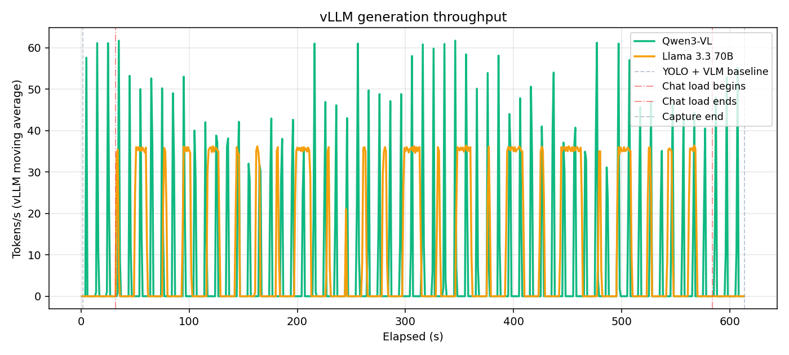
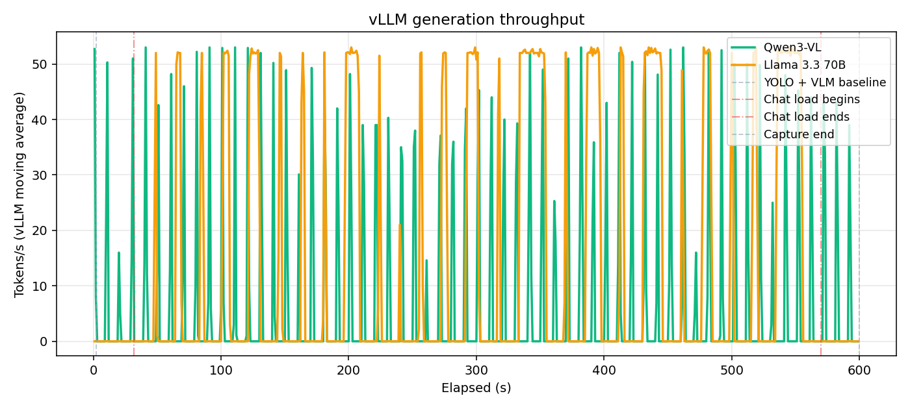

## Overview

Mulga recently gained access to Supermicro's H14 platform via their JumpStart program — an exciting opportunity to test Spinifex on a single bare-metal node running real, concurrent AI workloads.

The H14 chassis comes equipped with **8× AMD Instinct MI350X** (288 GB HBM3e each, 2.3 TB total). We used Spinifex to provision three isolated VMs, each assigned 2× MI350X via direct PCIe passthrough, and ran three computationally intensive workloads simultaneously: a YOLO11x vision model, a Qwen3-VL 235B FP8 vision language model, and a Llama 3.3 70B large language model.

<p><video src="https://iso.mulgadc.com/clipped-demo.mp4" controls width="100%" style="border-radius:6px"></video></p>

### Platform

| Component | Specification |
|---|---|
| **Bare-metal host** | Supermicro H14 |
| **Host OS** | Ubuntu 24.04 LTS or Debian 13 (minimum) |
| **Orchestration** | Spinifex — EC2-compatible bare-metal API |
| **Guest OS** | Ubuntu 26.04 LTS |
| **GPUs** | 8× AMD Instinct MI350X (288 GB HBM3e each, 2.3 TB total) |
| **GPU passthrough** | PCIe passthrough via vfio-pci |
| **Instance type** | `g7e.12xlarge` — 2× MI350X per VM |
| **Container runtime** | Docker (with ROCm device access) |
| **Inference runtime** | vLLM (`rocm/vllm` image) |
| **VM network** | Internal VPC, 192.168.10.0/24 |
| **Block storage** | Viperblock — EBS-compatible, local NVMe-backed |

Spinifex runs on the bare-metal host and exposes an EC2-compatible API to any standard `aws ec2` tooling. Guest VMs receive their GPU allocation at the hardware level — each VM's OS sees the MI350Xs as native PCIe devices with no virtualisation layer in the data path. Workloads across VMs share no GPU memory, no address space, and no network segment except through the VPC.

GPU passthrough requires a host kernel and OS that supports vfio-pci. Ubuntu 24.04 LTS (kernel 6.8+) and Debian 13 (kernel 6.12+) are the tested minimum baselines for the host. Guest VMs run Ubuntu 26.04 LTS.

## Prerequisites

- Supermicro H14 with 8× AMD Instinct MI350X installed
- Host OS: **Ubuntu 24.04 LTS** (kernel 6.8+) or **Debian 13** (kernel 6.12+) — minimum for vfio-pci support
- Spinifex installed and all services running (`systemctl status spinifex.target`)
- AMD GPU AMI registered (`ami-ubuntu-amd-gpu`) — Ubuntu 26.04 LTS with ROCm-compatible kernel
- AWS CLI configured with `AWS_PROFILE=spinifex` pointing at the Spinifex endpoint
- SSH key pair imported into Spinifex, VPC and security group created (see [Launching Instances](/docs/launching-instances))

GPU passthrough must be configured before launching GPU instances. This is a one-time step per host.

```bash
# Detect GPUs and bind to vfio-pci (requires reboot)
sudo spx admin gpu setup

# After rebooting — confirm passthrough is active and signal the daemon
sudo spx admin gpu enable
```

`spx admin gpu setup` blacklists the AMD driver on the host and binds each GPU to `vfio-pci`. After reboot, `spx admin gpu enable` verifies the binding and makes the GPU pool available to `RunInstances`.


To check available GPU instance types:

```bash
export AWS_PROFILE=spinifex
aws ec2 describe-instance-types \
    --query 'InstanceTypes[?GpuInfo].[InstanceType,GpuInfo.Gpus[0].Count,GpuInfo.Gpus[0].Name]' \
    --output table
```

## Instructions

### 1. Provision the VMs

Each VM was provisioned using standard AWS EC2 CLI commands — the only change from a normal AWS workflow is `AWS_PROFILE=spinifex`, which redirects the CLI to Spinifex's local EC2-compatible endpoint instead of AWS:

| VM | Instance type | GPUs | Role | Model |
|---|---|---|---|---|
| `vm-yolo` | g7e.12xlarge | 2× MI350X | Real-time object detection | YOLO11x |
| `vm-vlm`  | g7e.12xlarge | 2× MI350X | Multi-modal scene analysis | Qwen3-VL 235B FP8 |
| `vm-chat` | g7e.12xlarge | 2× MI350X | Conversational LLM | Llama 3.3 70B |

Six of the eight available MI350Xs are claimed here; the remaining two stay idle on the host, available for a fourth tenant without touching the existing three.

```bash
export AWS_PROFILE=spinifex

# vm-yolo — YOLO11x object detection, 200 GB disk
YOLO_ID=$(aws ec2 run-instances \
    --image-id ami-ubuntu-amd-gpu \
    --instance-type g7e.12xlarge \
    --key-name spinifex-key \
    --subnet-id <subnet-id> \
    --security-group-ids <sg-id> \
    --block-device-mappings 'DeviceName=/dev/sda1,Ebs={VolumeSize=200,DeleteOnTermination=true}' \
    --count 1 \
    --query 'Instances[0].InstanceId' --output text)
echo "vm-yolo launched: $YOLO_ID"

# vm-vlm — Qwen3-VL 235B FP8, 600 GB disk for weights
VLM_ID=$(aws ec2 run-instances \
    --image-id ami-ubuntu-amd-gpu \
    --instance-type g7e.12xlarge \
    --key-name spinifex-key \
    --subnet-id <subnet-id> \
    --security-group-ids <sg-id> \
    --block-device-mappings 'DeviceName=/dev/sda1,Ebs={VolumeSize=600,DeleteOnTermination=true}' \
    --count 1 \
    --query 'Instances[0].InstanceId' --output text)
echo "vm-vlm launched: $VLM_ID"

# vm-chat — Llama 3.3 70B, 300 GB disk
CHAT_ID=$(aws ec2 run-instances \
    --image-id ami-ubuntu-amd-gpu \
    --instance-type g7e.12xlarge \
    --key-name spinifex-key \
    --subnet-id <subnet-id> \
    --security-group-ids <sg-id> \
    --block-device-mappings 'DeviceName=/dev/sda1,Ebs={VolumeSize=300,DeleteOnTermination=true}' \
    --count 1 \
    --query 'Instances[0].InstanceId' --output text)
echo "vm-chat launched: $CHAT_ID"

# Wait for all three to reach running state
for ID in "$YOLO_ID" "$VLM_ID" "$CHAT_ID"; do
    aws ec2 wait instance-running --instance-ids "$ID"
    echo "$ID is running"
done

# Retrieve IPs (Spinifex assigns addresses from the internal VPC)
YOLO_IP=$(aws ec2 describe-instances --instance-ids "$YOLO_ID" \
    --query 'Reservations[0].Instances[0].PublicIpAddress' --output text)
VLM_IP=$(aws ec2 describe-instances --instance-ids "$VLM_ID" \
    --query 'Reservations[0].Instances[0].PublicIpAddress' --output text)
CHAT_IP=$(aws ec2 describe-instances --instance-ids "$CHAT_ID" \
    --query 'Reservations[0].Instances[0].PublicIpAddress' --output text)

echo "vm-yolo: $YOLO_IP"
echo "vm-vlm:  $VLM_IP"
echo "vm-chat: $CHAT_IP"
```

### 2. Verify GPU access

Once SSH is available, confirm both GPUs are visible inside each VM:

```bash
ssh -i ~/.ssh/spinifex-key ubuntu@$CHAT_IP 'lspci | grep -i amd'
```

Or install and run `amd-smi`:

```bash
ssh -i ~/.ssh/spinifex-key ubuntu@$CHAT_IP \
    'curl -fsSL https://repo.radeon.com/rocm/rocm.gpg.key | gpg --dearmor | sudo tee /etc/apt/keyrings/rocm.gpg >/dev/null && \
     echo "deb [arch=amd64 signed-by=/etc/apt/keyrings/rocm.gpg] https://repo.radeon.com/rocm/apt/6.3 noble main" | sudo tee /etc/apt/sources.list.d/rocm.list && \
     sudo apt-get update -qq && sudo apt-get install -y -q amd-smi-lib && \
     amd-smi list'
```



Two MI350X entries with distinct UUIDs confirm direct PCIe passthrough is working.

### 3. The orchestration layer

Spinifex provides an EC2-compatible API on bare metal. The relevant capabilities for this demo:

- **Multi-GPU claim per VM.** Each `g7e.12xlarge` requires two PCIe addresses claimed as a unit. Spinifex queries the available GPU pool on the host and assigns them to the guest VM at creation time, rolling back if the full allocation cannot be satisfied.
- **PCIe passthrough via vfio-pci.** All 8 MI350Xs are bound to `vfio-pci` on the bare-metal host. Each VM gets its GPUs at the hardware level.
- **Internal VPC (192.168.10.0/24).** VMs communicate directly without traversing the host's public network.

The result: three completely independent EC2 instances, each running their own separate workloads using only the GPU resources they were allocated.

### 4. Test methodology

Two capture runs were made against the same workload script: **30 s baseline** (YOLO and VLM models running, no chat load) → **25 scripted Llama chat prompts** at 15 s intervals → **30 s settle tail**.

The only difference between the two runs was tensor parallelism:

- **Demo 1 (TP=1):** each VM uses one of its two allocated GPUs. The second sits idle.
- **Demo 2 (TP=2):** each VM shards its model symmetrically across both GPUs using AMD Infinity Fabric (XGMI).

| Metric | TP=1 baseline (Demo 1) | TP=2 (Demo 2) |
|---|---|---|
| Wall clock | 613 s | 600 s |
| YOLO avg fps | 16.91 (min 15.3 / max 18.0) | 17.09 (min 15.6 / max 18.1) |
| Qwen peak tok/s | 61.7 | 53.0 |
| Llama peak tok/s | 36.4 | **53.1** |
| Both GPUs active (chat VM) | no — GPU 1 idle | **yes — symmetric** |
| VRAM per GPU (Qwen) | 259 GB on one, 0.3 GB on other | 241 GB on **both** |
| VRAM per GPU (Llama) | 261 GB on one, 0.3 GB on other | 248 GB on **both** |

### 5. Results

### Inter-tenant isolation

The charts below show the three independent workloads spiking activity on their associated GPUs, measured in GFX utilisation and power draw. YOLO average FPS stays at ~17 despite utilisation in the YOLO VM never exceeding 20%, indicating a bottleneck in networking or encoding rather than inference. Each chart highlights workload independence — pulses of GPU activity share no correlation across VMs.



GPU utilisation per VM across the full Demo 1 capture.



Power draw per VM during Demo 2.

### Single vs double GPU

When TP=2 is enabled, each VM shards its model symmetrically across both GPUs. Inside the chat VM, both GPUs pulse together on every request, each holding exactly **248 GB of VRAM** (weights split + KV cache shards). With TP=1, GPU 1 sat at 0% for the entire run.



Per-GPU utilisation inside `vm-chat` with TP=2.



Same VM with TP=1.

### vLLM generation throughput

With TP=1, Qwen peaks at ~60 tok/s and Llama caps around 35 tok/s — both compute-bound on a single MI350X. Enabling TP=2 lifts Llama's peak to ~50 tok/s (+47%) as generation is distributed symmetrically across both GPUs. Qwen's throughput is slightly lower under TP=2 due to collective overhead on the shared-memory transport.



Generation throughput during Demo 1 (TP=1).



Generation throughput during Demo 2 (TP=2).

### 6. Teardown

```bash
# Stop workloads on each VM
for IP in "$YOLO_IP" "$VLM_IP" "$CHAT_IP"; do
    ssh -i ~/.ssh/spinifex-key ubuntu@$IP 'docker stop $(docker ps -q)' || true
done

# Terminate all three instances — releases 6× MI350X back to the Spinifex pool
aws ec2 terminate-instances --instance-ids "$YOLO_ID" "$VLM_ID" "$CHAT_ID"
```

The six MI350Xs are immediately returned to the pool once the instances terminate, ready for a new allocation without touching the host.

### 7. Conclusion

Our trial of Supermicro's H14 platform demonstrates that Spinifex can turn a single bare-metal chassis into a credible multi-tenant AI serving platform, without any of the workloads ever knowing about each other. Spinifex utilises the flexibility of PCIe passthrough to allocate GPU resources in whichever configuration is required by the workload/s.

Importantly, it does so with standard `aws ec2` CLI calls — `run-instances`, `describe-instances`, `terminate-instances` — against Spinifex's EC2-compatible endpoint. Teams already operating AWS infrastructure can point their existing tooling at a Spinifex node with a single profile change, against GPUs that sit in their own rack.

*Access provided via the Supermicro JumpStart Program.*
