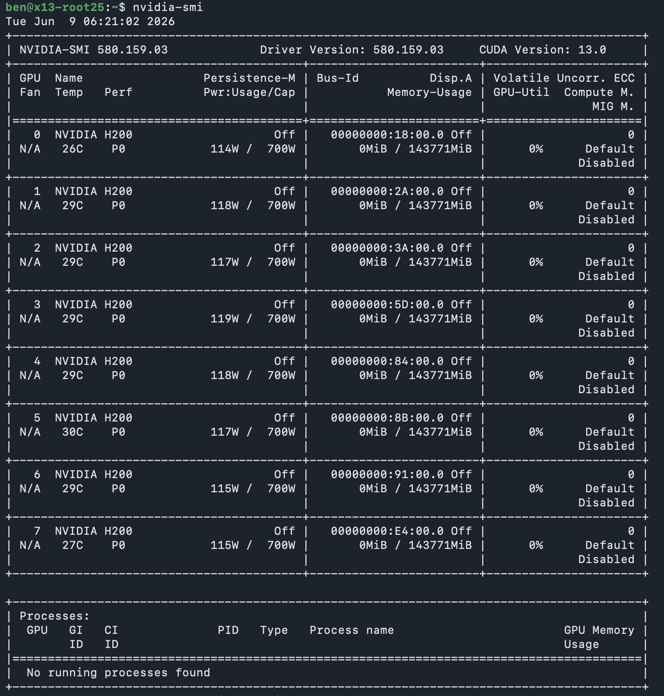
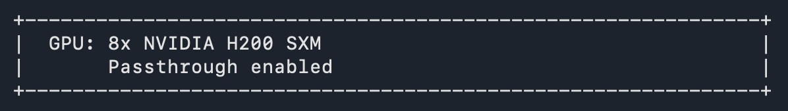
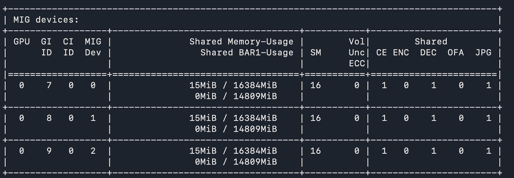

## Overview

Spinifex is an open-source infrastructure platform that brings core AWS services including EC2, EBS and S3 to bare-metal, edge, and on-prem environments. It exposes an AWS compatible API, so any tooling that works against AWS (the `aws` CLI, Terraform, SDKs) works against a Spinifex node unchanged, with a single profile swap.

This guide documents a full bare-metal AI deployment on a single SMCI X13 chassis using four of its eight available NVIDIA H200 SXM GPUs. These GPUs come with MIG (Multi Instance GPU) capability, which allows a single GPU to be "sliced" into up to seven independent GPU partitions. Each partition is capable of running its own workloads with reserved resources from the "host" GPU.

In this setup, each VM receives an entire H200 via PCIe passthrough and manages its own MIG partitions internally. This gives each tenant full control over how they slice their GPU — including the ability to run heterogeneous workloads at different partition sizes on the same physical card.

### VM layout

| VM | IP | MIG config | Workload | Model |
|---|---|---|---|---|
| `vm-llama3b` | 192.168.10.7  | 7 × 1g.18gb | Chat inference × 7 | Llama-3.2-3B-Instruct |
| `vm-qwen32b` | 192.168.10.8  | 2 × 3g.71gb | Chat inference × 2 | Qwen2.5-32B-Instruct |
| `vm-llama70b` | 192.168.10.12 | 1 × 7g.141gb | Chat inference × 1 | Llama-3.1-70B-FP8 |
| `vm-yolo`    | 192.168.10.14 | 2 × 3g.71gb | Object detection × 2 | YOLO11x + YOLO11s |

Twelve concurrent inference endpoints in total: 7 fast 3B slots, 2 mid-tier 32B slots, 1 full-GPU 70B slot, and 2 real-time vision streams running side-by-side to compare detection models.


### Platform

| Component | Specification |
|---|---|
| **Chassis** | Supermicro X13 8U GPU System |
| **CPUs** | 2× Intel Xeon Platinum 8568Y+ (48 cores each, 96 cores / 192 threads total) |
| **RAM** | 2 TB DDR5-4800 (32× 64 GB SK Hynix DIMMs) |
| **Storage** | 4× 7.68 TB KIOXIA CD6 NVMe SSDs (30.72 TB raw) |
| **GPUs** | 8× NVIDIA H200 SXM5 (141 GiB HBM3e per GPU, ~1.13 TB total) — 4 used in this demo |
| **Host OS** | Ubuntu 26.04 LTS |
| **Orchestration** | Spinifex — EC2-compatible bare-metal API |
| **Guest OS** | Ubuntu 26.04 LTS |
| **GPU partitioning** | NVIDIA MIG — managed inside each guest VM |
| **Block storage** | Predastore — S3-compatible, NVMe-backed |
| **Container runtime** | Docker |
| **Inference runtime** | vLLM (`vllm-openai` image from local registry) |
| **Vision runtime** | Ultralytics YOLO11 |

---


## Prerequisites

### 1. Verify GPU visibility on host
Before making any changes, verify that the host can see its GPUs:




## Instructions


### 1. Configure host-local VPC networking

Spinifex utilises bridged networking via OVN. In this example, the remote host exposes only one public IP address, attached to a single physical NIC. Before provisioning Spinifex, we must first ensure that `br-wan` exists and enslave the physical NIC to it.

Since we have no access to an upstream router or knowledge of available IP address pools, we must also attach our own `192.168.10.0/24` address range to `br-wan` which will be used by the guest VMs to communicate with the host and each other.

For example:

```yaml
# /etc/netplan/…
bridges:
  br-wan:
    addresses:
      - 192.168.10.1/24      # VM pool gateway — host-local
      - 198.51.100.10/24     # existing WAN IP — unchanged
    routes:
      - to: default
        via: 198.51.100.1
```

Then apply with `sudo netplan apply`. VMs, once provisioned, are reachable from the host at
`192.168.10.x`. For internet access through the host's WAN interface:

```bash
sysctl -w net.ipv4.ip_forward=1
iptables -t nat -A POSTROUTING -s 192.168.10.0/24 -o br-wan -j MASQUERADE
```
The exact process for this is described in the [VPC Networking](/docs/vpc-networking#host-local-subnet-no-upstream-router) guide.


### 2. Install Spinifex from source

Follow the [Install from Source](/docs/install-source) guide. This process will install Spinifex and start Spinifex services, however `spinifex.toml` needs to be edited to finalise the changes made to the networking in the previous section, as described in the following section.

### 3. Configure spinifex.toml and restart services

Edit `/etc/spinifex/spinifex.toml` to point the external pool and VPCD at the bridge created in step 1:

```toml
[network]
external_mode = "pool"

[[network.external_pools]]
name        = "wan"
source      = "static"         # required — no upstream DHCP for this range
range_start = "192.168.10.2"
range_end   = "192.168.10.100"
gateway     = "192.168.10.1"   # second address on br-wan
prefix_len  = 24
dns_servers = ["8.8.8.8"]
```

Then restart all services:

```bash
sudo systemctl start spinifex.target
sudo systemctl status spinifex.target
```

### 4. Attach Predastore storage

Spinifex distributes the Predastore object storage volume across multiple nodes using Reed–Solomon encoding for data redundancy. This chassis has four NVMe drives — one for the OS, three dedicated to data — so we back each Predastore storage node with its own physical drive, giving us fault-tolerant distributed storage on a single machine — conceptually similar to RAID 5, where data and parity are spread across drives so a single drive failure is recoverable.

Confirm drive assignments with `lsblk` before proceeding, as device names vary between systems.

```bash
lsblk   # identify the OS drive and the three data drives

# Stop services so Predastore isn't writing while we relocate its data directories
sudo systemctl stop spinifex.target

# --- Repeat the block below for each data drive (node-1/nvme-1, node-2/nvme-2, node-3/nvme-3) ---

# Mount the physical drive at a stable path
sudo mkdir -p /mnt/nvme-1
sudo mount /dev/nvme1n1 /mnt/nvme-1
sudo mkdir -p /mnt/nvme-1/nodes /mnt/nvme-1/db

# Move Predastore's node data and metadata off the OS drive onto the physical NVMe
sudo mv /var/lib/spinifex/predastore/distributed/nodes/node-1 /mnt/nvme-1/nodes/node-1
sudo mv /var/lib/spinifex/predastore/distributed/db/node-1    /mnt/nvme-1/db/node-1

# Symlink the original paths back so Predastore finds its data unchanged
sudo ln -s /mnt/nvme-1/nodes/node-1 /var/lib/spinifex/predastore/distributed/nodes/node-1
sudo ln -s /mnt/nvme-1/db/node-1    /var/lib/spinifex/predastore/distributed/db/node-1

# Persist the mount across reboots
echo "/dev/nvme1n1  /mnt/nvme-1  auto  defaults  0  2" | sudo tee -a /etc/fstab

# --- End of per-drive block ---

sudo systemctl start spinifex.target
```

Verify the nodes are healthy before proceeding:

```bash
export AWS_PROFILE=spinifex

aws s3 ls --endpoint-url https://localhost:8443
# Should return without error (empty bucket list is fine)
```

### 5. Enable GPU Passthrough
Spinifex allows GPUs to be utilised by guest VMS via VFIO-passthrough. This can be enabled via `sudo spx admin gpu setup`. Then, after a reboot, run `sudo spx admin gpu enable`. The Spinifex banner should update to reflect GPU passthrough state after every step:




### 6. Import the GPU AMI

The demo uses the standard Spinifex NVIDIA GPU AMI (`ubuntu-26.04-nvidia-gpu-x86_64`), which includes:

- Ubuntu 26.04 LTS guest image
- NVIDIA server driver (DKMS pre-built against the pinned kernel)
- Docker CE + nvidia-container-toolkit (`--gpus` support enabled at boot)
- Python 3 + venv, common utilities (tmux, curl, ffmpeg, etc.)

```bash
spx admin images import --name ubuntu-26.04-nvidia-gpu-x86_64
```

Confirm and set the AMI ID:
```bash
AMI_ID=$(aws ec2 describe-images \
    --filters "Name=name,Values=ubuntu-26.04-nvidia-gpu-x86_64" \
    --query 'Images[0].ImageId' --output text)
```

### 7. Create VPC resources

```bash
# Create VPC and subnet
VPC_ID=$(aws ec2 create-vpc --cidr-block 192.168.10.0/24 \
    --query 'Vpc.VpcId' --output text)
SUBNET_ID=$(aws ec2 create-subnet --vpc-id $VPC_ID \
    --cidr-block 192.168.10.0/24 \
    --query 'Subnet.SubnetId' --output text)

# Security group — allow SSH + all vLLM/YOLO ports
SG_ID=$(aws ec2 create-security-group \
    --group-name demo-sg --description "H200 MIG demo" \
    --vpc-id $VPC_ID --query 'GroupId' --output text)

aws ec2 authorize-security-group-ingress --group-id $SG_ID \
    --protocol tcp --port 22 --cidr 0.0.0.0/0
aws ec2 authorize-security-group-ingress --group-id $SG_ID \
    --protocol tcp --port 8000-8011 --cidr 0.0.0.0/0
```

```bash
# Create SSH key
aws ec2 create-key-pair --key-name spinifex-key \
  | jq -r '.KeyMaterial | rtrimstr("\n")' > ~/.ssh/spinifex-key

chmod 600 ~/.ssh/spinifex-key
ssh-keygen -y -f ~/.ssh/spinifex-key > ~/.ssh/spinifex-key.pub
```

Verify:

```bash
aws ec2 describe-key-pairs
```

### 8. Launch the four VMs

Each VM gets a whole H200 via PCIe passthrough. The `p5e.4xlarge` instance type maps one H200 per VM:

```bash
aws ec2 run-instances \
  --image-id $AMI_ID \
  --instance-type p5e.4xlarge \
  --key-name spinifex-key \
  --subnet-id $SUBNET_ID \
  --security-group-ids $SG_ID \
  --count 4
```

Wait until all four reach running state, then take note of the public IPs assigned to each instance:

```bash
aws ec2 describe-instances \
    --query 'Reservations[*].Instances[*].[InstanceId,PublicIpAddress,State.Name]' \
    --output table
```

### 9. Enable MIG inside each VM

MIG is enabled inside each guest VM, not on the host. SSH into each VM and enable it:

```bash
# Repeat on each VM IP
ssh -i ~/.ssh/spinifex-key ec2-user@<vm-ip>

sudo nvidia-smi -mig 1
nvidia-smi | grep "MIG M."
# Should show: MIG M.  Enabled
```

### 10. Create MIG partitions inside each VM

With MIG enabled, we are now able to partition each VM's assigned H200 GPU into several separate GPU instances. This process assigns each GPU slice its own UUID, so each VM goes from seeing one whole GPU to seeing a number of "MIG devices":



This allows us to run several separate workloads, each assigned to its own GPU instance, on the same physical GPU, and thus utilise more of the overall GPU's resources.

Run `nvidia-smi mig -lgip` to see the available partition types. MIG profiles are named Xg.Ygb, where:

* X is the number of GPU slices (GPU Instances, or GIs) allocated to the partition. On an H200 there are 7 allocatable GPU slices, so the largest profile is 7g.
* Y is the amount of HBM memory allocated to that partition.

Larger profiles also receive proportionally more SMs (Streaming Multiprocessors - analagous to CPU cores), cache, copy engines, encoders/decoders, and other GPU resources.

Thus we partition the GPUs assigned to our VMs as follows:

**vm-llama3b — 7 × 1g.18gb (Llama 3B):**
```bash
sudo nvidia-smi mig -cgi 1g.18gb,1g.18gb,1g.18gb,1g.18gb,1g.18gb,1g.18gb,1g.18gb -C
nvidia-smi -L  # Verify 7 MIG devices
```

**vm-qwen32b — 2 × 3g.71gb (Qwen 32B):**
```bash
sudo nvidia-smi mig -cgi 3g.71gb,3g.71gb -C
nvidia-smi -L  # Verify 2 MIG devices
```

**vm-llama70b — 1 × 7g.141gb (Llama 70B, full GPU):**
```bash
sudo nvidia-smi mig -cgi 7g.141gb -C
nvidia-smi -L  # Verify 1 MIG device
```

**vm-yolo — 2 × 3g.71gb (YOLO):**
```bash
sudo nvidia-smi mig -cgi 3g.71gb,3g.71gb -C
nvidia-smi -L  # Verify 2 MIG devices
```

Each MIG device gets a UUID of the form `MIG-xxxxxxxx-xxxx-xxxx-xxxx-xxxxxxxxxxxx`. These UUIDs are used to pin individual containers to their slice via `--gpus "device=<UUID>"` (for Docker) or `CUDA_VISIBLE_DEVICES=<UUID>` (for direct Python processes).

### 11. Configure Docker to use the local image registry

The vLLM image is served from the host's local Docker registry (`192.168.10.1:5000`).

Setting up the local registry on the host:

```bash
# Configure Docker to trust the local registry address
sudo tee /etc/docker/daemon.json > /dev/null <<'EOF'
{
  "insecure-registries": ["192.168.10.1:5000"]
}
EOF
sudo systemctl restart docker

# Start the registry container, bound to the bridge interface only
docker run -d \
    -p 192.168.10.1:5000:5000 \
    --name registry \
    --restart=always \
    registry:2

# Pull the vLLM image and push it into the local registry
docker pull vllm/vllm-openai:latest
docker tag vllm/vllm-openai:latest 192.168.10.1:5000/vllm-openai:latest
docker push 192.168.10.1:5000/vllm-openai:latest

# Verify the image is available
curl http://192.168.10.1:5000/v2/_catalog
# {"repositories":["vllm-openai"]}
```

Each VM then needs to trust it as an insecure registry:

```bash
# On each VM — vm-yolo uses direct Python, not Docker for YOLO
sudo tee /etc/docker/daemon.json > /dev/null <<'EOF'
{
  "insecure-registries": ["192.168.10.1:5000"]
}
EOF
sudo systemctl restart docker
```

### 12. Deploy the LLM workloads

Each LLM is downloaded using the Huggingface CLI onto the respective VM. First install the CLI:

```bash
pip install -U "huggingface_hub[cli]"
```

Then download the model and determine its snapshot directory. This directory contains the model’s config.json, tokenizer files, and weight files, and will be used as MODEL_DIR when launching vLLM.

```bash
#On vm-llama3b
hf download meta-llama/Llama-3.2-3B-Instruct

MODEL_DIR=$(dirname "$(find ~/.cache/huggingface/hub -path '*Llama-3.2-3B-Instruct*' -name config.json | head -1)")
echo "$MODEL_DIR"

#On vm-qwen32b
hf download Qwen/Qwen2.5-32B-Instruct

MODEL_DIR=$(dirname "$(find ~/.cache/huggingface/hub -path '*Qwen2.5-32B-Instruct*' -name config.json | head -1)")
echo "$MODEL_DIR"

#On vm-llama70b
hf download RedHatAI/Meta-Llama-3.1-70B-Instruct-FP8

MODEL_DIR=$(dirname "$(find ~/.cache/huggingface/hub -path '*Meta-Llama-3.1-70B-Instruct-FP8*' -name config.json | head -1)")
echo "$MODEL_DIR"
```

Then we run the docker containers as follows:

**vm-llama3b — 7 × Llama-3.2-3B-Instruct (one container per MIG slice):**

Enumerate the MIG UUIDs and start one vLLM container per slice:


```bash
mapfile -t UUIDS < <(nvidia-smi -L | grep -oP 'MIG-[0-9a-f-]+')
for i in "${!UUIDS[@]}"; do
    docker run -d --rm \
        --name "vllm-$i" \
        --gpus "device=${UUIDS[$i]}" \
        --ipc host \
        -p $((8000 + i)):8000 \
        -v "${MODEL_DIR}:/models:ro" \
        192.168.10.1:5000/vllm-openai:latest \
        vllm serve /models \
            --served-model-name llama-3b \
            --dtype bfloat16 \
            --max-model-len 4096 \
            --gpu-memory-utilization 0.90 \
            --port 8000
done
```

**vm-qwen32b — 2 × Qwen2.5-32B-Instruct:**

```bash
mapfile -t UUIDS < <(nvidia-smi -L | grep -oP 'MIG-[0-9a-f-]+')
for i in "${!UUIDS[@]}"; do
    docker run -d --rm \
        --name "qwen32b-$i" \
        --gpus "device=${UUIDS[$i]}" \
        --ipc host \
        -p $((8000 + i)):8000 \
        -v "${MODEL_DIR}:/models:ro" \
        192.168.10.1:5000/vllm-openai:latest \
        vllm serve /models \
            --served-model-name qwen2.5-32b \
            --dtype bfloat16 \
            --max-model-len 4096 \
            --gpu-memory-utilization 0.90 \
            --port 8000
done
```

**vm-llama70b — Llama-3.1-70B-Instruct-FP8 (full GPU slice):**

```bash
UUID=$(nvidia-smi -L | grep -oP 'MIG-[0-9a-f-]+' | head -1)
docker run -d --rm \
    --name vllm \
    --gpus "device=${UUID}" \
    --ipc host \
    -p 8000:8000 \
    -v "${MODEL_DIR}:/models:ro" \
    192.168.10.1:5000/vllm-openai:latest \
    vllm serve /models \
        --served-model-name meta-llama-3.1-70b \
        --dtype auto \
        --max-model-len 8192 \
        --gpu-memory-utilization 0.90 \
        --port 8000
```

### 13. Deploy YOLO object detection (vm-yolo)

For this demo we built a simple YOLO inference server that runs detection on a looping video file and serves the annotated output as an MJPEG stream. The same script runs twice on vm-yolo — once for YOLO11x (larger, more accurate) and once for YOLO11s (smaller, faster) — each pinned to its own MIG slice and listening on a different port.

The MIG pinning works through `CUDA_VISIBLE_DEVICES`: setting it to a MIG UUID before launch scopes the process to that slice, and CUDA remaps it to device index 0 inside the process. From the script's perspective it always sees one GPU at index 0 — the MIG boundary is invisible to it. `YOLO_MODEL` and `PORT` are what actually differentiate the two instances:

```bash
python3 -m venv ~/yolo-venv
~/yolo-venv/bin/pip install ultralytics fastapi "uvicorn[standard]" opencv-python-headless httpx

# Get MIG UUIDs
nvidia-smi -L
# GPU 0: NVIDIA H200 (UUID: GPU-...)
#   MIG 3g.71gb  Device 0: (UUID: MIG-<uuid0>)
#   MIG 3g.71gb  Device 1: (UUID: MIG-<uuid1>)

# YOLO11x on slice 0 — larger model, port 8010
CUDA_VISIBLE_DEVICES=MIG-<uuid0> \
  VIDEO_PATH=<path-to-video> \
  YOLO_MODEL=yolo11x.pt \
  YOLO_DEVICE=0 \
  PORT=8010 \
  ~/yolo-venv/bin/python ~/yolo_stream.py >> ~/yolo-x.log 2>&1 &

# YOLO11s on slice 1 — smaller/faster model, port 8011
CUDA_VISIBLE_DEVICES=MIG-<uuid1> \
  VIDEO_PATH=<path-to-video> \
  YOLO_MODEL=yolo11s.pt \
  YOLO_DEVICE=0 \
  PORT=8011 \
  ~/yolo-venv/bin/python ~/yolo_stream.py >> ~/yolo-s.log 2>&1 &
```

Each instance exposes a `/video` endpoint serving a `multipart/x-mixed-replace` MJPEG stream, consumable directly by browsers and most HTTP clients. YOLO11x (~75 MB) and YOLO11s (~9 MB) weights download automatically on first run from the Ultralytics model hub.

### 14. Dashboard

We also built a simple host-side dashboard — a FastAPI application that proxies all the VM streams to the browser so only one port on the host needs to be exposed. Each VM endpoint is wired in by address at startup, mapping directly to the IPs assigned in step 8:

```
http://192.168.10.14:8010  →  vm-yolo  YOLO11x MJPEG stream
http://192.168.10.14:8011  →  vm-yolo  YOLO11s MJPEG stream
http://192.168.10.7:8000   →  vm-llama3b  vLLM endpoint 0
http://192.168.10.7:8001   →  vm-llama3b  vLLM endpoint 1
... (one entry per endpoint across all three LLM VMs)
```

The dashboard has two proxy patterns: MJPEG passthrough for the YOLO feeds (forwarding the raw boundary stream from vm-yolo to the browser), and SSE passthrough for the LLM token streams (subscribing to each vLLM endpoint and re-emitting tokens as server-sent events). Both use a reconnect loop so the browser connection stays open if a VM is temporarily unreachable.


<p><video src="https://iso.mulgadc.com/h200-demo.mp4" controls width="100%" style="border-radius:6px"></video></p>

The dashboard shows:
- GPU allocation bars for all four VMs (proportional to MIG slice size)
- Live streaming LLM responses per endpoint, colour-coded by tier
- Side-by-side YOLO11x vs YOLO11s video feeds with FPS and detection counts

The dashboard also displays the overall GPU utilisation, derived as a percentage of maximum power usage. Importantly, it demonstrates how Spinifex combined with NVIDIA's MIG capability enables the deployment of multiple heterogeneous workloads on owned hardware.

### 15. Teardown

```bash
# Stop the YOLO processes on vm-yolo
ssh -i ~/.ssh/spinifex-key ubuntu@192.168.10.14 'pkill -f yolo_stream.py || true'

# Stop all vLLM containers on the LLM VMs
for IP in 192.168.10.7 192.168.10.8 192.168.10.12; do
    ssh -i ~/.ssh/spinifex-key ubuntu@$IP 'docker stop $(docker ps -q) 2>/dev/null || true'
done

# Disable MIG inside each VM before terminating.
for IP in 192.168.10.7 192.168.10.8 192.168.10.12 192.168.10.14; do
    ssh -i ~/.ssh/spinifex-key ubuntu@$IP \
        'sudo nvidia-smi mig -dci 2>/dev/null; sudo nvidia-smi mig -dgi 2>/dev/null; sudo nvidia-smi -mig 0' || true
done

# Terminate all four instances — releases 4× H200 back to the Spinifex pool
aws ec2 terminate-instances --instance-ids \
    $(aws ec2 describe-instances \
        --filters "Name=instance-state-name,Values=running" \
        --query 'Reservations[*].Instances[*].InstanceId' \
        --output text)
```

The four H200s are immediately returned to the host GPU pool once the instances terminate, ready for reallocation without touching the host.

---

### 16. Conclusion

This document highlights how Spinifex can turn a single bare-metal chassis into a multi-tenant AI serving platform. Spinifex utilises the flexibility of PCIe passthrough combined with NVIDIA's MIG capability to allocate GPU resources in whichever configuration is required by the workload/s. This flexibility and fine-grain control ensures maximum GPU utilisation.

Importantly, it does so with standard `aws ec2` CLI calls — `run-instances`, `describe-instances`, `terminate-instances` — against Spinifex's EC2-compatible endpoint. Teams already operating AWS infrastructure can point their existing tooling at a Spinifex node with a single profile change, against GPUs that sit in their own rack.
