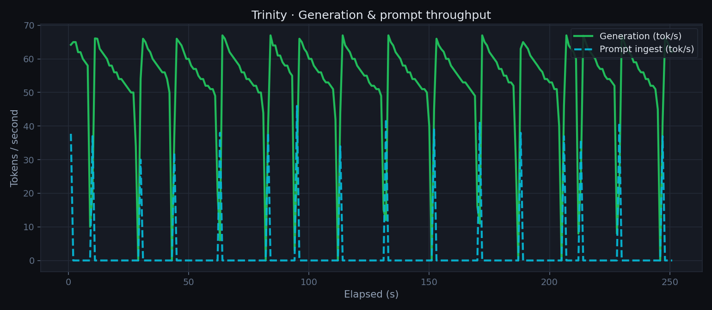
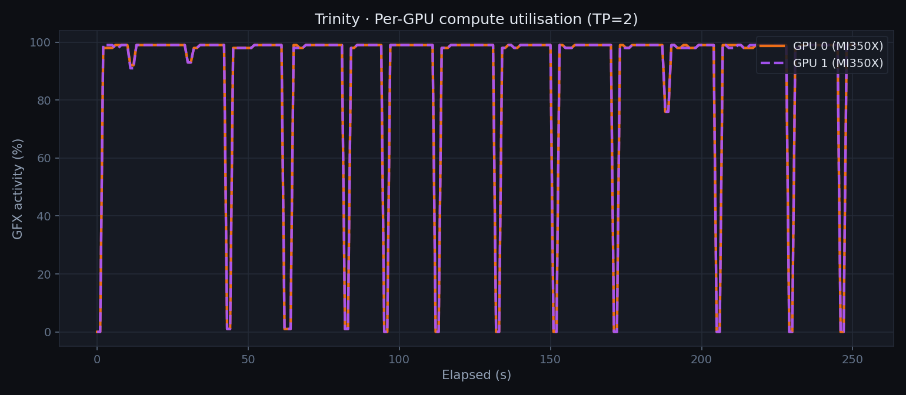
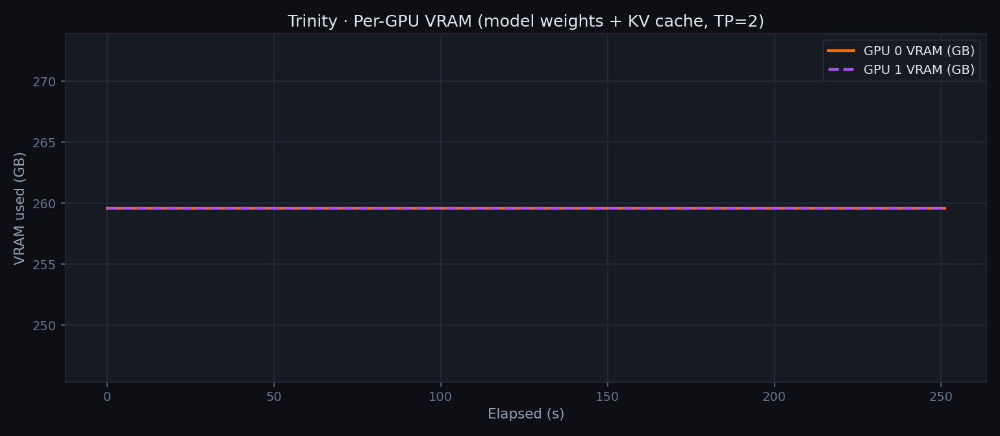
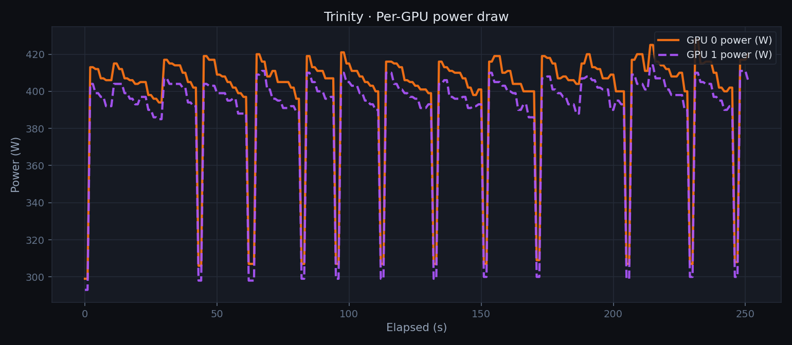
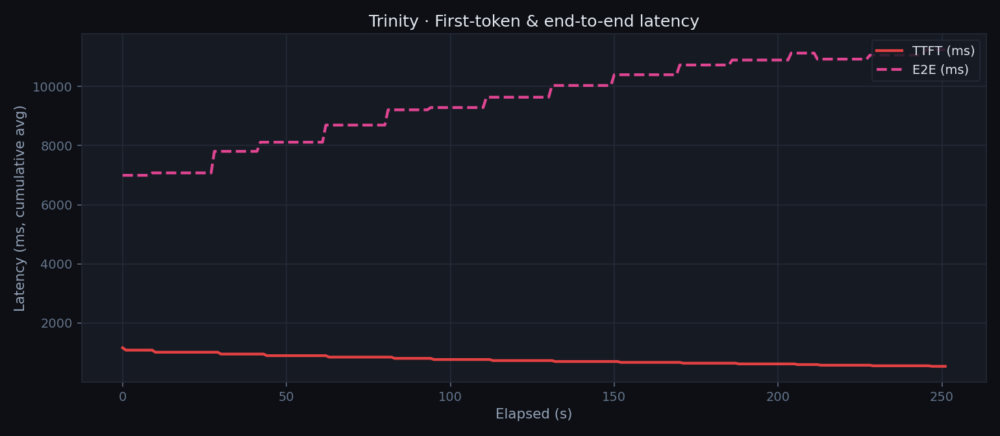
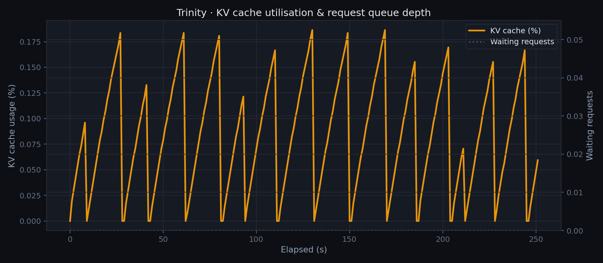

## Overview

### About Trinity

[Trinity](https://www.arcee.ai/trinity) is a family of open-weight language models from [Arcee AI](https://www.arcee.ai), built specifically for production agentic workloads: reliable tool calling, structured JSON output, coherent multi-turn conversations, and long-context reasoning. The family spans four sizes — Nano (6B), Mini (26B), Large Preview (400B), and Large Thinking (400B reasoning-optimised), with consistent capabilities and API surface across all of them. A workflow validated on Nano can be promoted to Large with no prompt changes.

Trinity Large Preview is a **sparse Mixture-of-Experts (MoE)** model. The headline number is 400B total parameters, but only **13B parameters activate per token** — the MoE routing selects a subset of experts for each forward pass, so inference cost is closer to a much smaller dense model than the raw parameter count suggests. The result is a 400B-class model with a **512K token context window** that fits on two high-memory GPUs and generates at competitive throughput.

Arcee has trained Trinity with a heavy focus on agent reliability — function selection accuracy, valid parameter generation, graceful failure recovery, and schema adherence for structured outputs. It is available as open weights on HuggingFace and is natively compatible with vLLM, SGLang, and llama.cpp.

### This guide

This writeup covers running Trinity Large Preview FP8 on a Supermicro H14 bare-metal node via Spinifex — our EC2-compatible orchestration layer. Two AMD Instinct MI350X GPUs (288 GB HBM3e each, 576 GB combined) provide just enough headroom for the FP8 weights plus active KV cache, provisioned and managed with standard `aws ec2` CLI commands.

At that scale the FP8 weights require around 400 GB of GPU memory — more than a single MI350X can hold. This guide covers splitting the model symmetrically across two MI350Xs using vLLM tensor parallelism (TP=2), running on a `g7e.12xlarge` instance provisioned via Spinifex on the H14.

The complete stack:

| Layer | Detail |
|---|---|
| Bare-metal host | Supermicro H14, 8× AMD Instinct MI350X |
| Orchestration | Spinifex (EC2-compatible API) |
| Instance type | `g7e.12xlarge` — 2× MI350X via PCIe passthrough |
| Disk | 800 GB (model weights alone are ~400 GB) |
| Inference runtime | vLLM (`rocm/vllm` Docker image) |
| Tensor parallelism | TP=2 — model sharded symmetrically across GPU 0 and GPU 1 |
| Model | `arcee-ai/Trinity-Large-Preview-FP8` |

### Platform

| Component | Specification |
|---|---|
| **Bare-metal host** | Supermicro H14 |
| **Host OS** | Ubuntu 24.04 LTS or Debian 13 (minimum) |
| **Orchestration** | Spinifex — EC2-compatible bare-metal API |
| **Guest OS** | Ubuntu 26.04 LTS |
| **GPUs** | 2× AMD Instinct MI350X (288 GB HBM3e each, 576 GB combined) |
| **GPU passthrough** | PCIe passthrough via vfio-pci |
| **Instance type** | `g7e.12xlarge` |
| **Container runtime** | Docker (with ROCm device access) |
| **Inference runtime** | vLLM (`rocm/vllm` image), tensor parallelism TP=2 |
| **Block storage** | Viperblock — EBS-compatible, 800 GB |
| **Model** | `arcee-ai/Trinity-Large-Preview-FP8` (400B MoE, ~13B active/token) |

Spinifex runs on the bare-metal host and presents an EC2-compatible API endpoint. Launching a `g7e.12xlarge` atomically claims two MI350Xs from the host's GPU pool and binds them to the guest VM via PCIe passthrough — the guest OS communicates with the hardware directly, with no software virtualisation layer in the data path. When the instance terminates, those two GPUs are immediately returned to the pool.

GPU passthrough requires a host kernel and OS that supports vfio-pci. Ubuntu 24.04 LTS (kernel 6.8+) and Debian 13 (kernel 6.12+) are the tested minimum baselines for the host. Guest VMs run Ubuntu 26.04 LTS, which ships with the ROCm-compatible kernel and userspace expected by the AMD GPU AMI.

## Prerequisites

- Supermicro H14 with at least 2× AMD Instinct MI350X installed
- Host OS: **Ubuntu 24.04 LTS** (kernel 6.8+) or **Debian 13** (kernel 6.12+) — minimum for vfio-pci support
- Spinifex installed and all services running (`systemctl status spinifex.target`)
- GPU passthrough configured — `spx admin gpu setup` (reboot required) then `spx admin gpu enable`
- AMD GPU AMI registered (`ami-ubuntu-amd-gpu`) — Ubuntu 26.04 LTS with ROCm-compatible kernel
- AWS CLI configured with `AWS_PROFILE=spinifex` pointing at the Spinifex endpoint
- SSH key pair imported, VPC and security group created (see [Launching Instances](/docs/launching-instances))
- Docker installed in the guest VM (included in the AMD GPU AMI)
- HuggingFace account with access to `arcee-ai/Trinity-Large-Preview-FP8`

GPU passthrough must be configured before launching GPU instances:

```bash
sudo spx admin gpu setup   # binds GPUs to vfio-pci — requires reboot
# ... reboot ...
sudo spx admin gpu enable  # confirms passthrough and makes GPU pool available
```

## Instructions

### 1. Provision the instance

Spinifex exposes a standard EC2 API on the bare-metal host. The only difference from a real AWS workflow is `AWS_PROFILE=spinifex`.

```bash
export AWS_PROFILE=spinifex

# Check available GPU instance types
aws ec2 describe-instance-types \
    --query 'InstanceTypes[?GpuInfo].[InstanceType,GpuInfo.Gpus[0].Count,GpuInfo.Gpus[0].Name]' \
    --output table

# Launch a g7e.12xlarge with 800 GB disk
# Spinifex atomically claims 2× MI350X via PCIe passthrough for this instance type
INSTANCE_ID=$(aws ec2 run-instances \
    --image-id ami-ubuntu-amd-gpu \
    --instance-type g7e.12xlarge \
    --key-name spinifex-key \
    --subnet-id <subnet-id> \
    --security-group-ids <sg-id> \
    --block-device-mappings 'DeviceName=/dev/sda1,Ebs={VolumeSize=800,DeleteOnTermination=true}' \
    --count 1 \
    --query 'Instances[0].InstanceId' --output text)

echo "Launched: $INSTANCE_ID"

# Wait for running state
aws ec2 wait instance-running --instance-ids "$INSTANCE_ID"

# Get the IP
INSTANCE_IP=$(aws ec2 describe-instances \
    --instance-ids "$INSTANCE_ID" \
    --query 'Reservations[0].Instances[0].PublicIpAddress' --output text)

echo "IP: $INSTANCE_IP"
```

Once SSH is available, confirm both GPUs are visible:

```bash
ssh -i ~/.ssh/spinifex-key ubuntu@$INSTANCE_IP 'lspci | grep -i amd'
```

Or install and run `amd-smi` on the instance:


Two MI350X entries with distinct UUIDs confirm direct PCIe passthrough.

### 2. Pull the vLLM Docker image

```bash
ssh -i ~/.ssh/spinifex-key ubuntu@$INSTANCE_IP

# On the VM:
docker pull rocm/vllm:latest
```

> The `rocm/vllm` image is large (~20 GB). Pull it while the model is downloading in parallel if bandwidth allows.

### 3. Pull the model

Trinity Large Preview FP8 weighs roughly 400 GB, so expect the model download to take some time.

```bash
# On the VM:
pip install 'huggingface-hub[hf_xet]'
hf download 'arcee-ai/Trinity-Large-Preview-FP8' --repo-type model

# Monitor progress — looking for ~400 GB total
du -sh ~/.cache/huggingface/hub/
```

The model lands in `~/.cache/huggingface/hub/`. vLLM picks it up automatically from there on serve.

### 4. Run vLLM

Trinity needs TP=2 to fit across both MI350Xs:

```bash
# On the VM:
docker run --rm -d \
    --name trinity \
    --device /dev/kfd \
    --device /dev/dri \
    --group-add video \
    --ipc host \
    --network host \
    -v ~/.cache/huggingface:/root/.cache/huggingface \
    rocm/vllm:latest \
    vllm serve arcee-ai/Trinity-Large-Preview-FP8 \
        --tensor-parallel-size 2 \
        --dtype auto \
        --max-model-len 8192 \
        --gpu-memory-utilization 0.90 \
        --host 0.0.0.0 \
        --port 8003
```

Watch the startup log:

```bash
docker logs -f trinity
```

Loading a 400B FP8 model across two GPUs takes **2–4 minutes**. Wait for:

```
INFO:     Application startup complete.
```

Then verify:

```bash
curl http://localhost:8003/health
curl http://localhost:8003/v1/models | python3 -m json.tool
```

### 5. Test it

A quick sanity check via the OpenAI-compatible API before running benchmarks:

```bash
curl http://localhost:8003/v1/chat/completions \
    -H "Content-Type: application/json" \
    -d '{
        "model": "arcee-ai/Trinity-Large-Preview-FP8",
        "messages": [{"role": "user", "content": "Explain tensor parallelism in three sentences."}],
        "max_tokens": 256
    }'
```

The first request will be slowest — KV cache is cold. Subsequent requests warm up noticeably.

### 6. Dashboard

We created a quick dashboard for a live view of the model's telemetry — throughput, latency, GPU utilisation, VRAM, and KV cache — streamed via SSE from the vLLM metrics endpoint and the GPU stats sidecar.

<p><video src="https://iso.mulgadc.com/trinity-workload.mp4" controls width="100%" style="border-radius:6px"></video></p>

### 7. Benchmark results

Two captures were run against the live model:

- **Chat session:** A short interactive session — low concurrency, variable cadence, 56 s total. Reflects real conversational use.
- **Scripted benchmark:** 5-minute sustained load driver — rotating batch of 15 long-form technical prompts at 1.5 s cadence. Reflects peak throughput.

| Metric | Chat session | Benchmark (5 min) |
|---|---|---|
| Peak tok/s | 67.1 | 67.0 |
| Avg tok/s (under load) | 18.7 | **52.9** |
| Avg TTFT | 1668 ms | 758 ms |
| Min TTFT | 1502 ms | 538 ms |
| Max TTFT | 1871 ms | 1165 ms |
| GPU 0 util (avg) | 30.2% | 88.8% |
| GPU 1 util (avg) | 30.1% | 88.7% |
| VRAM per GPU | 259.6 GB | 259.6 GB |
| Avg power (both GPUs) | 664 W | 788 W |
| Peak power | 828 W | 839 W |
| GPU temp | 65 °C | 65 °C |

The lower avg utilisation in the chat session reflects idle gaps between conversational turns; peak throughput is identical at ~67 tok/s in both runs, indicating the hardware ceiling rather than a software one.

### Generation throughput



Generation and prompt-ingest tok/s over the 5-minute benchmark. The model sustains ~53 tok/s average at continuous load, peaking at 67 tok/s.

### Per-GPU compute utilisation



GPU 0 and GPU 1 track each other closely throughout the benchmark — TP=2 distributes attention and FFN layers symmetrically across both MI350Xs.

### Per-GPU VRAM



Both GPUs hold 259.6 GB — model weights sharded evenly, plus KV cache. 90.2% of HBM3e is occupied at rest, leaving ~26 GB headroom per GPU for active KV cache during generation.

### Per-GPU power



Power draw during active generation peaks at ~420 W per GPU, for a combined chassis draw well under the MI350X's 750 W TDP per card. Idle between prompts returns to ~300 W.

### Latency



Cumulative average TTFT and E2E latency over the benchmark. TTFT settles to ~758 ms avg once the KV cache is warm; E2E tracks request length as expected.

### KV cache utilisation



KV cache occupancy rises as requests pile up during the sustained load phase. The queue depth stays near zero — the model keeps pace with the 1.5 s prompt cadence.

### 8. Teardown

```bash
# Stop the container
ssh -i ~/.ssh/spinifex-key ubuntu@$INSTANCE_IP 'docker stop trinity'

# Terminate the instance — releases the 2× MI350X back to the Spinifex pool
aws ec2 terminate-instances --instance-ids "$INSTANCE_ID"
```

The two MI350Xs are immediately available to Spinifex for a new workload once the instance terminates.

### 9. Conclusion

Trinity Large Preview demonstrates that frontier-class open-weight models are now within reach of a two-GPU bare-metal setup. The MoE architecture is crucial: 400B total parameters with only 13B active per token means the model generates at ~53 tok/s sustained and peaks at 67 tok/s on a pair of MI350Xs — throughput that would be difficult to match with a dense model of comparable quality at that memory footprint.

Combining this with Spinifex as the infrastructure layer allows teams to own the entire workflow. Provisioning a `g7e.12xlarge` instance, pulling a 400 GB model, and serving it through vLLM took a handful of standard `aws ec2` commands and a single `docker run`. The same workflow runs identically on any Spinifex-managed bare-metal node, with the GPUs returned to the pool when instances terminate.

For teams evaluating Trinity for production agentic workloads — tool calling, structured outputs, long-context reasoning — this represents a credible self-hosted deployment path: open weights, Apache 2.0 license, owned hardware and familiar tooling.

*Model access: `arcee-ai/Trinity-Large-Preview-FP8` via HuggingFace. Hardware access via Supermicro JumpStart Program.*
