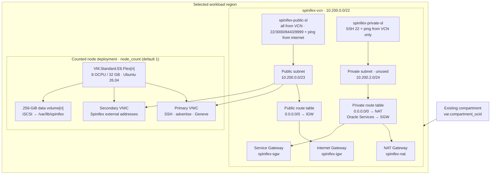

# oci-spx — Terraform for Spinifex on OCI

Terraform configuration that builds the OCI infrastructure a Spinifex cluster runs on: a VCN with its gateways and subnets, one to N nodes with two VNICs each, and a data volume per node. No DRG, remote peering, local peering gateway, RZG, or other external network attachment is created.

**This is a local fork of [`aszynkow/oci_mulgadc`](https://github.com/aszynkow/oci_mulgadc), modified for Spinifex.** It builds infrastructure only; Spinifex itself is installed afterwards by the existing deploy path (`update-nodes.sh`, `install-node.sh`), the same scripts that serve prod and dev-prod. The operator guide that wraps it is [`docs/oci-integration`](../../../docs/oci-integration/README.md); the plan is `docs/development/feature/oci-terraform-provisioning.md` in the mulga monorepo.

## What This Repository Adds

**It deploys into a compartment that already exists and creates no identity resources.** `compartment_ocid` is required. Upstream created a compartment, an IAM group and a root policy; those need tenancy-root rights, which is the opposite of the permission boundary this deployment argues for.

Every resource is prefixed with `deployment_name` (default `spinifex`), so nothing here can collide with or be mistaken for something built by hand in the same compartment. The value becomes the VCN `dns_label`, so it is validated as 1-15 lowercase alphanumerics.

- `spinifex-vcn` (`10.200.0.0/22`) with public and private subnets, IGW, NAT Gateway, Service Gateway, and separate public/private route tables.
- A public-subnet security list opening the whole VCN to itself and, separately, `node_client_cidr_allow_list` to everything — guest policy belongs to the customer's AWS security groups, not to OCI.
- A counted `VM.Standard.E6.Flex` node deployment using the latest compatible Canonical Ubuntu 26.04 image, with one data volume per node.
- A second VNIC per node in the same public subnet, which is where every Spinifex external address is registered at runtime.

## How this differs from upstream

| | Upstream | Here |
| --- | --- | --- |
| Shape | `BM.Standard.E2.64` | `VM.Standard.E6.Flex`, 8 OCPU / 32 GB |
| Node placement | Private subnet, no public IP | **Public subnet, public IP required** |
| Bastion | Standard Bastion in the private subnet | Removed |
| Compartment | Created, with an IAM group and root policy | **Existing**, by OCID; no identity resources |
| Vault | Imports the SSH private key as a secret | Removed |
| Resource names | `mulgadc-*` | `${deployment_name}-*`, default `spinifex-*` |
| VNICs per node | 1 | 2 |
| VCN | `/16` | `/22` |
| Data volume | 20 TiB | 256 GiB |

## Quick Start

Prerequisites: Terraform, Python 3, OCI credentials in `~/.oci/config`, and the public and private halves of the SSH key. The Python helper creates and uses this repository's isolated `.venv` and installs [requirements.txt](requirements.txt).

```bash
cd scripts/terraform/oci-spx

echo 'compartment_ocid = "<ocid of an existing compartment>"' > terraform.auto.tfvars

python3 scripts/oci_env.py --ssh-public-key-path <path_to_public_ssh_key> -- terraform init

python3 scripts/oci_env.py --ssh-public-key-path <path_to_public_ssh_key> -- terraform plan -out=mulgadc.tfplan
```

Review the saved plan, then apply that exact plan:

```bash
python3 scripts/oci_env.py --ssh-public-key-path <path_to_public_ssh_key> -- terraform apply mulgadc.tfplan
```

## Config and State

| Item | Purpose |
| --- | --- |
| `scripts/oci_env.py` | Loads OCI profile inputs, discovers the tenancy home region, exports Terraform variables, and runs Terraform in the repository `.venv`. |
| `requirements.txt` | Python dependency set for the environment helper. |
| `terraform.tfvars.example` | Example non-secret Terraform inputs. Copy it to untracked `terraform.auto.tfvars` for local overrides. |
| `.venv/` | Repository-local virtual environment; generated locally and not committed. |
| `terraform.tfstate` | Terraform state; generated locally unless a remote backend is configured. Do not commit it. |

The helper defaults to OCI profile `apacanzset03child03`. If it is absent and `apacanzset03child3` is locally configured, the helper explicitly falls back to that profile. Override either setting when needed:

```bash
python3 scripts/oci_env.py --profile my-profile --region ap-sydney-1 -- terraform plan
```

`ssh_public_key_path` is what installs your key on each node. **`ssh_private_key_path` is unused** — the vault that imported it was removed, so Terraform never reads a private key and none can reach the state file. The helper still exports it, which is why the variable is still declared.

> [!WARNING]
> Never commit the state file, a plan file, or key material. `.gitignore` covers `terraform.tfstate*`, `*.tfplan`, `*.auto.tfvars`, `terraform.tfvars` and `*.pem`.

## Architecture



## Repository Layout

```text
.
├── identity.tf          # Lookup of the existing compartment
├── network.tf           # VCN, gateways, routes, subnets, and security lists
├── compute.tf           # Counted nodes, second VNICs, volumes, and iSCSI attachments
├── cloud-init/          # user_data template and the data-volume mount script
├── provider.tf          # Single-region provider
├── variables.tf         # Inputs and validations
├── outputs.tf           # OCIDs and policy outputs
├── versions.tf          # Terraform and provider version constraints
├── terraform.tfvars.example
├── requirements.txt
└── scripts/oci_env.py   # Python environment and Terraform command helper
```

## Identity and regions

**Everything is created in one region, in a compartment that already exists.** There is no aliased home-region provider and no identity resource, because creating a compartment, a group or a root policy needs tenancy-root rights. A profile scoped to a compartment fails those calls with `404-NotAuthorizedOrNotFound` against the home-region identity endpoint, which reads like a missing resource rather than a missing permission.

`region` defaults to `ap-sydney-1`. Spinifex's own region is a separate setting that follows AWS naming and defaults to `ap-southeast-2`; seeing both is correct, not a mismatch.

## Sizing

`node_count` defaults to `1` and supports `1` through `25`. Each index produces a matching instance, second VNIC, data volume, and attachment; names include the index, for example `spinifex-node-01`.

**8 OCPU (16 vCPU) and 32 GB RAM is the minimum recommended for a Spinifex node**, and is what the variables default to. OCI counts an OCPU as a full core, so 8 OCPU is 16 threads. The control plane, predastore, viperblock, NATS and OVN all share that before a single guest boots.

**Bare metal is the preferred shape** — the whole host, no noisy neighbour, and nested virtualisation that is not a guest of a guest. Until the bare-metal quota in this tenancy is raised we deploy on `VM.Standard.E6.Flex`, which is known-good: nested KVM works on it, measured on `mulga-poc`.

`shape_config` sizes a flex shape and is **rejected on a fixed bare-metal shape**, so `compute.tf` emits it only when the shape name contains `Flex`. Setting `compute_shape` to a `BM.*` shape is therefore a one-variable change, and `compute_ocpus` and `compute_memory_in_gbs` are then ignored.

Each data volume defaults to `256` GiB at `120` VPUs/GB, the Ultra High Performance tier. It is a separate data volume: the boot volume comes from the image's default size and is not affected by `data_volume_size_in_gbs`.

## The data volume and cloud-init

`cloud-init/mount-data-volume.sh` runs once per boot from `user_data` and leaves the volume mounted at `data_mountpoint`, which defaults to `/var/lib/spinifex`. It mounts Spinifex's data directory itself rather than `/mnt/something` with a redirect, so it is one mount and no Spinifex config points anywhere unusual.

It is safe to re-run. **It formats only a device with no filesystem on it**, and treats a `blkid` failure it does not recognise as fatal rather than assuming the device is blank.

**`_netdev` is load bearing.** Without it the mount is attempted before `iscsid` has a session, and the boot either hangs or silently lands the whole stack on the small boot disk. That is what happened on `mulga-poc` before its fstab entry was corrected, and it was only caught because a benchmark looked wrong. The acceptance test is therefore a **reboot**, not a successful first boot — `findmnt /var/lib/spinifex`, never `ls`.

The script mounts the device by name and never lets `mount(8)` resolve the mount point through fstab: the fstab entry exists for the next boot, not the current one.

`device` is set on the attachment deliberately. A volume attached without one is named after the boot disk — `mulga-poc`'s symlink is `/dev/oracleoci/oraclevda1 → /dev/sdb1` — whereas asking for the path gives a stable `/dev/oracleoci/oraclevdb`, identical on every node.

## The WAN bridge

`cloud-init/setup-wan-bridge.sh` builds `br-wan`, the Linux bridge carrying Spinifex's external datapath, over the **secondary** VNIC: NIC enslaved, bridge MAC cloned from the VNIC, MTU 9000, and table-200 source routing.

**Source routing is not optional on OCI.** OCI enforces the source address per VNIC, so a reply leaving through the primary from a secondary address is dropped on the wire. Test egress past the subnet — pinging the VCN router proves nothing, because the hypervisor answers it locally.

**It writes `/etc/netplan/60-spinifex-wan.yaml` and never edits `50-cloud-init.yaml`.** cloud-init owns that file and regenerates it, so edits there are lost. netplan merges every file in the directory, which is why a separate higher-numbered file is the supported way to extend a cloud-init-managed network.

**The VNIC's MAC and address come from IMDS at runtime, not from Terraform.** They cannot come from Terraform: the second VNIC is attached after the instance reaches RUNNING, so when `user_data` is written it does not exist yet. The script reads `/opc/v2/vnics/` and takes the first entry whose MAC is not that of the interface holding the default route.

`spinifex-wan-bridge.service` carries it, with `ConditionPathExists=!` on the netplan file: a boot where the VNIC arrived late retries, and once configured the unit stops running because netplan owns the config. Seeing it `inactive` after a reboot is correct, not a failure.

## The host firewall

**The Ubuntu OCI image closes the ports a node serves.** Its INPUT chain ends in `REJECT --reject-with icmp-host-prohibited` with only `22`, ICMP, `lo` and ESTABLISHED above it, so `3000`, `8443` and `9999` are unreachable on a fresh instance. `cloud-init/open-service-ports.sh` inserts them **above** the REJECT — appending would put them where they can never match — and persists with `netfilter-persistent save`.

> [!WARNING]
> **Never flush iptables on an OCI node.** The image's `InstanceServices` chain in OUTPUT is what permits iSCSI to `169.254.2.0/24:3260` and the metadata service. `iptables -F` takes `/var/lib/spinifex` and IMDS with it, and it surfaces later as a mount problem rather than a firewall one.

FORWARD is left alone too: Spinifex adds its own `spinifex-nat-egress` rules there.

`node_service_ports` drives the host firewall only, and that is the whole of what it drives. The OCI security list is open, deliberately — see below.

### Three layers, and only one of them is the customer's

| Layer | Guards | Who sets it |
| --- | --- | --- |
| OCI security list | The subnet | **Open.** Narrow `node_client_cidr_allow_list` to restrict who reaches the deployment at all |
| OVN security groups | Each guest | The customer, through the AWS API, exactly as on EC2 |
| Host firewall (`open-service-ports.sh`) | The node's own listeners | `node_service_ports` |

**The OCI security list is open on purpose.** A guest's firewall is its AWS security group, and a customer who opens `443` on theirs expects `443` to work. They cannot see an OCI security list, let alone edit one. Enumerating guest ports there would mean a Terraform change per customer port, and the failure would present as "my security group does nothing" — among the hardest network faults to trace. The intra-VCN rule is kept separate from the internet rule so that narrowing the latter can never cut Geneve, OVN, NATS or predastore between nodes.

## Network and Access

**Spinifex nodes sit in the public subnet with public IPs, and this is a requirement rather than a convenience.** A node serves the UI on `3000`, the predastore gate on `8443` and the AWS gateway on `9999` to operators and customers directly; a node in a private subnet cannot do its job. There is no bastion.

Each node gets two VNICs in that same subnet. The primary carries the host plane — SSH, the node's advertise address, and the Geneve overlay — and the secondary is where the OCI allocator registers every Spinifex external address as a secondary private IP. `VM.Standard.E6.Flex` allows two VNIC attachments in total, so that is the whole budget; Oracle documents up to 64 secondary private IPv4 objects per VNIC, which is the per-node ceiling on Elastic IPs.

`skip_source_dest_check` is deliberately left off. Routed NAT masquerades to the VNIC's own address and an Elastic IP's private half is itself a registered address on the VNIC, so nothing Spinifex sends is a foreign source.

The private subnet is **unused today** and kept only so it exists: Spinifex guests live on the OVN overlay and never occupy an OCI subnet.

`node_client_cidr_allow_list` controls who may reach a node's SSH and service ports from the internet, and defaults to `0.0.0.0/0`. Restrict it before production use:

```hcl
node_client_cidr_allow_list = ["203.0.113.10/32"]
```

## The API user this seeds

The OCI provider integration needs credentials on each node so Spinifex can allocate addresses at runtime. **Grant that user only the operations Spinifex performs on addresses** — create/get/list/delete private IPs, create/get/update/delete public IPs — and nothing else. It is not a tenancy admin. Broader rights widen the blast radius of a node compromise for no benefit.

## Common Commands

Show the current outputs:

```bash
terraform output
```

Run a plan through the Python helper:

```bash
python3 scripts/oci_env.py --ssh-public-key-path <path_to_public_ssh_key> -- terraform plan
```

Export the helper's variables into the current shell instead of wrapping every command:

```bash
eval "$(python3 scripts/oci_env.py --shell --ssh-public-key-path <path_to_public_ssh_key>)"
terraform plan
```

## Troubleshooting

- **Missing SSH-path error:** pass `--ssh-public-key-path` to `oci_env.py`. The private-key option is optional and unused.
- **`404-NotAuthorizedOrNotFound` on a create:** this is a permission error wearing a not-found error's clothes. Check the profile can write to `compartment_ocid`.
- **Additional node does not have a data volume:** keep `node_count` within `1`–`25`; the instance, volume, and attachment use the same count.
- **Need to access a node:** SSH to its public IP with the key from `ssh_public_key_path`. `terraform output nodes` lists the names and addresses; `terraform output -raw hosts_file` writes the form `update-nodes.sh --hosts-file` accepts.
- **`shape_config` rejected on apply:** the shape is a fixed bare-metal one. Remove the size variables from your `.auto.tfvars`; they do not apply.
- **Second VNIC refused:** `VM.Standard.E6.Flex` allows two VNIC attachments and both are used here. A shape with a lower `max-vnic-attachments` cannot run Spinifex.
- **`/var/lib/spinifex` is not mounted after boot:** read `/var/log/cloud-init-output.log` for the `[spinifex-data-volume]` lines. If it says the device never appeared, the iSCSI session is the problem — check `iscsiadm -m session` and that the Block Volume Management agent plugin is enabled. Re-running `/usr/local/sbin/spinifex-mount-data-volume /dev/oracleoci/oraclevdb /var/lib/spinifex` is safe.
