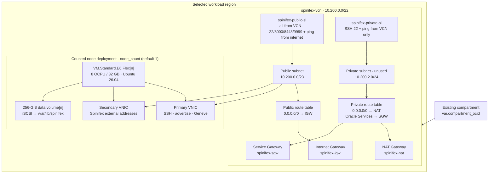

# oci-spx — Terraform for Spinifex on OCI

Terraform configuration that builds the OCI infrastructure a Spinifex cluster runs on: a VCN with its gateways and subnets, one to N nodes with two VNICs each, and a data volume per node. No DRG, remote peering, local peering gateway, RZG, or other external network attachment is created.

**This is a local fork of [`aszynkow/oci_mulgadc`](https://github.com/aszynkow/oci_mulgadc), modified for Spinifex.** It builds OCI infrastructure only. Run `validate-topology.sh` afterwards to install Spinifex, form the cluster, configure the OCI allocator, and validate it; the driver can either build new infrastructure itself or use this Terraform state through `--existing-state-file`. It invokes `install-node.sh` internally for multi-node formation. See [Deploy and validate Spinifex on OCI](../../../docs/oci-integration/README.md#5-deploy) for the driver commands, including the existing-infrastructure path. The operator guide is [`docs/oci-integration`](../../../docs/oci-integration/README.md); the plan is `docs/development/feature/oci-terraform-provisioning.md` in the mulga monorepo.

## What This Repository Adds

**It deploys into a compartment that already exists and creates no identity resources.** `compartment_ocid` is required. Upstream created a compartment, an IAM group and a root policy; those need tenancy-root rights, which is the opposite of the permission boundary this deployment argues for.

Every resource is prefixed with `deployment_name` (default `spinifex`), so nothing here can collide with or be mistaken for something built by hand in the same compartment. The value becomes the VCN `dns_label`, so it is validated as 1-15 lowercase alphanumerics.

- `spinifex-vcn` (`10.200.0.0/22`) with public and private subnets, IGW, NAT Gateway, Service Gateway, and separate public/private route tables.
- A public-subnet security list opening the whole VCN to itself and, separately, `node_client_cidr_allow_list` to everything — guest policy belongs to the customer's AWS security groups, not to OCI.
- A counted `VM.Standard.E6.Flex` node deployment using the latest compatible Canonical Ubuntu 26.04 image, with one data volume per node.
- A second VNIC per node in the same public subnet, which is where every Spinifex external address is registered at runtime.

## How this differs from upstream

| | Upstream | Here |
| --- | --- | --- |
| Shape | `BM.Standard.E2.64` | `VM.Standard.E6.Flex`, 8 OCPU / 32 GB |
| Node placement | Private subnet, no public IP | **Public subnet, public IP required** |
| Bastion | Standard Bastion in the private subnet | Removed |
| Compartment | Created, with an IAM group and root policy | **Existing**, by OCID; no identity resources |
| Vault | Imports the SSH private key as a secret | Removed |
| Resource names | `mulgadc-*` | `${deployment_name}-*`, default `spinifex-*` |
| VNICs per node | 1 | 2 |
| VCN | `/16` | `/22` |
| Data volume | 20 TiB | 256 GiB |

## Quick Start

Prerequisites: Terraform, Python 3, OCI credentials in `~/.oci/config` or the environment, and the public and private halves of the SSH key. The Python helper is standard library only, so there is nothing to install: it once used the OCI SDK, which meant a virtualenv and therefore `python3-venv` on every host that runs it.

```bash
cd scripts/terraform/oci-spx

echo 'compartment_ocid = "<ocid of an existing compartment>"' > terraform.auto.tfvars

python3 scripts/oci_env.py --ssh-public-key-path <path_to_public_ssh_key> -- terraform init

python3 scripts/oci_env.py --ssh-public-key-path <path_to_public_ssh_key> -- terraform plan -out=mulgadc.tfplan
```

Review the saved plan, then apply that exact plan:

```bash
python3 scripts/oci_env.py --ssh-public-key-path <path_to_public_ssh_key> -- terraform apply mulgadc.tfplan
```

## Config and State

| Item | Purpose |
| --- | --- |
| `scripts/oci_env.py` | Loads the credential from a profile or the environment, checks its shape, exports Terraform variables, and runs Terraform. |
| `terraform.tfvars.example` | Example non-secret Terraform inputs. Copy it to untracked `terraform.auto.tfvars` for local overrides. |
| `terraform.tfstate` | Terraform state; generated locally unless a remote backend is configured. Do not commit it. |

The helper reads the `DEFAULT` profile, which is what `oci setup config` writes. Set `OCI_CLI_PROFILE` or pass `--profile` to read a different one; a named profile the config does not hold is an error rather than a fallback, so a deployment cannot land in a tenancy nobody chose.

```bash
python3 scripts/oci_env.py --profile my-profile --region ap-sydney-1 -- terraform plan
```

`ssh_public_key_path` is what installs your key on each node. **`ssh_private_key_path` is unused** — the vault that imported it was removed, so Terraform never reads a private key and none can reach the state file. The helper still exports it, which is why the variable is still declared.

> [!WARNING]
> Never commit the state file, a plan file, or key material. `.gitignore` covers `terraform.tfstate*`, `*.tfplan`, `*.auto.tfvars`, `terraform.tfvars` and `*.pem`.

## Architecture


```mermaid
flowchart TB
  compartment["Existing compartment<br/>var.compartment_ocid"]

  subgraph region["Selected workload region"]
    subgraph vcn["spinifex-vcn · 10.200.0.0/22"]
      igw["Internet Gateway<br/>spinifex-igw"]
      nat["NAT Gateway<br/>spinifex-nat"]
      sgw["Service Gateway<br/>spinifex-sgw"]
      public_rt["Public route table<br/>0.0.0.0/0 → IGW"]
      private_rt["Private route table<br/>0.0.0.0/0 → NAT<br/>Oracle Services → SGW"]
      public_subnet["Public subnet<br/>10.200.0.0/23"]
      private_subnet["Private subnet · unused<br/>10.200.2.0/24"]
      public_sl["spinifex-public-sl<br/>all from VCN · 22/3000/8443/9999 + ping from internet"]
      private_sl["spinifex-private-sl<br/>SSH 22 + ping from VCN only"]

      public_subnet --> public_rt --> igw
      private_subnet --> private_rt
      private_rt --> nat
      private_rt --> sgw
      public_sl --> public_subnet
      private_sl --> private_subnet
    end

    subgraph node_set["Counted node deployment · node_count (default 1)"]
      node["VM.Standard.E6.Flex[n]<br/>8 OCPU / 32 GB · Ubuntu 26.04"]
      vnic1["Primary VNIC<br/>SSH · advertise · Geneve"]
      vnic2["Secondary VNIC<br/>Spinifex external addresses"]
      volume["256-GiB data volume[n]<br/>iSCSI → /var/lib/spinifex"]
      node --> vnic1
      node --> vnic2
      node --> volume
    end
    public_subnet --> vnic1
    public_subnet --> vnic2
  end

  compartment --> vcn
```

## Repository Layout

```text
.
├── identity.tf          # Lookup of the existing compartment
├── network.tf           # VCN, gateways, routes, subnets, and security lists
├── compute.tf           # Counted nodes, second VNICs, volumes, and iSCSI attachments
├── cloud-init/          # user_data template and the data-volume mount script
├── provider.tf          # Single-region provider
├── variables.tf         # Inputs and validations
├── outputs.tf           # OCIDs and policy outputs
├── versions.tf          # Terraform and provider version constraints
├── terraform.tfvars.example
└── scripts/oci_env.py   # Python environment and Terraform command helper
```

## Identity and regions

**Everything is created in one region, in a compartment that already exists.** There is no aliased home-region provider and no identity resource, because creating a compartment, a group or a root policy needs tenancy-root rights. A profile scoped to a compartment fails those calls with `404-NotAuthorizedOrNotFound` against the home-region identity endpoint, which reads like a missing resource rather than a missing permission.

`region` defaults to `ap-sydney-1`. Spinifex's own region is a separate setting that follows AWS naming and defaults to `ap-southeast-2`; seeing both is correct, not a mismatch.

## Sizing

`node_count` defaults to `1` and supports `1` through `25`. Each index produces a matching instance, second VNIC, data volume, and attachment; names include the index, for example `spinifex-node-01`.

**8 OCPU (16 vCPU) and 32 GB RAM is the minimum recommended for a Spinifex node**, and is what the variables default to. OCI counts an OCPU as a full core, so 8 OCPU is 16 threads. The control plane, predastore, viperblock, NATS and OVN all share that before a single guest boots.

**Bare metal is the preferred shape** — the whole host, no noisy neighbour, and nested virtualisation that is not a guest of a guest. Until the bare-metal quota in this tenancy is raised we deploy on `VM.Standard.E6.Flex`, which is known-good: nested KVM works on it, measured on `mulga-poc`.

`shape_config` sizes a flex shape and is **rejected on a fixed bare-metal shape**, so `compute.tf` emits it only when the shape name contains `Flex`. Setting `compute_shape` to a `BM.*` shape is therefore a one-variable change, and `compute_ocpus` and `compute_memory_in_gbs` are then ignored.

Each data volume defaults to `256` GiB at `120` VPUs/GB, the Ultra High Performance tier. It is a separate data volume: the boot volume comes from the image's default size and is not affected by `data_volume_size_in_gbs`.

## The data volume and cloud-init

`cloud-init/mount-data-volume.sh` runs once per boot from `user_data` and leaves the volume mounted at `data_mountpoint`, which defaults to `/var/lib/spinifex`. It mounts Spinifex's data directory itself rather than `/mnt/something` with a redirect, so it is one mount and no Spinifex config points anywhere unusual.

It is safe to re-run. **It formats only a device with no filesystem on it**, and treats a `blkid` failure it does not recognise as fatal rather than assuming the device is blank.

**`_netdev` is load bearing.** Without it the mount is attempted before `iscsid` has a session, and the boot either hangs or silently lands the whole stack on the small boot disk. That is what happened on `mulga-poc` before its fstab entry was corrected, and it was only caught because a benchmark looked wrong. The acceptance test is therefore a **reboot**, not a successful first boot — `findmnt /var/lib/spinifex`, never `ls`.

The script mounts the device by name and never lets `mount(8)` resolve the mount point through fstab: the fstab entry exists for the next boot, not the current one.

`device` is set on the attachment deliberately. A volume attached without one is named after the boot disk — `mulga-poc`'s symlink is `/dev/oracleoci/oraclevda1 → /dev/sdb1` — whereas asking for the path gives a stable `/dev/oracleoci/oraclevdb`, identical on every node.

## The WAN bridge

`cloud-init/setup-wan-bridge.sh` builds `br-wan`, the Linux bridge carrying Spinifex's external datapath, over the **secondary** VNIC: NIC enslaved, bridge MAC cloned from the VNIC, MTU 9000, and table-200 source routing.

**Source routing is not optional on OCI.** OCI enforces the source address per VNIC, so a reply leaving through the primary from a secondary address is dropped on the wire. Test egress past the subnet — pinging the VCN router proves nothing, because the hypervisor answers it locally.

**It writes `/etc/netplan/60-spinifex-wan.yaml` and never edits `50-cloud-init.yaml`.** cloud-init owns that file and regenerates it, so edits there are lost. netplan merges every file in the directory, which is why a separate higher-numbered file is the supported way to extend a cloud-init-managed network.

**The VNIC's MAC and address come from IMDS at runtime, not from Terraform.** They cannot come from Terraform: the second VNIC is attached after the instance reaches RUNNING, so when `user_data` is written it does not exist yet. The script reads `/opc/v2/vnics/` and takes the first entry whose MAC is not that of the interface holding the default route.

`spinifex-wan-bridge.service` carries it, with `ConditionPathExists=!` on the netplan file: a boot where the VNIC arrived late retries, and once configured the unit stops running because netplan owns the config. Seeing it `inactive` after a reboot is correct, not a failure.

## The host firewall

**The Ubuntu OCI image closes the ports a node serves.** Its INPUT chain ends in `REJECT --reject-with icmp-host-prohibited` with only `22`, ICMP, `lo` and ESTABLISHED above it, so `3000`, `8443` and `9999` are unreachable on a fresh instance. `cloud-init/open-service-ports.sh` inserts them **above** the REJECT — appending would put them where they can never match — and persists with `netfilter-persistent save`.

> [!WARNING]
> **Never flush iptables on an OCI node.** The image's `InstanceServices` chain in OUTPUT is what permits iSCSI to `169.254.2.0/24:3260` and the metadata service. `iptables -F` takes `/var/lib/spinifex` and IMDS with it, and it surfaces later as a mount problem rather than a firewall one.

FORWARD is left alone too: Spinifex adds its own `spinifex-nat-egress` rules there.

`node_service_ports` drives the host firewall only, and that is the whole of what it drives. The OCI security list is open, deliberately — see below.

### Three layers, and only one of them is the customer's

| Layer | Guards | Who sets it |
| --- | --- | --- |
| OCI security list | The subnet | **Open.** Narrow `node_client_cidr_allow_list` to restrict who reaches the deployment at all |
| OVN security groups | Each guest | The customer, through the AWS API, exactly as on EC2 |
| Host firewall (`open-service-ports.sh`) | The node's own listeners | `node_service_ports` |

**The OCI security list is open on purpose.** A guest's firewall is its AWS security group, and a customer who opens `443` on theirs expects `443` to work. They cannot see an OCI security list, let alone edit one. Enumerating guest ports there would mean a Terraform change per customer port, and the failure would present as "my security group does nothing" — among the hardest network faults to trace. The intra-VCN rule is kept separate from the internet rule so that narrowing the latter can never cut Geneve, OVN, NATS or predastore between nodes.

## Network and Access

**Spinifex nodes sit in the public subnet with public IPs, and this is a requirement rather than a convenience.** A node serves the UI on `3000`, the predastore gate on `8443` and the AWS gateway on `9999` to operators and customers directly; a node in a private subnet cannot do its job. There is no bastion.

Each node gets two VNICs in that same subnet. The primary carries the host plane — SSH, the node's advertise address, and the Geneve overlay — and the secondary is where the OCI allocator registers every Spinifex external address as a secondary private IP. `VM.Standard.E6.Flex` allows two VNIC attachments in total, so that is the whole budget; Oracle documents up to 64 secondary private IPv4 objects per VNIC, which is the per-node ceiling on Elastic IPs.

`skip_source_dest_check` is deliberately left off. Routed NAT masquerades to the VNIC's own address and an Elastic IP's private half is itself a registered address on the VNIC, so nothing Spinifex sends is a foreign source.

The private subnet is **unused today** and kept only so it exists: Spinifex guests live on the OVN overlay and never occupy an OCI subnet.

`node_client_cidr_allow_list` controls who may reach a node's SSH and service ports from the internet, and defaults to `0.0.0.0/0`. Restrict it before production use:

```hcl
node_client_cidr_allow_list = ["203.0.113.10/32"]
```

## How each node authenticates to OCI

The allocator needs OCI credentials at runtime, and there are two ways to give it them. A node with neither forms, passes every health check, and then refuses every launch that wants a public address with `InsufficientAddressCapacity` — the cause appears only in the node's journal, so this is worth getting right before first start.

**Instance principal is the better one.** Each node authenticates with the certificate its own metadata service serves, so no key material exists on any node, there is nothing to rotate, and nothing sensitive reaches Terraform state. The cost is a dynamic group and a policy, which are tenancy-root resources — so creating them needs a tenancy-admin principal, which is why the rest of this configuration deliberately creates nothing at tenancy root.

`instance_principal` has three values, because using an instance principal and being allowed to create one are different rights:

| Value | Pool auth | Creates the dynamic group and policy | Credential needed |
| --- | --- | --- | --- |
| `off` (default) | API key file | No | Compartment-scoped |
| `adopt` | `instance_principal` | No — assumes they exist | Compartment-scoped |
| `create` | `instance_principal` | Yes | **Tenancy admin** |

Create them once per tenancy, then every deployment and rebuild afterwards uses `adopt`:

```bash
./setup-identity.sh --dry-run    # always first
./setup-identity.sh
```

`setup-identity.sh` targets only those two resources and keeps them in `.identity/terraform.tfstate`, separate from every topology's state. That separation is load-bearing: `validate-topology.sh` destroys its own state at the end of each run, so holding tenancy resources there would let a nightly teardown delete the tenancy's policy.

**`adopt` references the dynamic group by nothing at all.** Its matching rule is `instance.compartment.id`, so it covers every instance in the compartment and names no OCID — which is why adopting needs no read on an identity resource and no tenancy rights. The cost is that a missing policy is invisible at apply time: the node forms, passes every health check, and then refuses every launch wanting a public address. The allocator gate in `validate-topology.sh` is what catches that, by requiring `ocinet credential authorised to allocate` in each node's `spinifex-daemon` journal.

The policy grants four verbs in one compartment: `use vnics`, `manage private-ips`, `manage public-ips` and `use subnets`.
That is exactly what allocating an external address does and nothing more.
`use subnets` looks unrelated and is not: `CreatePrivateIp` is checked against `SUBNET_ATTACH` and `CreatePrivateIp` is how an address is registered, so a policy without it authorises nothing and every allocation returns a 404.

**An API key is the fallback**, and the default because it needs nothing from a tenancy admin. Grant that user only the operations Spinifex performs on addresses and nothing else; it is not a tenancy admin, and broader rights widen the blast radius of a node compromise for no benefit.

`spx-oci-config.sh` installs it on **every** node, as `/etc/spinifex/oci/{oci_api_key.pem,config}` — not a home directory, because the daemon's unit sets `ProtectHome=yes`. Both files are needed: `oci_config_file` names an ordinary OCI SDK config, so a node holding only the PEM forms and then fails every allocation. The profile it writes is `spinifex`, matching `oci_config_profile`:

```ini
[spinifex]
user=ocid1.user.oc1..<yours>
fingerprint=<yours>
tenancy=ocid1.tenancy.oc1..<yours>
region=ap-sydney-1
key_file=/etc/spinifex/oci/oci_api_key.pem
```

The script takes `validate-topology.sh`'s hook contract, `hook <ssh-key> <host>...`, so it is both the default thing to pass to `--credential-hook` and runnable on its own against an existing cluster. `--dry-run` resolves and validates the credential without touching a host.

It resolves the credential in four steps and takes the first complete one: the `OCI_SPX_*` environment variables, the `[spinifex]` profile in `~/.oci/config`, `~/.oci/oci_api_key_spx.pem` with the Terraform profile's identifiers, then the Terraform credential itself with a warning that it is wider than needed. Steps 2 to 4 go through `scripts/oci_env.py`, the same resolver the apply uses, so the node credential and the one that built the infrastructure cannot come from different profiles. The fingerprint is checked against the key before anything is written, because a mismatched pair is otherwise an OCI 401 at the first allocation.

Credential material reaches the nodes over SSH, in the remote shell's stdin rather than its arguments, and goes into neither user-data nor Terraform state. `--credential-hook` still accepts any executable with that argument shape, so a tenancy holding credentials in a vault can substitute its own. Instance principal needs no hook at all, which is the reason to prefer it wherever a dynamic group can be created.

Either way, Terraform stages the matching pool block at `/etc/spinifex/oci/external-pool.toml` on each node, with `oci_auth` set to match. Append it to `/etc/spinifex/spinifex.toml` after `spx admin init` and restart `spinifex.target`. Under instance principal that file holds no secret at all, which is the point of it.

## Validating a topology end to end

`validate-topology.sh` has two modes. By default it builds a topology from nothing, installs the published Spinifex release, forms the cluster, runs a Terraform workbook against it, proves the workbook serves traffic, and destroys everything. In existing-infrastructure mode, it reads an already-applied Terraform state and installs/validates Spinifex without applying or destroying OCI infrastructure. Three topologies exist because each breaks differently — bare metal presents VNICs unlike a VM, a single node has no Geneve underlay to get wrong, and only a cluster exercises RAFT, the gateway chassis and cross-node allocation.

```bash
./validate-topology.sh --topology bm        --dry-run
./validate-topology.sh --topology vm-single --instance-principal
./validate-topology.sh --topology vm-multi  --instance-principal
```

`--topology` has no default on purpose: a command aimed at the wrong one is the easiest expensive mistake here. Each topology keeps its own state under `.validate-<topology>/`, so two can be built from one checkout without either destroying the other's instances, and every log from the run lands there.

**A topology's shape and node count are defaults, not settings.** They go to Terraform as `TF_VAR_compute_shape` and `TF_VAR_node_count`, which is the weakest source Terraform reads, so a `terraform.auto.tfvars` in the checkout outranks them and a deployment sizes itself in that file with no flag to pass. CI has no such file — `*.auto.tfvars` is gitignored — so a named topology stays the same every run. `instance_principal` is the exception and remains a `-var`, because `--instance-principal` is a choice about the run rather than about the infrastructure's size, and a stale tfvars must not quietly contradict it.

The count that later gates read is the number of addresses the `hosts_file` output names, not the number asked for, and the run logs the shape and count it built. A tfvars that changes either is reported rather than silently diverging from the topology's name.

**The teardown decides the verdict.** A topology or workbook that cannot be destroyed is half proved, and has been a real defect before, so `destroy` runs from an `EXIT` trap even on failure and a teardown failure fails the run. `--keep` leaves everything up and records no verdict. Other flags: `--skip-workload` (form and verify, launch no guests), `--workbook NAME`, `--ssh-public-key` / `--ssh-private-key`.

**A clean teardown can still leave public IPs behind, and they count against the tenancy.** The addresses Spinifex allocates for guests are created by the running node, so they are in no Terraform state and `destroy` neither sees nor removes them. The node's own reconcile collects detached ones every ten minutes, which is exactly the sweep a destroy takes away. Twenty accumulated in `spxbm` over four runs and exhausted the tenancy's 50 reserved-public-IP limit, at which point every later launch in every compartment failed. [Check for leftover public IPs afterwards](../../../docs/oci-integration/README.md#check-for-leftover-public-ips-afterwards) has the query and the rule for reading it.

The workbook runs **on the node** against `127.0.0.1`, because the node certificate carries no SAN for its public address — a workbook driven from outside the VCN is still blocked.

### Validate infrastructure Terraform already created

Use this after you have completed the Terraform-only [Quick Start](#quick-start). The default state file contains the `hosts_file`, `compute_shape`, and `instance_principal` outputs the driver needs.

For infrastructure configured with `instance_principal = "adopt"` and an existing Dynamic Group/policy, run from this directory:

```bash
./validate-topology.sh \
  --topology vm-multi \
  --existing-state-file "$PWD/terraform.tfstate" \
  --instance-principal \
  --oci-profile <compartment-deployer-profile> \
  --ssh-public-key ~/.ssh/oci-spx.pub \
  --ssh-private-key ~/.ssh/oci-spx \
  --skip-workload
```

If the Dynamic Group and policy do not exist, add both of these options to the same command:

```text
--setup-instance-principal --identity-oci-profile <tenancy-admin-profile>
```

The Terraform-only apply still creates no identity resources. The optional validation-driver flag is the action that creates the Dynamic Group/policy, using a separate `.identity/terraform.tfstate`.

For infrastructure configured with `instance_principal = "off"`, supply the API-key handoff hook instead of `--instance-principal`:

```bash
./validate-topology.sh \
  --topology vm-multi \
  --existing-state-file "$PWD/terraform.tfstate" \
  --oci-profile <compartment-deployer-profile> \
  --credential-hook ./spx-oci-config.sh \
  --ssh-public-key ~/.ssh/oci-spx.pub \
  --ssh-private-key ~/.ssh/oci-spx \
  --skip-workload
```

`--existing-state-file` skips Terraform apply and destroy, and automatically keeps the hosts. If state is unavailable, replace it with `--existing-hosts-file /path/to/hosts`, containing one public SSH IP address per line. A hosts file carries no authentication metadata, so pass either `--instance-principal` or `--credential-hook` explicitly.

## Common Commands

Show the current outputs:

```bash
terraform output
```

Run a plan through the Python helper:

```bash
python3 scripts/oci_env.py --ssh-public-key-path <path_to_public_ssh_key> -- terraform plan
```

Export the helper's variables into the current shell instead of wrapping every command:

```bash
eval "$(python3 scripts/oci_env.py --shell --ssh-public-key-path <path_to_public_ssh_key>)"
terraform plan
```

## Troubleshooting

- **Missing SSH-path error:** pass `--ssh-public-key-path` to `oci_env.py`. The private-key option is optional and unused.
- **`404-NotAuthorizedOrNotFound` on a create:** this is a permission error wearing a not-found error's clothes. Check the profile can write to `compartment_ocid`.
- **Additional node does not have a data volume:** keep `node_count` within `1`–`25`; the instance, volume, and attachment use the same count.
- **Need to access a node:** SSH to its public IP with the key from `ssh_public_key_path`. `terraform output nodes` lists the names and addresses; `terraform output -raw hosts_file` writes the form `update-nodes.sh --hosts-file` accepts.
- **`shape_config` rejected on apply:** the shape is a fixed bare-metal one. Remove the size variables from your `.auto.tfvars`; they do not apply.
- **Second VNIC refused:** `VM.Standard.E6.Flex` allows two VNIC attachments and both are used here. A shape with a lower `max-vnic-attachments` cannot run Spinifex.
- **`/var/lib/spinifex` is not mounted after boot:** read `/var/log/cloud-init-output.log` for the `[spinifex-data-volume]` lines. If it says the device never appeared, the iSCSI session is the problem — check `iscsiadm -m session` and that the Block Volume Management agent plugin is enabled. Re-running `/usr/local/sbin/spinifex-mount-data-volume /dev/oracleoci/oraclevdb /var/lib/spinifex` is safe.
